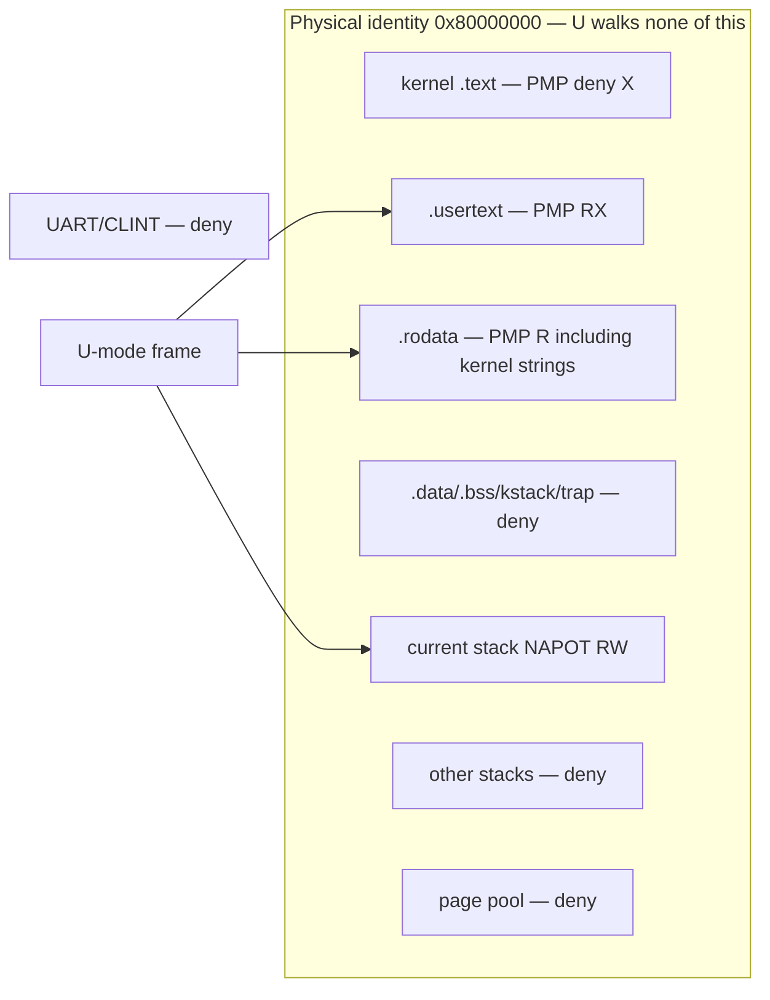
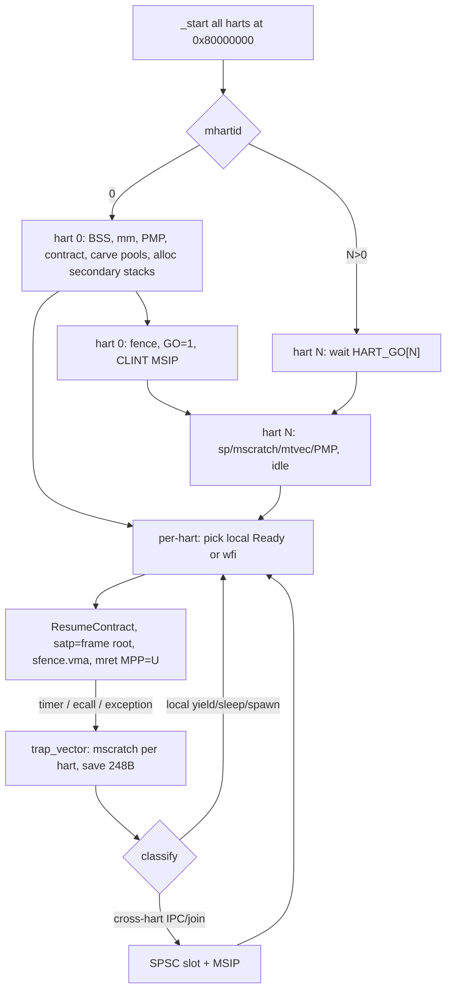
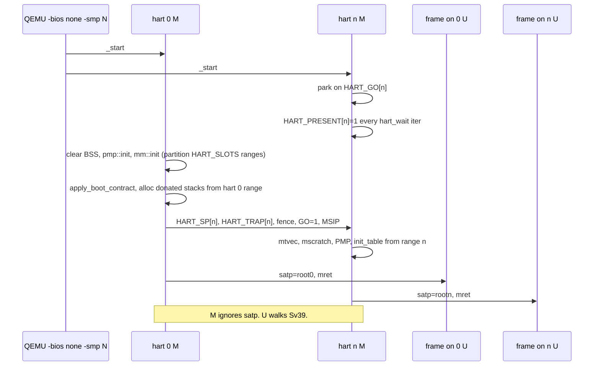

# PicoOS 0.1.4 (0.4) — Frame Kernel: honest SMP, non-legacy Sv39, PMP as last belt, no compile-time MAX_TASKS

| Field | Value |
| --- | --- |
| Title | PicoOS 0.1.4 (0.4) Frame Kernel |
| Author | (design; implementation follows the PR plan) |
| Date | 2026-09-05 |
| Status | Reviewed (writer/reviewer loop, 0 open issues) |
| Tree audited | `/Users/vladislavkalinkin/PicoOS` as shipped **0.3.0** (edition 2024, rustc **1.98.1**) |
| Target | RISC-V 64 (`riscv64gc-unknown-none-elf`), QEMU `virt`, **`-bios none`** |
| Milestone | **PicoOS 0.1.4** — Frame Kernel on real extra harts, Sv39 isolation that is not a Unix mm, PMP as physical last belt, runtime-bounded frame table |
| Informal alias | **0.4** (the 0.3 spec parked “Sv39 / S-mode / SMP” under that name) |
| Banner at freeze | `PicoOS 0.1.4` |

This document is a **delta from the shipped 0.3.0 Frame Kernel**. It does **not** reuse the 0.2 or 0.3 “current tree as 0.2.0” inventory. Facts below are from the **live 0.3.0 tree**. Where the 0.3 spec (written against 0.2.0) disagrees with the live tree, the live tree wins.

---

## Overview

PicoOS 0.3.0 is a correct **one-hart** Frame Kernel: M-mode owner, U-mode frames, unlocked PMP with U-execute only on `.usertext`, nine `ecall`s including spawn/join and 32-byte copy-IPC, always-on round-robin, 100 Hz `mret` preemption, one `cargo build`, `.boot_contract` UART matrix, banner `PicoOS 0.3.0`. It is still a **uniprocessor prototype** in four places the owner parked for this milestone:

1. **One hart.** `IrqCell` is “this hart, `MIE=0`”. `CLINT_MTIMECMP` is hart 0 only. `boot.S` has no `mhartid` split. SMP comments would be theater.
2. **No virtual memory.** U and M share a physical identity map. Isolation is PMP + ResumeContract, not a walker. A Frame has a stack page, not an address space.
3. **PMP is the primary isolation story**, not a last belt. That was correct for 0.3; it is not the 0.1.4 product.
4. **`MAX_TASKS = 8`** is a compile-time array (`src/kernel/task/table.rs`). IPC and the scheduler scan `0..MAX_TASKS`. That cap is prototype furniture.

0.1.4 finishes the Frame Kernel identity — **dispatch, protection, IPC routing** — on **multiple real RISC-V harts** with **Sv39 that does not recreate `struct mm_struct`**. A Frame is still the thread. Address spaces exist to isolate frames. The kernel stays hermetic. PMP remains, demoted to the physical last belt if SATP or the walker is wrong.

**Privilege decision (binding):** 0.1.4 **stays an M-mode kernel** that programs `satp` for U and `mret`s into U. It does **not** move the kernel to S-mode in this milestone. PMP cannot distinguish S from U; an S-mode kernel that must fetch its own `.text` and map UART/CLINT/bitmap cannot use PMP as a last belt against a hostile identity SATP. That is not a style preference — it is the RISC-V PMP model (see Key Decisions and Alternatives A–B). Homegrown `-bios none` stays. OpenSBI stays out.

**Filesystem, POSIX, ELF, net:** none. Not “later in the same series.”

---

## Naming

| Name | Role |
| --- | --- |
| **PicoOS 0.1.4** | Product version. UART banner, freeze tag, and `Cargo.toml` `version`. **Not semver:** `0.3.0` → `0.1.4` is a rename the owner asked for, not a capability downgrade. Do not sort this crate with cargo/semver tools. |
| **0.4** | Informal alias for the work the 0.3 spec deferred (“Sv39/S-mode/SMP”). Do not put `0.4.0` on the banner. Milestone ordering in conversation is 0.2 → 0.3 → 0.4/0.1.4. |
| Previous freeze | **PicoOS 0.3.0** (live `src/kernel/banner.rs`, `Cargo.toml`) |

Scripts and docs may say “0.1.4 (0.4)” once. After freeze, the string that must appear on the console is `PicoOS 0.1.4`.

---

## Background & Motivation

### What 0.3.0 actually shipped (live tree)

Package `PicoOS` **0.3.0**, edition **2024**, `rust-toolchain.toml` channel **1.98.1**, Clippy groups `all` + `pedantic` + `nursery` + `cargo` denied from `Cargo.toml` and `scripts/check-all.sh`. Panic = abort. **No `[features]`**. No `scenario_*`. No third-party crates. No `heap.rs`. No `static mut`. No host `#[test]`. Zero `#[allow(dead_code)]` in `src/`. Zero `cfg(feature)` in `src/`.

**Layout (keep; grain is right):**

```
src/main.rs
src/arch/riscv64/   boot.S, trap.S, trampoline.S, cpu.rs, pmp.rs,
                    restore.rs, timer.rs, traps.rs, ecall.rs, mod.rs
src/drivers/        mmio.rs, uart.rs
src/platform/       qemu_virt_riscv64.rs
src/kernel/         banner, contract, cpu, irq_cell, ipc, log, memory,
                    sys, ticks, trap_frame, test
src/kernel/task/    table, scheduler, entry, fault, test, test/bootstrap.rs
src/user/           stubs.rs, workers.rs
linker-riscv64.ld
scripts/            check-all.sh, qemu-expect.sh, run-riscv.sh,
                    check-usertext.sh, 11 marker tests
```

**Platform (must stay, with SMP offsets added):** load `0x8000_0000`, 128 MiB RAM, UART0 `0x1000_0000`, CLINT `0x0200_0000`, timebase 10 MHz, 16 PMP entries, QEMU `-M virt -bios none -nographic`. Live `timer.rs` writes `platform::CLINT_MTIMECMP` (**hart 0 only** = `CLINT_BASE + 0x4000`). Live `qemu-expect.sh` does not pass `-smp` or `-m` (QEMU virt default is one hart). Live `run-riscv.sh` passes `-m 128M`.

**Always-on kernel path (`kernel_main`):**

1. Banner `PicoOS 0.3.0` / Frame Kernel; capability list.
2. `arch::init_exceptions` (`mtvec` = `trap_vector`, `mscratch` = `__trap_stack_top`).
3. `arch::pmp::init` — pmp0 TOR-deny `[0, __text_start)`, pmp1 TOR-deny through `__user_text_start`, pmp2 TOR RX `.usertext`, pmp3 TOR R `.rodata`, pmp4 NAPOT current stack (`pmp4 << 32` in `pmpcfg0`).
4. `contract::apply_boot_contract` (volatile load of `.boot_contract`).
5. Memory selftest + table reap, or truncated reap/kernel_fault plans.
6. `spawn_default_image` per `BootContract` 0..=9.
7. Arm CLINT at **100 Hz** (`RISCV_TIMER_HZ` in `main.rs` and `TIMER_HZ` in `traps.rs`).
8. `scheduler::run` → `mret` to first Ready frame (`MPP=U`).

**Contracts that already work** (keep green on `-smp 1` after every PR):

| Byte | Script | Marker |
| --- | --- | --- |
| 0 | `test-default-riscv.sh` | `spawn join leak: OK` |
| 1 | `test-task-resume-selftest.sh` | `scheduler resume loop result: OK` |
| 2 | `test-two-task-handoff-riscv.sh` | `scheduler resume loop result: OK` |
| 3 | `test-task-sleep-riscv.sh` | `task sleep wake result: OK` |
| 3 | `test-task-sleep-runtime-e2e-riscv.sh` | `task sleep runtime e2e result: OK` |
| 4 | `test-scheduler-fault-lifecycle-riscv.sh` | `task fault scheduler result: OK` |
| 5 | `test-timer-preemption-riscv.sh` | `timer preemption result: OK` |
| 6 | `test-mm-reap-riscv.sh` | `mm leak check: OK` |
| 7 | `test-kernel-fault-guard-riscv.sh` | `kernel fault guard result: OK` |
| 8 | `test-ipc-riscv.sh` | `ipc rendezvous: OK` |
| 9 | `test-user-text-riscv.sh` | `user text: kernel fetch deny OK` |

**Frame identity as shipped:**

```text
Frame = TaskId (= slot 0..7)
      × privilege U
      × stack [PA, PA+4K)          -- exclusive PMP NAPOT while running
      × TrapImage                  -- GPR + mepc + mstatus  (M-CSRs)
      × Lifecycle                  -- Empty/Ready/Running/Blocked/Finished/Faulted
      × BlockReason                -- SleepUntil | Join | Send | Recv
      × ResumeContract             -- sp in stack AND mepc in .usertext
      × IpcPending                 -- at most 32 bytes while Blocked-Send
```

Idle is not a slot. `switch_after` does not destroy. Join is the reap.

### Pain points (why 0.1.4 is not “turn on -smp and satp”)

1. **`IrqCell` is a one-hart invariant, not a lock.** `src/kernel/irq_cell.rs`: `unsafe impl Sync` with comment “one hart; mutation happens only while MIE is clear.” Using it as a multi-hart mutex (or wrapping it in `amoswap`) would be a lie. Live users: `TASKS`, `MM`, `CPU`, `PLAN`, scheduler marker flags, `RENDEZVOUS_PRINTED`, `USER_TEXT_FETCH_DENY_PRINTED`, `PANICKING`. `ticks.rs` is already an `AtomicU64` — the only honest shared counter in the tree.

2. **`MAX_TASKS = 8` is wired through the product.** `static TASKS: IrqCell<[Task; 8]>`. `snapshot_tasks` / `write_tasks` copy the whole array. `ipc.rs` `wake_senders_to` / `wake_stranded_recvs` scan `0..MAX_TASKS`. `u_spawn_name` is a match on slots 0..=7. `wake_sleeping_tasks` uses `[false; MAX_TASKS]`. Raising the constant is not the fix; deleting the compile-time cap is.

3. **Identity map + one NAPOT is the 0.3 product limit.** U `sys_log` accepts kernel `.rodata` physically (`sys.rs` `user_buffer_ok`). Workers’ `b"..."` literals live there. `worker_pmp_deny` stores to `__data_start`. `worker_kernel_fetch` `jalr`s a kernel `.text` physical address. After Sv39 those physical addresses are **unmapped U VAs** unless we keep an identity map — which we will not.

4. **Trap path is M-only and one-stack.** `trap.S` `csrrw sp, mscratch, sp` against a single `__trap_stack_top`. `restore.rs` rewrites `trap_top - 248`. Second hart would clobber hart 0’s trap frame.

5. **Duplicate “current” state.** `kernel/cpu.rs` `Cpu.current` and `scheduler.rs` `CURRENT_TASK_ID` both exist. Agents.md forbids shadow copies. 0.1.4 deletes one.

6. **`TrapImage.mstatus` is stored and never consumed.** `restore.rs` always calls `synthesize_mstatus_for_mret_worker()`. That field is a shadow CSR. 0.1.4 drops it.

7. **0.3 deferred list (PLAN.md / 0.3 spec):** Sv39, S-mode, OpenSBI vs homegrown, SMP, VFS, net, POSIX. VFS/net/POSIX stay out. S-mode is reconsidered below and **rejected for 0.1.4** so PMP last-belt is real.

---

## Goals & Non-Goals

### Goals (milestone 0.1.4)

- **Done-when list** (finite; see below). Banner may read `PicoOS 0.1.4` only when that list is QEMU-tested.
- **Honest SMP:** QEMU `-smp 2` runs **two RISC-V harts** concurrently in U-mode frames. Not software threads on hart 0. Not “affinity” comments. `-smp 4` is an extra script, not a `check-all` freeze gate (Open Question 4).
- **Mutex-free kernel.** No spinlock, no mutex, no `IrqCell` used across harts, no `amoswap`/`lr.sc` acquire-loop renamed as “lock-free.” Shared mutation is either **partitioned** (each hart owns its bytes) or **SPSC + IPI** (one writer hart, one reader hart). If some object cannot be done that way, it is named in Open Questions — none are smuggled in.
- **Frame-native Sv39:** MODE=8, 4 KiB pages, QEMU virt DRAM layout unchanged. Each live Frame has a page table that maps **only** that frame’s user text window, user rodata window, and stack. **No** kernel `.text` in U. **No** identity map of DRAM in U. **No** mmap, fork, COW, demand paging, recursive PT map, ELF loader, high-half kernel-in-every-process.
- **PMP last belt:** unlocked PMP still applied to U **and to hardware page-table walks** (effective privilege S, same R/W/X as U). The walker **must** be able to read PT pages. The belt is: U must not **write** other stacks or PT pages; a contract **intentionally** identity-maps kernel `.data` into a probe frame and proves the store still faults on PMP. Primary isolation is Sv39; this test is why PMP is not theater.
- **Runtime-bounded task table** allocated from `memory::alloc_pages`. No `MAX_TASKS`. No `GlobalAlloc`. Capacity derived from free pages at hart-local init.
- **One binary, `.boot_contract` extended**, UART markers named here, scripts in the same PR. `scripts/check-all.sh` green after every PR (existing `-smp 1` matrix never regresses).
- **`unsafe`:** still only `src/arch/` plus existing MMIO in `src/drivers/` plus the (now per-hart) cell. Every block has `// SAFETY:`. No new `#[cfg(feature)]`. No `#[allow(dead_code)]`.

### Non-goals (explicit)

- **POSIX, libc, ELF, Unix paths, shells, GNU utilities.**
- **VFS / filesystem / inodes / path namespace.**
- **Networking, VirtIO, block devices, userspace drivers as a 0.1.4 deliverable.**
- **S-mode kernel, `stvec`/`sret`/`sepc`, OpenSBI, SBI ecalls as the product path.** Homegrown M trampoline into S is Alternative A and Open Question 1; default is **stay M**.
- **ASID.** `satp.ASID = 0`; `sfence.vma` on every SATP switch. Product limit, not a bug.
- **Frame migration** between harts. A Frame’s home hart is its life.
- **Demand paging, anonymous mmap, swapping, copy-on-write.**
- **Execute-only user text (no R).** Binding: **RX on UTEXT, R on URODATA.** RISC-V `auipc`/`ld` and the fetch-probe load will read those pages. Do not schedule an XO dump as a 0.1.4 maybe.
- **General heap / `GlobalAlloc` / `std::alloc`.**
- **Capability IPC, seL4-style CSpace.**
- **Host `std` tests as a substitute for QEMU contracts.**
- **Bringing `scenario_*` back.**

---

## Key Decisions

1. **M-mode kernel + Sv39 for U only. `satp` is written from M. Trap path stays `mtvec` / `mret` / `mepc`.** Rationale: RISC-V PMP (and Smepmp) can distinguish **M vs S/U**, never **S vs U**. An S-kernel must execute kernel `.text` and access UART, CLINT, the bitmap, and page-table pages; those PMP entries would then also admit U if SATP were identity. That makes “PMP as last belt” theater. M-mode ignores `satp` (bare physical unless `MPRV`), so the kernel needs **no trampoline page in U tables**, **no kernel text in U**, and 0.3 PMP still bites U. This **overrides** the 0.3 spec’s lean toward “homegrown `mret` into S” because 0.1.4 added an explicit last-belt requirement the 0.3 lean cannot satisfy. See Alternative A.

2. **Bootstrap stays `-bios none`. No OpenSBI.** Rationale: unchanged from 0.3 Key Decision 2. QEMU `virt` with `-bios none` starts **every** `-smp` hart at `0x8000_0000`. Homegrown `boot.S` parks `mhartid != 0` until hart 0 writes a per-slot go flag and an MSIP. We do not take `a0`/`a1` SBI conventions.

3. **A thread is a Frame. A Frame has a home hart and a page table. There is no process table and no `mm_struct`.** Rationale: PicoOS still has no fork, no exec, no shared address space object. Spawn creates one Frame with one stack page and one Sv39 root. Join destroys the stack and the PT pages. `TaskId` is no longer a slot index (see 6).

4. **Share-nothing SMP: per-hart run-queue, per-hart task table, partitioned page bitmap, no kernel spinlock.** Rationale: the owner asked for honest multithreading without mutex-like primitives if possible. It is possible for every 0.1.4 kernel object except UART THR on the panic path (named exception). Cross-hart IPC and remote join are **SPSC payload + dedicated ack + CLINT IPI**. **Every** cross-hart send/join **blocks the sending Frame** (`HartOut`); the hart schedules other local frames. There is **no** same-frame completion for a remote peer (that would be a spin in M waiting for an ack). `lr.sc`/`amoswap` used as “take this lock” is forbidden even if commented “lock-free.” A `WFI` until MSIP inside the send ecall is the same class of hart-blocking wait — also forbidden.

5. **`IrqCell` becomes `HartLocal<T>`. It is not a multi-hart mutex.** Rationale: the 0.3 SAFETY comment is “one hart + MIE=0.” Index by `mhartid`. Each hart touches only `slots[hart]`. IRQs remain off in M while in the kernel on that hart (`without_interrupts`). Compile-time `platform::HART_SLOTS = 8` is a **virt topology bound** (like `PMP_ENTRIES = 16`), not a software `MAX_TASKS`. QEMU freeze tests use `-smp 1` and `-smp 2`. Runtime `hart_count` is the number of harts **with `mhartid < HART_SLOTS`** that registered present. `mhartid >= HART_SLOTS` (e.g. QEMU `-smp 16`) **architecturally parks forever** and **must not index** `HART_GO` / `HartLocal`. Cross-hart publication of “who is in U” is **not** a `HartLocal` read: it is `AtomicU64 HART_U_TID[HART_SLOTS]` (**0 = idle**, never a valid Frame id — see KD6).

6. **`TaskId` is packed `(generation, hart, local)`, not a global slot. Generation starts at 1; packed id 0 is never a Frame.** Rationale: a global `0..N` space needs a shared allocator. Per-hart local indices plus a hart field need no shared counter. `sys_gettid` / spawn return values / IPC peer ids use the packed `u64`. Live `id == slot` is deleted. UART prints packed ids as **hex**. The reap contract (`mm leak check: OK`) asserts **pages returned** and **local-index reuse**, **not** `id2 == id` (generation makes that false by design).

   `TaskId = (generation as u64) << 32 | (hart as u64) << 16 | (local as u64)`. **`generation` is initialized to 1** on `init_table` (not 0). First spawn on hart 0 is therefore `1<<32 | 0 | 0` ≠ 0. Destroy bumps generation; if the `u16` wraps to 0, **skip to 1**. Packed **0 is reserved**: idle/empty sentinel for `HART_U_TID[i]` and `PeerGoneTid` (`compare_exchange(0, tid)` is then never a no-op). Do not store a valid tid in a 0-means-empty cell. Syscall failure remains `u64::MAX` (distinct from 0 and from any packed id).

7. **Page allocator is partitioned, not locked.** Rationale: live `MM: IrqCell<MmState>` cannot be shared. At `memory::init` (hart 0, before any `alloc_pages`), carve the bitmap into **`HART_SLOTS` (8) word-aligned ranges** (multiples of 64 pages) so harts never share a `u64` bitmap word. **Do not wait on `HART_PRESENT` and do not repartition later.** `-smp 1` leaves ranges 1..=7 unused — named waste, not a bug; 0.3 leak checks use `used`, not “all RAM is hart 0’s.” Each hart first-fits only in its range. No `amoswap` on bits. `hart_count` is **only** for UART `harts present: N` and PeerGone fan-out, never for carving.

8. **User VA is three windows in one 2 MiB Sv39 L0. Kernel is not in them.** Binding (Sv39, `VA[38]=0`, VPN[2]=0, VPN[1]=0):

   | Window | VA | Maps |
   | --- | --- | --- |
   | UTEXT | `0x0000_0000_0010_0000` | physical `.usertext` LMA, RX, PTE `U=1` |
   | URODATA | `UTEXT + (LMA_urodata - LMA_utext)` | physical `.userrodata` LMA, R, PTE `U=1` |
   | USTACK | `0x0000_0000_0018_0000` | the frame’s stack page, RW, PTE `U=1`; `sp` starts at `+PAGE_SIZE` |

   `0x0010_0000`, the URODATA VA (a few 4 KiB pages after UTEXT if sections are adjacent in the ELF), and `0x0018_0000` all have **VPN[1] = 0**, so spawn allocates **exactly one L2 + one L1 + one L0** (3 PT pages). Do **not** place USTACK at `0x0020_0000` (that is VPN[1]=1, a second L0).

   **LMA/VMA:** `.usertext` / `.userrodata` stay linked at **physical identity** (ELF VMA = LMA, as today). Kernel `memory::user_text_start()` and PMP `pmpaddr` remain **PAs**. U maps those PAs at the windows above with **the same relative spacing as LMA**, so U `auipc`/`lla` from `.usertext` to `.userrodata` forms a correct URODATA pointer (`runtime_pc + link_offset = UTEXT + (string_lma - text_lma)`). Do **not** set linker VMA to the U window without `AT(LMA)` — that would make symbol addresses stop being PAs. USTACK is not a linked section.

9. **New linker section `.userrodata`, physically immediately after `.usertext` (4 KiB aligned).** Rationale: 0.3 `u_sys_log(b"...")` points at kernel `.rodata`. Mapping kernel `.rodata` into U would be a crutch. Workers/stubs put string literals and `KERNEL_FETCH_PROBE_ADDR` in `.userrodata` (`#[link_section = ".userrodata"]`). `user_buffer_ok` for log becomes **stack VA ∪ URODATA VA** after `walk_user`. Kernel `.rodata` is PMP-deny for U. **PR6 must not ship until `check-usertext.sh` proves string objects are in `.userrodata` and that worker `lla` targets sit at `UTEXT + (lma - __user_text_start)` once PR7 maps them.** Until SATP is on, those `lla` results are still PAs and log still works physically.

10. **PMP stays unlocked, 16 entries, lowest-number match, demoted to last belt.** Hardware PT walks are PMP-checked as **S**. TOR entry *i* matches `pmpaddr[i-1] ≤ y < pmpaddr[i]` **regardless of `pmpcfg[i-1]`** (live `pmp.rs`: “do not mix as TOR *i−1*”). **Never TOR-after-NAPOT.** Binding: pmp0–4 TOR as today; **pmp5 NAPOT RW 4 KiB current stack**; **pmp6 NAPOT R on the whole DRAM window** (`RAM_START=0x8000_0000`, `RAM_SIZE=128 MiB`, naturally aligned). pmp6 is **static**. pmp0–5 win on kernel/MMIO/usertext/userrodata/stack because they are lower indices. Remainder of the pool is R. Belt: U must not **write** other stacks/PTs; U **read** of pool PTEs/stacks is a named product limit.

11. **No compile-time `MAX_TASKS`. Capacity is `min(local_free_pages / 8, 512)` per hart, table storage from `alloc_pages`.** Rationale: 8 is unused furniture; 16 is the same furniture. A live Frame costs 1 stack + **3 PT pages** + table slot. Budgeting 8 pages/frame is honest. 512 locals/hart is a runtime ceiling. It is **computed**, not a `const MAX_TASKS` the compiler folds into every loop. `HART_SLOTS = 8` stays a platform constant.

12. **No ASID, no demand faults that allocate, no frame migration, IPC stays 32-byte rendezvous.** Rationale: finish identity, do not boil the ocean. Same-hart IPC is the 0.3 algorithm on the **local** table. Cross-hart IPC copies into `Mailbox[src][dst]`; completion is always via `Ack[dst][src]` Ready-ing a blocked Frame.

13. **UART TX is hart-0-only in the running system, starting at the first `-smp 2` PR.** Other harts’ `sys_log` and kernel lines go through an SPSC log ring to hart 0 (**lands in PR9**, not a later cleanup). **Panic path** (`KERNEL PANIC`) may busy-poll `UART_LSR_THRE` from any hart — the one named exception.

14. **QEMU UART scripts remain the ABI.** New markers listed here. `qemu-expect.sh` gains optional `-smp N` and always passes `-m 128M`. Existing tests stay `-smp 1`. Isolation markers are gated on `BootContract` + `mcause` + `mtval` (see fault path).

15. **Banner `0.1.4` at freeze only**, listing capabilities a QEMU test actually hit (Sv39 user windows, PMP belt, two-hart concurrent U, cross-hart IPC, page-backed table). `Cargo.toml` version is also `0.1.4` (not semver; Key Decision naming).

16. **Delete duplicate `CURRENT_TASK_ID` and `TrapImage.mstatus`.** One current id (`Cpu.current` per hart). Restore keeps synthesizing `mstatus` (`MIE=0`, `MPIE=1`, `MPP=U`, **`MPRV=0`**, **FS preserved** as live `synthesize_mstatus_for_mret_worker` already does).

17. **`satp` encoding and write site.** `Task.satp_root` stores the **root PA** returned by `alloc_pages`. `activate_user_satp(pa)` does `csrw satp, (8 << 60) | (pa >> 12)` then `sfence.vma x0, x0`. **Only** called from `arm_worker_for_mret` immediately before `mret_to_trap_image`. Same-frame ecalls (`sys_log`, spawn return, …) **leave SATP**. Idle-exit writes `satp = 0`. Trap-to-M **leaves SATP** (M ignores it). Never `MPRV` copies in 0.1.4.

18. **Software walk is the only U-pointer translation.** `walk_user(satp_root_pa, va, want_rw) -> Option<pa>` in `vm.rs`: depth ≤ 3, 4 KiB leaves only, require `V|U`, require `R` (and `W` if `want_rw`), reject `G`, reject megapage (`RSW`/leaf at L1/L2), reject stores to URODATA (`want_rw` on a R-only leaf → `None`). Bad PTE → **task fault**, not panic. IPC dest walk uses **dest** `satp_root` on the **dest hart**. Kernel then copies with physical stores (M bypasses unlocked PMP).

19. **Hart 0-only `ticks::increment` from PR3.** Other harts’ timers preempt locally and `wake_sleeping_tasks` against the shared atomic; they must not `fetch_add`.

---

## Audit: live 0.3 leftovers (do not paper over)

### Isolation as shipped (physical identity)



0.1.4 **breaks** the identity for U. The same physical regions exist. U only has three VAs.

### SMP as shipped

- `boot.S`: single `_start`, `la sp, __stack_top`, clear BSS, `call kernel_main`.
- `cpu.rs`: `mhartid` is **read for UART** in `print_cpu_info` and never used for control.
- `IrqCell` Sync SAFETY is one-hart.
- `timer.rs` `set_mtimecmp` → `CLINT_MTIMECMP` hart 0.
- One kernel stack (64 KiB), one trap stack (4 KiB) in `linker-riscv64.ld`.

### Table as shipped

- `pub const MAX_TASKS: usize = 8`
- `static TASKS: IrqCell<[Task; MAX_TASKS]>`
- `TaskId = usize` with `id == slot`
- `spawn_inner` linear search for Empty
- `find_next_task_after` modulo `MAX_TASKS`

### `unsafe` map (0.1.4 budget)

| Location | 0.3 | 0.1.4 |
| --- | --- | --- |
| `arch/riscv64/*` CSR, `mret`, `wfi`, PMP, trap | keep | keep; add `satp`, `sfence.vma`, `mhartid` park, MSIP |
| `drivers/mmio.rs`, `uart.rs` | keep | keep; UART putc from hart 0 (and panic) |
| `kernel/irq_cell.rs` | one-hart cell | **replace** with `HartLocal`; same SAFETY shape per slot |
| `kernel/contract.rs` volatile `.boot_contract` | keep | keep; hart 0 only, before secondaries run |
| `kernel/sys.rs` `from_raw_parts` after walk | keep | walk to PA first, then the same copy |
| `kernel/ipc.rs` user copies | keep | same; cross-hart copies into mailbox bytes then dest stack PA |
| `memory.rs` debug poison | keep | per-hart range, IRQs off on that hart |
| New walker / PTE stores | — | **`src/arch/riscv64/vm.rs`** (hardware map), not a silent kernel `unsafe` in `table.rs` |

---

## Proposed Design

### Thesis

```text
Frame = TaskId { generation:u16 /* starts at 1; never 0 */, hart:u16, local:u16 }
      /* packed 0 is not a Frame — idle/empty sentinel */
      × home hart
      × privilege U
      × user VA windows { UTEXT, URODATA, USTACK }
      × satp_root PA (Sv39; PPN only inside activate_user_satp)
      × stack PA [base, base+4K)
      × TrapImage                  -- GPR + mepc  (no saved mstatus)
      × Lifecycle / BlockReason    -- SleepUntil | Join | Send | Recv | HartOut { dst, kind }
      × ResumeContract / IpcPending
```

Kernel verbs: **dispatch** (per-hart), **protection** (Sv39 primary, PMP belt, ResumeContract), **IPC routing** (local rendezvous or SPSC+IPI copy). Still not a Unix.

M-mode ignores SATP. Kernel fetch/load/store is physical. U is translated.

### Milestone definition: PicoOS 0.1.4

**Done when** a **single** `cargo build` binary on QEMU virt:

1. Boots on `-smp 1` with banner `PicoOS 0.1.4`; **all 0.3 contract markers still pass** (semantics preserved; a few isolation lines are renamed where 0.3 names would lie — see markers).
2. Sv39 is on for every U `mret`: `satp.MODE = 8`. A U load of an unmapped VA (kernel `.data` physical-as-VA) **store-page-faults the task**, not the kernel. Marker `sv39 deny: kernel store unmapped OK`.
3. U page tables do **not** contain kernel `.text`, UART, CLINT, the bitmap, other stacks, or an identity of the page pool. Script `scripts/test-sv39-windows-riscv.sh` (byte 13) prints the three VPN leaves from a walker dump and **fails** if any other leaf `V=1` exists (including kernel `.text` PPN).
4. Contract `user_text`: U loads `KERNEL_FETCH_PROBE_ADDR` from **URODATA VA** (value = kernel `.text` PA) then `jalr`s it; the task takes **instruction page fault** (`mcause` 12, `mtval` = that PA). Marker `user text: kernel fetch deny OK` kept. The load itself must not fault (probe slot is mapped).
5. Contract `pmp_belt`: kernel **intentionally** installs an identity PTE `U=1 RW` covering kernel `.data` for a probe frame; U store still **PMP store-access-faults** (`mcause` 7). Marker `pmp belt: store deny OK`. Same for fetch of kernel `.text` with a hostile X identity PTE: `mcause` 1, `pmp belt: fetch deny OK`. These markers are **gated on `BootContract::PmpBelt`** so they cannot fire on the user-text plan.
6. `sys_spawn` / join / IPC work with **user VAs** and a table whose capacity was printed at boot from free pages, not the literal `8`. Marker `task table hart 0: cap` plus the existing spawn-join leak marker.
7. `-smp 2`: hart 0 and hart 1 both enter U. Publication is `AtomicU64 HART_U_TID[i]` (`Release` of the packed id in `arm_worker_for_mret`, **`0` on idle-exit**). Hart 0 `Acquire`-loads both slots; marker `smp two harts: OK` when **both are nonzero**. Valid because **no Frame has tid 0** (KD6: `generation` starts at 1). **Not** a cross-hart read of `HartLocal<Cpu>`.
8. `-smp 2` cross-hart copy-IPC of 32 bytes. Marker `smp ipc: OK`.
9. No `MAX_TASKS` symbol. No kernel spinlock. `IrqCell` type name gone. `scripts/check-all.sh` green (old matrix + new contracts).
10. Zero new `#[cfg(feature)]`. Zero `#[allow(dead_code)]`.

**Success metric:** `scripts/check-all.sh` green; banner capabilities match tests that ran.

### Default image (byte 0, `-smp 1`)

Same occupants as 0.3 (yield, sleep, pmp-deny probe **reinterpreted as unmapped-kernel-store**, spawn parent + child). Peak occupancy still small. Isolation marker on this plan becomes `sv39 deny: kernel store unmapped OK`, printed **only** when `plan == Default`, `mcause` code **15** (store page fault), and `mtval == memory::data_start()` (the PA used as VA by `worker_pmp_deny`). Do **not** keep printing `pmp deny: task fault OK` on this path — that line moves to the belt contract (`mcause` 7, plan `PmpBelt`).

### Architecture



### Privilege and bootstrap



**`boot.S` delta (hart 0 only clears BSS):**

```text
_start:
    csrr t0, mhartid
    li   t1, 8                 /* HART_SLOTS */
    bgeu t0, t1, hart_overflow /* no table index */
    bnez t0, hart_wait
    la   sp, __stack_top
    /* clear BSS + trap stack as today */
    call kernel_main
    j hang

hart_overflow:
    wfi
    j hart_overflow            /* mhartid >= HART_SLOTS: park forever */

hart_wait:
    /* sb 1, HART_PRESENT[t0]  -- every iteration, after QEMU/hart0 zero BSS */
    /* busy-load HART_GO[t0]; do NOT wfi (mie.MSIE is still 0). */
    j hart_wait
```

**Closed bring-up sequence (not circular):**

1. QEMU `-bios none -smp N` starts **all** harts at `0x8000_0000`. BSS is QEMU-zeroed, then hart 0 clears it again.
2. `mhartid >= HART_SLOTS` → `hart_overflow` forever, **no index**.
3. In-range secondaries **busy-load** `HART_GO[id]` and **write `HART_PRESENT[id] = 1` every iteration** (safe during hart 0’s BSS clear: they may briefly write, get zeroed, write again).
4. Hart 0: BSS + trap-stack clear → `pmp::init` → **`memory::init` partitions into `HART_SLOTS` ranges once** → `apply_boot_contract` → `alloc_pages` / donated M-stacks / `init_table` **only from range 0** → `fence w,w` → `GO[n]=1` for `n` with `HART_PRESENT[n]==1` (optional 10 ms sample for the print) → `fence w,w` → MSIP. **Never repartition. Never wait on PRESENT before `memory::init`.**
5. After GO, hart `n` sets `sp`/`mscratch`/`mtvec`/`PMP`/`MTIE`/`MSIE`, **`init_table` from range n**, then `scheduler::run`. Frame stacks and PT pages come from the **home** range. Hart 0 does not `init_table(1)`.

`hart_count` = number of `HART_PRESENT[i]==1` with `i < HART_SLOTS`, sampled when hart 0 prints `harts present: N` (PR9 may wait 10 ms so secondaries have stored 1). It does **not** size the bitmap. PR1 prints `harts present: 1` without waiting (park smoke: secondaries must not run `kernel_main`; a second banner fails the script). MSIP is a kick after GO; the park loop does not depend on it.

`HART_GO`, `HART_SP`, `HART_TRAP_TOP`, `HART_PRESENT` live in `.bss`, one slot per `HART_SLOTS`.

**CLINT (cite):**

| Register | Address |
| --- | --- |
| `MSIP[hart]` | `0x0200_0000 + 4 * hart` |
| `MTIMECMP[hart]` | `0x0200_4000 + 8 * hart` |
| `MTIME` | `0x0200_BFF8` (shared) |

Live `platform::CLINT_MTIMECMP` is hart 0. 0.1.4 adds `clint_mtimecmp(hart)` and `clint_msip(hart)`. IPI: write `1` to `MSIP[dest]`. Enable `mie.MSIE` as well as `MTIE`. Dest path is `handle_machine_software_interrupt` (below): **save** the interrupted U image like the timer, then drain, then `switch_to`. PR3 stub only clears MSIP and **returns to `trap_return`** (same frame) — it must **not** `switch_after`.

**Per-hart stacks:** hart 0 keeps linker `__stack_top` (64 KiB) and `__trap_stack_top` (4 KiB). `HART_TRAP_TOP[0]` is initialized to `__trap_stack_top` before any `mret` (PR3). For each secondary, hart 0 `alloc_pages(16)` kernel stack + `alloc_pages(1)` trap stack **from hart 0’s bitmap range** before GO, stores tops in `HART_SP` / `HART_TRAP_TOP`. Those M-mode stacks are **donated, never freed**. Secondaries do not allocate on their first instructions. **After GO**, each hart `init_table` + `pmp::init` + `mtvec`/`mscratch`/`MTIE`/`MSIE` from **its own** page range. Frame stacks and PT pages come from the **home** hart. No `spawn_on`. Cross-hart join/IPC only after both tables exist (GO already orders that).

**Kernel remains non-preemptible on a hart:** `traps.rs` already `disable_irq()` on entry. Nested timer while in M does not run. Per-hart `HartLocal` therefore needs no lock.

### Mutex-free shared-state map

| Object | 0.3 | 0.1.4 | Why not a lock |
| --- | --- | --- | --- |
| `Cpu` | `IrqCell<Cpu>` | `HartLocal<Cpu>` | private |
| Run queue / table | global `[Task; 8]` | per-hart page-backed table | private; remote ops are messages |
| Page bitmap | `IrqCell<MmState>` | one bitmap, **disjoint bit ranges** per hart | no shared words |
| `PLAN` / boot contract | `IrqCell` | write once on hart 0 before GO; then read-only | publication, not a lock |
| Ticks | `AtomicU64` | keep; **only hart 0** `fetch_add`s on its timer | already atomic |
| Once-markers | `IrqCell<bool>` | `AtomicBool` swap | not a mutex |
| Who is in U | n/a | `AtomicU64 HART_U_TID[HART_SLOTS]` | publication, not a lock |
| Same-hart IPC | scan `0..8` | scan home table | private |
| Cross-hart IPC/join | n/a | `Mailbox[src][dst]` + `Ack[dst][src]` | IPC+join only; one writer each |
| PeerGone | n/a | `PeerGoneTid[home][obs]: AtomicU64` | wait-free; never a Full slot |
| UART | any putc | hart 0 drain; **separate** SPSC byte ring (PR9) | Full: drop kernel line / retry U ecall |
| PMP | hart 0 CSRs | each hart’s CSRs | private |

**SPSC mailboxes — IPC and join only (not PeerGone, not UART):**

```text
Mailbox[src][dst]:  Empty | Full, payload IpcMsg | JoinReq
Ack[dst][src]:      Empty | Full, payload { a0, a1 }
```

Payload `Mailbox` is written only by `src`. Ack is written only by `dst`. Two local frames sending to the same remote hart serialize on that one slot via **ecall retry**, not a spin in M.

Producer of a **remote** send/join (src hart, IRQs off):

1. Walk caller buffer to PA (`walk_user`, local `satp_root`).
2. If `Mailbox[src][dst]` is **Full**: save `TrapImage` at the **ecall pc** (`mepc` **not** +4), mark **Ready**, `switch_after`. The ecall **retries** on next dispatch. Not `HartOut` (nobody would know to wake an unposted waiter).
3. If Empty: write payload, `Release` Full, `MSIP[dst]`, save image with **`mepc+4`**, mark `Blocked { HartOut { dst, kind } }`, `switch_after`. **Never** same-frame-return a remote send. **Never** WFI-until-ack.

**PeerGone (wait-free, not a mailbox):** `PeerGoneTid[home][observer]: AtomicU64` (**0 = empty**, packed `TaskId` ≠ 0, or `u64::MAX` = “wake every local Send/HartOut targeting that home hart”). Dying hart: `compare_exchange(0, tid, Release, Relaxed)` with **`tid != 0`**; on failure `store(MAX, Release)`. Dest on IPI/timer: `swap(0, Acquire)` and wake. A collapsed `MAX` may spuriously fail a send with `a0=MAX` while a different peer still lives — named limit, freeze tests have one remote peer. **No Frame left to `HartOut` on the death path; no spin.** Because generation starts at 1, `compare_exchange(0, 0)` cannot happen.

**UART ring (PR9, not `Mailbox`):** per-hart SPSC byte/line ring into hart 0. User `sys_log` on hart ≠ 0: if the ring is Full, save at **ecall pc** (no +4), Ready, retry. Kernel `write_line` from hart ≠ 0: **drop the line** if Full (named limit). Hart 0 drains the ring on timer and IPI **before** its own prints. Panic path may poll THR from any hart.

Consumer — **`handle_machine_software_interrupt(frame)`** (PR10; PR3 stub is different):

1. If `current` is `Some`, **`save_preempted_trap_image` exactly as `handle_timer_interrupt`** (live `traps.rs`). Live `switch_after` does **not** save; the caller must.
2. Clear `MSIP[me]`.
3. Drain `Mailbox[*][me]`, `Ack[*][me]`, `PeerGoneTid[*][me]`, UART ring.
4. `switch_to(next_after(interrupted))` — not `switch_after` without the save.

PR3 IPI stub: clear MSIP, **return to `trap_return`** (same frame). No `switch_after` on a no-op IPI.

**No spinning in M. No WFI-until-ack in an ecall.**

`HART_SLOTS = 8` ⇒ 56 payload slots and 56 ack slots. Each payload ≤ 40 bytes. Static in `.bss`.

**What is not a mailbox:** page alloc, local spawn, local join of a local zombie, local IPC, PeerGone, UART.

### Non-legacy Sv39

**MODE.** `activate_user_satp(root_pa)`:

```text
csrw satp, (8u64 << 60) | (root_pa >> 12)   /* MODE=Sv39, ASID=0, PPN = PA[55:12] */
sfence.vma x0, x0
```

`Task.satp_root` is the **root PA** (`alloc_pages` return), not a PPN. Do not OR a PA like `0x80xx_xxxx` into `satp`. Write SATP **only** from `arm_worker_for_mret` immediately before `mret_to_trap_image`. Same-frame ecall leaves SATP. Idle-exit: `csrw satp, 0`. Trap to M: leave SATP (M ignores it; `MPRV` stays 0).

**sfence.vma.** After every `csrw satp` and after PTE stores when building a table. From M, `sfence.vma x0, x0`.

**Hardware walker vs PMP.** The CPU’s table walk is a series of **S-privilege loads** of L2/L1/L0 PTEs. Unlocked PMP applies. If those PAs are unmatched/deny, the first U fetch is an **instruction access fault**, not a translated UTEXT execute. Hence pmp6 **NAPOT R on all DRAM** (see PMP) so every pool PA is readable; pmp5 still wins RW on the current stack. Software `walk_user` is M-mode physical loads (M bypasses PMP) and is used only for syscall buffer translation.

**`walk_user(satp_root_pa, va, want_rw) -> Option<u64>`** (one function, `vm.rs`):

1. Reject if `va` has non-canonical Sv39 bits (`va[63:39]` not sign-extended from `va[38]`).
2. `a = satp_root_pa`. For `level` in `{2, 1, 0}`:
   - load PTE at `a + vpn[level]*8` (physical).
   - if `!V` → `None`.
   - if `R|W|X` any set: this is a leaf. If `level != 0` → `None` (no megapages). If `G` → `None`. If `!U` → `None`. If `!R` → `None`. If `want_rw && !W` → `None`. Return `ppn << 12 | va[11:0]`.
   - else next `a = pte.ppn << 12`.
3. Depth exhausted → `None`.

`None` at a syscall → **task fault** (`illegal_syscall` / `record_and_switch_user_fault`), never `halt`. Dest IPC walk runs on the dest hart with dest `satp_root`. Kernel copies are `from_raw_parts` on the **PA**, SAFETY: M-mode, range came from a successful walk, dest stack/PT still live because dest is not reaped while Recv-blocked.

**Who allocates PT pages.** The **home hart** from its bitmap range, at spawn, IRQs already off (same 0.3 spawn-on-ecall exception). UTEXT + URODATA + USTACK share VPN[2]=0, VPN[1]=0 → **exactly 3 PT pages** (1 L2 + 1 L1 + 1 L0 with three leaves). Walker-dump contract prints those three nodes and no others.

**PTE flags.** UTEXT: `V|R|X|U|A|D` (A/D set in software). URODATA: `V|R|U|A`. USTACK: `V|R|W|U|A|D`. No `G`. No user mapping of PT pages.

**Build/destroy:**

```text
spawn:
  stack = alloc_pages(1)            -- home hart
  l2,l1,l0 = alloc_pages(1)×3      -- exactly three
  map UTEXT   → [__user_text_start, __user_text_end)     /* PAs */
  map URODATA → [__user_rodata_start, __user_rodata_end) /* PAs */
  map USTACK  → stack PA at VA 0x0018_0000
  sfence.vma x0, x0
  Task.satp_root = l2               /* PA */
  Ready

join/destroy:
  free stack, l2, l1, l0            /* these four pages, no extras in 0.1.4 */
  Empty slot, bump generation       /* skip 0; packed TaskId of next spawn != old id and != 0 */
```

**ResumeContract (VA, not PA):**

```rust
fn resume_contract(id: TaskId, image: &TrapImage) -> bool {
    image.is_valid()
        && user_stack_va_contains(image.gpr.sp)   // [0x0018_0000, 0x0018_1000]
        && user_text_va_contains(image.mepc)      // [UTEXT, UTEXT+len)
}
```

Fresh start: `mepc = UTEXT + (user_trampoline_lma - __user_text_start)`, `a0 = UTEXT + (entry_lma - __user_text_start)`, `a1 = spawn_arg`, `sp = 0x0018_0000 + PAGE_SIZE`.

**`sys_spawn` entry check:** `entry` is a **U VA** in the caller’s text window (not a kernel PA). Boot `table::spawn` from M still takes a `TaskEntry` symbol and converts PA → UTEXT VA.

**What is not Sv39-classic**

| Classic Unix | 0.1.4 |
| --- | --- |
| High half kernel in every user table | **Forbidden** |
| Identity map of DRAM for U | **Forbidden** |
| `mmap` / `brk` | **No syscall** |
| `fork` / COW | **No** |
| Demand fault allocates | U page/protection fault → **task Faulted** |
| Recursive self-map for the walker | Software walk from PA; **no** |
| ELF loader, `AT_PHDR`, auxv | **No** |
| `struct mm_struct` + VMA tree | Three fixed windows on `Task` |
| Shared writable mappings | **No** (IPC is copy) |
| ASID + lazy shootdown | ASID=0, sfence on switch |

**Page-fault codes (task fault, not allocate):** `mcause` 12 instruction page fault, 13 load page fault, 15 store page fault. Add to `TaskFaultReason`. Live `from_mcause` does not know these yet.

**Fault-path markers (binding, `fault.rs`):** every isolation line is `BootContract` + `mcause` + `mtval`. Live 0.3 prints `pmp deny: task fault OK` on store/load **access** fault 7/5 and `user text: kernel fetch deny OK` on instruction **access** fault 1 with `is_inside_kernel_text(mtval)`, ungated on plan — after Sv39 those conditions go silent or double-print the belt.

| Plan | `mcause` | `mtval` | Marker |
| --- | --- | --- | --- |
| Default | 15 | `data_start` (PA used as VA) | `sv39 deny: kernel store unmapped OK` |
| UserText | 12 | `kernel_fetch_probe_target` **PA** (value loaded from URODATA) | `user text: kernel fetch deny OK` |
| PmpBelt store | 7 | kernel `.data` PA (identity PTE) | `pmp belt: store deny OK` |
| PmpBelt fetch | 1 | kernel `.text` PA (identity X PTE) | `pmp belt: fetch deny OK` |

`KERNEL_FETCH_PROBE_ADDR` lives in **`.userrodata`** (U-mapped). Its **value** is the kernel `.text` PA. After SATP, the worker `lla`s the slot (URODATA VA), loads the PA, `jalr`s it. If the slot stayed in kernel `.rodata`, the **load** would page-fault and the user-text script would go red.

**Kernel SATP.** Kernel does not enable paging. No kernel VA layout. No high half.

### PMP as last belt

Unlocked. 16 entries. RV64: pmp0–7 in `pmpcfg0`. **Lowest-numbered match wins.** TOR entry *i* matches `pmpaddr[i-1] ≤ y < pmpaddr[i]` **regardless of `pmpcfg[i-1]`** — not “the previous region’s coverage.” Live `pmp.rs` already forbids mixing a TOR as *i−1* of a later TOR when *i−1* is NAPOT. **Do not TOR-after-NAPOT.** Each hart programs **its own** PMP. Hardware page-table walks are checked as **S**.

`.userrodata` sits between `.usertext` and `.rodata` so TOR addresses increase. pmp4 end is **`__free_memory_start`**. pmp4’s lower bound is `pmpaddr3` (`__user_rodata_end >> 2`), so it covers kernel `.rodata`/`.data`/`.bss`/kstack/trap — **not** the page pool.

```text
.text        ALIGN(4K)   __text_start .. __text_end
.usertext    ALIGN(4K)   __user_text_start .. __user_text_end     /* keep live `. += 4` skip */
.userrodata  ALIGN(4K)   __user_rodata_start .. __user_rodata_end
.rodata      ALIGN(4K)   kernel constants — U deny
.data / .boot_contract / .bss / kstack / trap_stack
__free_memory_start
pool … RAM_END = RAM_START + 128MiB
```

| Index | Encoding | `pmpaddr` | S/U perms | Coverage (after lowest-number match) |
| --- | --- | --- | --- | --- |
| pmp0 | TOR, no RWX | `__text_start >> 2` | deny | `[0, __text_start)` UART/CLINT/MROM |
| pmp1 | TOR, no RWX | `__user_text_start >> 2` | deny | kernel `.text` + 4K gap; lower bound `pmpaddr0` |
| pmp2 | TOR RX | `__user_text_end >> 2` | R\|X | `.usertext`; lower bound `pmpaddr1` |
| pmp3 | TOR R | `__user_rodata_end >> 2` | R | `.userrodata`; lower bound `pmpaddr2` |
| pmp4 | TOR, no RWX | `__free_memory_start >> 2` | deny | kernel `.rodata`/`.data`/`.bss`/kstack/trap; lower bound `pmpaddr3` |
| pmp5 | NAPOT 4 KiB RW | `(stack_pa >> 2) \| 0x1FF` | R\|W | **this hart’s current** U stack (wins over pmp6) |
| pmp6 | NAPOT R, 128 MiB | `(RAM_START >> 2) \| 0x00FF_FFFF` | **R only** | whole DRAM `0x8000_0000`…+128MiB; pool PT/stacks/free that pmp0–5 did not take |
| pmp7–15 | OFF | 0 | — | unused |

NAPOT identity: region size `2^(G+3)` bytes with `G` trailing 1s in `pmpaddr`. 4 KiB → `| 0x1FF`. 128 MiB at `0x8000_0000` is naturally aligned; `(0x800_0000 >> 3) - 1 = 0x00FF_FFFF`. **pmp6 is static** (never retargeted).

`pmpcfg0` packs pmp0..pmp7: pmp5 bits 40–47, pmp6 bits 48–55. `set_pmpcfg2(0)` unchanged. `set_current_stack` writes **only `pmpaddr5`**.

**Why this is not TOR-after-NAPOT:** pmp6 is NAPOT, not TOR, so it does not use `pmpaddr5` as a lower bound. A TOR pmp6 with `RAM_END >> 2` would match `pmpaddr5 ≤ y < RAM_END>>2` where `pmpaddr5` is the **NAPOT encoding of the stack**, which moves every switch and does **not** equal `__free_memory_start >> 2`. PT pages below the running stack would be unmatched → walker IAF.

**Match order:** pmp0–4 still win on kernel/MMIO/user windows. pmp5 wins RW on the current stack. Everything else in DRAM (other stacks, PT pages, free pool) is pmp6 **R**. Hostile identity SATP cannot **store** there. It **can read** — named product limit. Putting a pool R entry **before** pmp5 would make the running stack R-only — forbidden.

**Why pmp4 exists:** hostile identity SATP mapping `.data` still hits deny (belt contract). Do not “deny the pool.”

**M bypasses unlocked PMP.** Kernel copies, UART, CLINT, PTE fills stay physical.

**`scripts/check-usertext.sh`:** keep the `.usertext` symbol contract; add `.userrodata` bounds for named string objects / `KERNEL_FETCH_PROBE_ADDR`; kernel symbols still `< __text_end`. After PR7, also check that `URODATA_VA - UTEXT_VA == __user_rodata_start - __user_text_start` (LMA delta).

### Trap / timer / restore

- `trap.S` stays `.text.trap`, `csrrw sp, mscratch, sp`, 248-byte frame, `mret`.
- Live `trap_return` does `la t6, __trap_stack_top; csrw mscratch, t6` (lines 50–52). **That must die in PR3.** Binding: `trap_return` reloads `mscratch` from `HART_TRAP_TOP[mhartid]` (word array in `.bss`; slot 0 = `__trap_stack_top`). `is_trap_stack_addr` / kernel-fault guard use **this hart’s** `[top-4096, top)`. Kernel-fault contract stays `-smp 1`.
- `restore.rs` idle-exit `csrw mscratch` uses the same per-hart top, not the linker symbol.
- `traps.rs`: handle interrupt 7 (timer) **and** interrupt 3 (software / IPI). Timer: `mtimecmp(mhartid)`. **Only hart 0** calls `ticks::increment` (PR3). Every hart `wake_sleeping_tasks` **on its local table** against the shared tick. Timer **saves** `TrapImage` then `switch_to`. IPI **PR10** uses `handle_machine_software_interrupt` (save then drain then `switch_to`). IPI **PR3** only clears MSIP and returns to `trap_return`.
- `activate_user_satp` lives in `arm_worker_for_mret` only (not a second write in `restore.rs`).
- Idle-exit: `satp = 0` (bare), `mscratch` = this hart’s trap top, jump `idle_loop` on this hart. No `mret`.
- Same-frame vs switch-return from 0.3 **unchanged for local ecalls**. Remote send/join are always switch-return.
- `TrapImage` drops `mstatus`. `from_frame` takes `mepc` only. Synthesize still preserves `mstatus.FS`.

### MAX_TASKS retirement

**Replacement.** Per hart:

```text
struct HartTable {
    cap: usize,            -- runtime, ≤ 512
    used: usize,           -- occupied (incl. zombies)
    gen: u16,              -- starts at 1; bumped on destroy; skip 0 on wrap
    slots: *mut Slot,      -- page-backed array, cap entries
    free_head: Option<u16> -- intrusive free list of Empty locals
}
```

`Slot` is today’s `Task` plus `satp_root: u64` (root **PA**) and `home: u16`. Alloc: `pages = ceil(cap * size_of::<Slot>() / 4096)`, `alloc_pages(pages)` from **this** hart. `init_table` runs on **this hart after GO** (hart 0 also runs it before first spawn on `-smp 1`). Hart 0 must not `init_table(1)` out of hart 0’s pages.

**Capacity formula (binding):**

```text
local_free = pages in this hart's bit range
cap = min(local_free / 8, 512)
if cap < 4: cap = 4 if local_free allows, else halt with "mm: hart pool too small"
```

Print at boot (hart 0 prints all): `task table hart 0: cap N pages P`. Marker substring `task table hart 0: cap` for a small contract or fold into default boot log (default script can remain on `spawn join leak: OK`).

**Id allocation.**

```text
TaskId = (generation as u64) << 32 | (hart as u64) << 16 | (local as u64)
/* generation starts at 1; wrap 0 → 1; packed 0 is never returned */
```

`sys_gettid` returns that `u64` (**never 0**). Destroy bumps `generation` (never reuse a `TaskId` while a zombie of the old gen exists; after Empty, new spawn gets new gen). Stale join/send: `a0 = MAX`. A `sys_join`/`sys_send` tid of **0** is treated as never-existed (`a0 = MAX`), not as slot 0.

**Scan costs.** Same-hart IPC / join waiter / sleep wake: O(`cap_local`) worst case, typically tiny used. **Do not** walk other harts’ tables. Cross-hart send: decode `hart` from `TaskId`, fill `Mailbox[src][dst]`. Dest matches against **local** Recv waiters. No `for id in 0..MAX_TASKS`.

**`u_spawn_name`.** Delete the 0..=7 match. Format `u-{hart}-{local}` into the 16-byte name field (truncate).

**`snapshot_tasks` / `write_tasks`.** Delete. In-place `HartLocal` access with IRQs off. The 0.3 copy-the-array pattern is why Clippy allows `large_stack_arrays`; drop the allow if nothing else needs it.

**Reap selftest.** `test_reap_leak_check` in `src/kernel/test.rs` still `spawn` + `mark_task_finished` + `destroy` and checks `stats.used`. **Do not require `id2 == id`.** Packed ids include a generation; the second spawn must reuse the **local index** (`id2.local == id.local`) and restore `used`. Print tids with `write_hex_u64`. Marker remains `mm leak check: OK`. Reap contract stays `-smp 1`. `src/kernel/test.rs` is a **PR5 file**.

### Cross-hart spawn / join / IPC

**Spawn.** `sys_spawn` always creates on the **current** hart. No `spawn_on` syscall in 0.1.4. SMP images: **each hart’s `hart_main`** (after GO) calls a plan hook: byte 0 only hart 0 spawns the 0.3 default image; byte 10 hart 0 and hart 1 each spawn one worker.

**Join remote.** If `target.hart != me`, post `JoinReq { joiner, target }` on `Mailbox[me][dest]`, IPI dest, mark joiner `HartOut`, **`switch_after`**. Dest runs the 0.3 join rules on its table and writes status to `Ack[dest][me]`. One joiner still. Self-join still faults (same hart, same packed id). **No same-frame remote join.**

**IPC remote (always block the sender Frame):**

```mermaid
sequenceDiagram
  participant A as Frame A hart 0 U
  participant K0 as hart 0 M
  participant Box as Mailbox[0][1]
  participant Ack as Ack[1][0]
  participant K1 as hart 1 M
  participant B as Frame B hart 1 U
  A->>K0: ecall send(tid_B, buf, 32)
  K0->>K0: walk A stack VA → PA, Blocked HartOut
  K0->>Box: payload + src tid
  K0->>K1: MSIP
  K0->>K0: switch_after (other local frames)
  K1->>K1: drain Box, walk B Recv VA → PA, copy
  K1->>B: Ready, TrapImage.a0=32 a1=tid_A
  K1->>Ack: {32, tid_A}
  K1->>K0: MSIP
  K0->>K0: drain Ack, Ready A, TrapImage.a0=32
  Note over K0: A resumes on a later dispatch, not in the send ecall
```

Payload still 32 bytes. `n==0` or `n>32` or buffer not in **caller stack VA** (`walk_user` `want_rw=false` for the send src, `true` for dest Recv) → task fault.

**Peer exit** of a remote T: home hart wakes local senders-to-T as today, then wait-free `PeerGoneTid[home][obs]` publish (CAS tid, else store `MAX`) for every other present hart and MSIP them. **Not** a `Mailbox` post. Dest drains on IPI/timer and wakes local Send/HartOut.

### Scheduler

Per-hart round-robin on the local table (`find_next_dispatchable_after` using `cap`, not `MAX_TASKS`). No global ready list. No migration. Preemption 100 Hz **per hart**. Idle is per-hart `wfi`, not a Frame.

Delete `CURRENT_TASK_ID`. `scheduler::current_task_id()` reads `cpu::current()` (hart-local).

`mark_task_running` must not walk other harts to demote Running → Ready. Only one Running per hart: the local current.

### Adult leftovers in this milestone (in scope, not ocean)

| Leftover | Action |
| --- | --- |
| `CURRENT_TASK_ID` vs `Cpu.current` | delete the static |
| `TrapImage.mstatus` unused | delete the field |
| `snapshot_tasks` full-array copy | delete |
| `u_spawn_name` 0..=7 | runtime name |
| `user_buffer_ok` physical `.rodata` | URODATA VA |
| `CLINT_MTIMECMP` hart 0 only | per-hart |
| `IrqCell` one-hart comment vs SMP | `HartLocal` |
| `worker_pmp_deny` as Sv39-unmapped | rename marker; belt test is separate |
| `trap.S` hardcoded `__trap_stack_top` | `HART_TRAP_TOP[mhartid]` in PR3 |
| Isolation markers ungated on plan | gate `mcause`/`mtval`/`BootContract` |
| Clippy `large_stack_arrays` allow | drop if unused |
| `table.rs` `too_many_lines` | split mailbox/id helpers if Clippy fires; no dead wrappers |

Out of scope: VFS, net, ELF, S-mode, ASID, migration, capabilities.

---

## API / Interface Changes

Syscall numbers **unchanged** (`a7` 0..=8). Meanings that change:

| Call | 0.3 | 0.1.4 |
| --- | --- | --- |
| `spawn` a0 | PA in `.usertext` | **U VA** in UTEXT |
| `spawn` return | slot | packed `TaskId` |
| `join` / `send` tid | slot | packed `TaskId` |
| `gettid` | slot | packed `TaskId` |
| `log` buffer | stack PA ∪ kernel `.rodata` | stack VA ∪ URODATA VA |
| `send`/`recv` buf | stack PA | stack VA; kernel walks to PA |

Illegal entry VA → task fault (same as 0.3 hostile PC). Full table / OOM → `a0 = MAX` without fault.

No new syscall for SMP. No mmap. No `sys_detach`.

`handle_ecall` / `*mut Riscv64TrapFrame` same-frame path stays **for local** log/gettid/spawn/completed-local-IPC/join-of-local-zombie. Remote send/join always switch.

---

## Data Model Changes

No disk. No migration of saved tables.

**`Task` adds:** `satp_root: u64` (root **PA**), `home: u16`, `generation: u16` (**starts at 1**), `local: u16`. **`Task.id`** is the packed `TaskId` (one field, not two; **never 0**). **Removes:** identity with slot index.

**`TrapImage`:** drop `mstatus`.

**`MmState`:** **one** `bitmap: [u64; 512]` in `.bss` (already there), `HartLocal<MmHart>` with `{ lo, hi, used, high_water }`. `alloc_pages` uses `mhartid` range. No per-hart copy of the bitmap.

**Free poison** (`0xA5` debug) stays; only the owning hart poisons.

**Boot contract bytes:**

| Byte | Name | Notes |
| --- | --- | --- |
| 0..=9 | as 0.3 | `-smp 1`; isolation markers updated as specified |
| 10 | `smp_two` | `-smp 2`; each of harts 0,1 spawn a yield loop; kernel prints `smp two harts: OK` when `HART_U_TID[0]` and `HART_U_TID[1]` are both **nonzero**. Hart 0’s first Frame is `gen=1` so its published tid is `1<<32`, not 0. Log ring already on hart 0 (PR9). |
| 11 | `smp_ipc` | `-smp 2`; hart 1 Recv worker, hart 0 Send worker with `arg = tid_B` published via `AtomicU64` hart 1 writes before Recv blocks; marker `smp ipc: OK` |
| 12 | `pmp_belt` | `-smp 1`; hostile identity PTEs; markers gated on this plan: `pmp belt: store deny OK` (`mcause` 7) and `pmp belt: fetch deny OK` (`mcause` 1) |
| 13 | `sv39_windows` | `-smp 1`; walker dump of the three VPN leaves; marker `sv39 windows: OK` |

Unknown byte → default, as today.

`qemu-expect.sh` signature: `qemu-expect.sh <marker> [contract-byte] [smp]`. Default smp=1. Passes `-smp` to QEMU. Also pass `-m 128M` so RAM matches `platform::RAM_SIZE` (live expect currently relies on QEMU default).

---

## Alternatives Considered

### A. S-mode kernel + homegrown M trampoline (`mret` into S once) — 0.3 default lean

- **Pros:** Textbook; `stvec`/`sret`; 0.3 Open Question 1 default; kernel could use a high-half SATP that is not in U tables (with a trampoline page).
- **Cons:** PMP/Smepmp cannot say “S yes, U no.” Last belt against a bare/`U=1` identity SATP **fails** for every PA the S-kernel must touch (`.text`, UART, CLINT, bitmap, PT pages). Fixing that with “S ecalls M for every UART byte and PTE store” is an SBI we said we would not take, plus a trampoline page mapped in every U table (the owner forbade kernel text in U; a trap page is the next-best crutch). Rewrites `trap.S`, `TrapImage` CSRs, timer (Sstc vs CLINT), every contract.
- **Decision:** **Rejected for 0.1.4.** Revisit only if the owner drops the last-belt requirement or RISC-V grows S-vs-U PMP. Open Question 1 records the override.

### B. M-mode kernel + Sv39 for U (`satp` from M, keep `mret`) — 0.3 Alternative B, **chosen**

- **Pros:** PMP last belt is real (M bypasses). `mtvec` physical ⇒ **no U trampoline mapping**. `trap.S` mostly stays. No OpenSBI. Matches “no kernel in U” literally.
- **Cons:** Kernel is not a “supervisor OS” in the textbook sense; M is a large trusted surface. `mret` to U with `MPP=U` is already the 0.3 path.
- **Decision:** **0.1.4 binding.**

### C. OpenSBI `-bios default`

- **Pros:** SBI timer/IPI; secondaries already parked.
- **Cons:** C firmware; load address/hartid/DTB conventions; fights clean-slate; 0.3 already rejected it.
- **Decision:** **Rejected.** Stay `-bios none`.

### D. Classic Sv39 high-half kernel mapped into every process

- **Pros:** `sv39` textbooks; kernel VAs never alias user.
- **Cons:** Exactly the crutch the owner forbade. Maps kernel text into U (or at least into every user SATP, executable or not).
- **Decision:** **Rejected.** Kernel stays physical (M, SATP off).

### E. Mutex / spinlock / `IrqCell` as cross-hart lock / `amoswap` ticket

- **Pros:** Familiar; one global table; one bitmap.
- **Cons:** Owner asked for honest mutex-free if possible. A CAS loop is a mutex. `IrqCell` SAFETY is one-hart.
- **Decision:** **Rejected** for 0.1.4 kernel objects. Partition + SPSC.

### F. Serializing hart 0 for all table/mm/IPC (handoff every ecall)

- **Pros:** One writer, no partition bugs; still no spinlock if harts WFI for replies.
- **Cons:** Not “real extra harts running frames concurrently” for spawn/IPC; hart 0 becomes a bottleneck; every `sys_log` from hart 1 already needs a similar path (we **do** serialize UART that way because THR is one register). Table/mm/IPC **can** be partitioned, so they should be.
- **Decision:** UART (and panic) serialized to hart 0. Everything else share-nothing.

### G. Keep `MAX_TASKS = 8` or raise to 16

- **Pros:** Tiny diff; 0.3 Open Question 3 default was stay 8.
- **Cons:** Owner explicitly retired the compile-time cap. 16 is the same furniture.
- **Decision:** **Page-backed runtime cap.**

### H. Global tid space with a lock-free allocator

- **Pros:** `TaskId` stays a small integer.
- **Cons:** Shared free-list CAS is easy to get wrong and easy to turn into a spin. Packed `(gen,hart,local)` needs no shared allocator.
- **Decision:** Packed id.

### I. Map page pool RW in PMP “because Sv39 is enough” / deny the whole pool

- **Pros of pool RW:** Stop retargeting NAPOT.
- **Cons of pool RW:** Hostile identity SATP then **writes** every stack and every page table. Belt is hollow.
- **Cons of pool deny (original draft):** hardware PT walks are S-privilege loads of PT pages in the pool; first U fetch becomes IAF. Sv39 does not boot.
- **Decision:** **pmp5 NAPOT RW current stack, pmp6 NAPOT R on all 128 MiB DRAM** (static). No TOR-after-NAPOT. U read of other stacks/PTEs is a named product limit. U write of them is denied. Keep per-switch stack NAPOT (`pmpaddr5` only).

### J. Demand paging “so user stacks can grow”

- **Pros:** Looks adult.
- **Cons:** Theater without a VMA story; 4 KiB is the 0.3 stack; owner said no anonymous fault-allocate unless required. Not required.
- **Decision:** **Rejected.** Fault → Faulted.

---

## Security & Privacy Considerations

**Threat model (0.1.4):**

- Attacker: buggy or hostile **U-mode Frame** on any present hart, arbitrary `ecall`s, arbitrary VAs, constructed SATP only if it can write PT pages (it must not).
- Assets: kernel image, bitmap, other frames’ stacks/PT/TrapImage/IPC pending, UART/CLINT, other harts’ kernel stacks.
- Not in model: DMA, Spectre, malicious QEMU, physical PMP bypass, extra devices, OpenSBI (absent).

**Boundaries:**

| Boundary | 0.1.4 mechanism |
| --- | --- |
| U → kernel text fetch | unmapped (page fault) **and** PMP pmp1 deny if identity PTE planted |
| U → kernel data / MMIO | unmapped **and** PMP pmp0/pmp4 deny |
| U → own stack only (write) | one USTACK page; PMP pmp5 NAPOT RW matches that PA while running |
| U → other stacks / PT pages (write) | unmapped in the honest table; PMP pmp6 DRAM **R** if identity PTE planted |
| U → other stacks / PT pages (read) | **product limit** if SATP is hostile (pmp6 R); honest tables do not map them |
| U → `.usertext` gadgets | still possible (not CFI); same 0.3 product limit; UTEXT is **RX**, not XO |
| U → kernel `.rodata` | **no longer mapped, PMP pmp4 deny** (delta vs 0.3) |
| U → other frame via IPC | 32-byte copy; no shared PTE |
| Cross-hart smash of table | other hart’s table PA not in U map; pmp6 DRAM R so stores still fault |
| SATP attacker-controlled | cannot write PT pages (not mapped; pmp6 DRAM R); belt contract plants identity on **kernel** PAs |
| Second hart clobber trap stack | per-hart `mscratch` |
| FS-based attack | **no FS** |

**Privacy:** IPC payload in sender pending or mailbox slot; reap poisons stack/PT pages in debug (`0xA5`).

**Product limits (0.1.4, not homework that leaves it a prototype):**

- M-mode kernel (large TCB vs an S-kernel).
- ASID=0, global sfence on switch.
- U can execute gadgets in `.usertext` (shared physical text, **RX** in every frame; not XO).
- Direct send-to-tid, no caps.
- No migration; a wedged hart does not donate its frames.
- UART panic path is unsynchronized.
- `HART_SLOTS = 8` topology cap; extra QEMU harts park forever without indexing the table.
- Hostile SATP can **read** (not write) page-pool PAs, because pmp6 is DRAM-wide R so the walker can load PTEs.

---

## Observability

Stay linear: UART lines, no shadow logs, no metrics daemon. Hart 0 prints.

| Event | Marker / line |
| --- | --- |
| Boot | `PicoOS 0.1.4` |
| Contract | `boot contract: default` (names as today + `smp_two` / `smp_ipc` / `pmp_belt` / `sv39_windows`) |
| Harts | `harts present: N` |
| Table | `task table hart 0: cap …` |
| SATP | `satp: sv39` printed once at first U dispatch |
| Default sched | `default scheduler: yield and sleep OK` (keep) |
| Unmapped kernel store | `sv39 deny: kernel store unmapped OK` (replaces default-plan `pmp deny: task fault OK`) |
| User fetch kernel | `user text: kernel fetch deny OK` (keep; `mcause` 12, `mtval` = probe PA, plan `UserText`) |
| PMP belt | `pmp belt: store deny OK` (`mcause` 7), `pmp belt: fetch deny OK` (`mcause` 1), plan `PmpBelt` only |
| Sv39 windows | `sv39 windows: OK` (three leaves, no kernel PPN) |
| Spawn/join leak | `spawn join leak: OK` (keep) |
| IPC local | `ipc rendezvous: OK` (keep) |
| SMP | `smp two harts: OK`, `smp ipc: OK` |
| Hart park (PR1) | `harts present: 1` on `-smp 2` (secondaries parked, not registered) |
| Failures | `FAILED` substring |
| Panic | `KERNEL PANIC` + file:line |

Timer `tick:` lines remain **preempt plan only**. SMP tests must not flood the 20 s expect timeout.

No new `log_*` features.

---

## Rollout Plan

Ordered series. After **every** PR: `scripts/check-all.sh`. No new Cargo features. Rollback = git revert.

**QEMU:** existing scripts `-smp 1` (explicit) and `-m 128M`. New SMP scripts pass `-smp 2`. `-smp 4` is `scripts/test-smp4-riscv.sh`, **not** in `check-all` until a measured 20 s budget exists.

**Risks:**

| Risk | Severity | Mitigation |
| --- | --- | --- |
| S-mode temptation makes PMP belt theater | High | Key Decision 1; belt contract is a freeze gate |
| Identity SATP leftover in “debug convenience” maps | High | walker dump: U tables only three windows; `check-usertext` + belt |
| `*(.text*)` swallows a badly named user section | High | keep `.usertext` / `.userrodata` names; never `.text.user` |
| Hardware walk starved by pool PMP-deny | High | pmp6 NAPOT R on all DRAM; no TOR-after-NAPOT |
| TOR *i* using NAPOT `pmpaddr[i-1]` | High | pmp5/pmp6 both NAPOT; live `pmp.rs` rule |
| PRESENT after GO vs partition before GO | High | partition `HART_SLOTS` at `mm::init`; PRESENT is print-only |
| User `lla` to strings is a garbage VA | High | URODATA VA tracks LMA delta; `check-usertext` |
| Second hart uses hart 0 trap stack | High | `trap.S` loads `HART_TRAP_TOP[mhartid]` (PR3) |
| `MSIP` / `MTIMECMP` hart 0 only | High | platform helpers; `-smp 2` preemption on hart 1 |
| Bitmap word shared across hart ranges | High | align ranges to 64 pages |
| Mailbox Full / PeerGone on a dying Frame | High | Full → retry ecall (`mepc` not +4); PeerGone atomics; UART not in IPC slot |
| IPI `switch_after` without save | High | `handle_machine_software_interrupt` saves like timer; PR3 stub same-frame |
| Park `wfi` with `MSIE=0` | High | busy-load `HART_GO`; overflow harts never index |
| `IrqCell` left `Sync` and used from two harts | High | type deleted; `HartLocal` indexes `mhartid` |
| Default marker still says `pmp deny` after Sv39 | Medium | rename in the same PR as the walker |
| 100 Hz × 4 harts floods UART | Medium | quiet timer except preempt; SMP logs are single-shot |
| `MAX_TASKS` leftover in a scan | Medium | `rg MAX_TASKS` must be 0 in `src/` at freeze |
| Hostile spawn entry as PA still accepted | Medium | ResumeContract + spawn check on UTEXT VA |
| QEMU `-smp` hart park livelock | Medium | busy-load GO; PR1 `-smp 2` banner-once / `harts present: 1` |
| Isolation markers fire on the wrong `mcause` | Medium | gate on plan + cause + `mtval`; probe slot in `.userrodata` |
| `sfence.vma` omitted → stale U fetch | Medium | one function `activate_user_satp` |
| Table cap 512 × 4 harts IPC scan | Low | scans are per-hart; freeze tests use tiny used |
| Panic UART garbled on two-hart panic | Low | accepted exception |

---

## Open Questions

Only true forks. Defaults bind if the owner does not answer. Implementation-critical choices (PMP NAPOT DRAM R not TOR-after-NAPOT, LMA/VMA, USTACK VPN, always-block remote send, mailbox Full retries without `mepc+4`, PeerGone atomics, UART ring separate, IPI save-then-switch, `satp` PA vs PPN, park/PRESENT vs `HART_SLOTS` partition, `trap.S` `mscratch`, packed-id reap, UART/ticks PR order, `HART_U_TID` 0 = idle never a Frame, `generation` starts at 1, `walk_user`, pmp4 end, leave SATP on trap, one shared bitmap, dedicated ack slots, `HART_SLOTS` overflow, `mstatus.FS`) are **closed in Key Decisions**, not listed here.

1. **Override Key Decision 1: S-mode kernel in 0.1.4 anyway?** Default: **no, stay M + Sv39 U.** Choosing S requires either dropping “PMP last belt” or accepting it is theater for kernel PAs. Do not implement both in one series.

2. **ASID in 0.1.4?** Default: **no** (`ASID=0`, global sfence).

3. **Frame migration?** Default: **no.**

4. **`-smp 4` in `check-all.sh`?** Default: **no.** Extra script `scripts/test-smp4-riscv.sh` only, until a measured 20 s `qemu-expect` budget exists. Not a freeze gate.

5. **IPC payload 32 vs 8?** Already closed in 0.3: **32.** Not reopened.

OQ1–3 do not block PR1. Walker/PMP/VA layout **do** block PR7; they are specified, not TBD.

---

## References

- Shipped 0.3 spec: `/Users/vladislavkalinkin/PicoOS/docs/picoos-0.3-frame-kernel.md` (reviewed, 0 open issues; privilege lean toward S is **overridden** here by the last-belt requirement)
- Brief 0.3 plan: `/Users/vladislavkalinkin/PicoOS/PLAN.md`
- Agent rules: `/Users/vladislavkalinkin/PicoOS/Agents.md` and `AGENTS.md`
- Live tree: `Cargo.toml` 0.3.0, `rust-toolchain.toml` 1.98.1, `linker-riscv64.ld`, `src/**`, `scripts/**`
- RISC-V Privileged Spec: `satp` MODE 8 Sv39 (`PPN = PA >> 12`), M ignores SATP unless `MPRV`, PMP checked for S/U not M (unlocked), **page-table walks checked as S**, lowest-number PMP match, **TOR *i* uses `pmpaddr[i-1]` regardless of `pmpcfg[i-1]`**, NAPOT `pmpaddr = (base>>2)|((size>>3)-1)`, `mcause` 12/13/15 page faults, CLINT MSIP/MTIMECMP, `sfence.vma`, `WFI` wakes on `mie`-enabled interrupts even if `mstatus.MIE=0`
- Smepmp / `mseccfg.MML` truth table — relevant only if OQ1 is answered S; still cannot split S vs U
- QEMU virt: `-M virt -bios none -smp N -m 128M -nographic`; all harts at `0x8000_0000`

---

## PR Plan

Ordered series. “Independently reviewable” means a reviewer can understand one PR against its parent. After every PR: `scripts/check-all.sh`.

### PR1 — Hart park and topology

- **Title:** Park secondary harts in `boot.S`; `HART_SLOTS` platform bound
- **Files:** `src/arch/riscv64/boot.S`, `src/arch/riscv64/mod.rs`, `src/platform/qemu_virt_riscv64.rs`, `src/kernel/banner.rs` (no version bump), `scripts/test-hart-park-riscv.sh`, `scripts/qemu-expect.sh` (`-smp`, `-m 128M`), `scripts/check-all.sh`
- **Depends:** none
- **Changes:** `mhartid >= HART_SLOTS` → `wfi` forever, **no table index**. `0 < mhartid < HART_SLOTS` **busy-loads** `HART_GO[id]` (no `wfi`). Hart 0 prints `harts present: 1`. New script: `-smp 2`, marker `harts present: 1`, **fail if a second banner line** (`PicoOS`) appears (secondaries must not run `kernel_main`). Existing tests pass `-smp 1` explicitly.

### PR2 — `HartLocal`; delete `IrqCell` and duplicate current-id

- **Title:** Per-hart cells; `Cpu` is not a global mutex
- **Files:** `src/kernel/irq_cell.rs` (replace/rename to `hart_local.rs`), `src/kernel/cpu.rs`, `src/kernel/task/scheduler.rs` (`CURRENT_TASK_ID` deleted), `src/kernel/contract.rs`, `src/main.rs` `PANICKING`, marker flags in `scheduler.rs` / `ipc.rs` / `fault.rs` → `AtomicBool` where they are once-flags
- **Depends:** PR1
- **Changes:** `HartLocal<T>` indexed by `mhartid` (`< HART_SLOTS`). SAFETY: this hart, IRQs off. `HART_U_TID` `AtomicU64` array added (**0 = idle, never a valid tid**; PR5 makes gen start at 1). `-smp 1` contracts unchanged.

### PR3 — Per-hart CLINT, `trap.S` `mscratch`, hart-0-only ticks

- **Title:** `mtimecmp(hart)` / `msip(hart)`; `HART_TRAP_TOP[mhartid]`; ticks only on hart 0
- **Files:** `src/platform/qemu_virt_riscv64.rs`, `src/arch/riscv64/timer.rs`, `src/arch/riscv64/trap.S`, `src/arch/riscv64/traps.rs`, `src/arch/riscv64/restore.rs`, `src/arch/riscv64/cpu.rs` (MSIE), `src/arch/riscv64/mod.rs` (`is_trap_stack_addr`)
- **Depends:** PR2
- **Changes:** Timer uses `mhartid`. **`ticks::increment` only if `mhartid == 0`.** `trap_return` does **not** `la __trap_stack_top`; it loads `HART_TRAP_TOP[mhartid]` (slot 0 = linker top). Software-interrupt **stub** clears MSIP and **returns to `trap_return`** (same frame; does not `switch_after`). Kernel-fault contract stays `-smp 1`. Markers unchanged.

### PR4 — Partition the page bitmap

- **Title:** Disjoint first-fit ranges; one shared bitmap
- **Files:** `src/kernel/memory.rs`, `src/kernel/test.rs` (reap/used accounting)
- **Depends:** PR2
- **Changes:** Shared `[u64; 512]` bitmap, `HartLocal<MmHart>` **`HART_SLOTS` word-aligned ranges at `init`** (not `hart_count`). `-smp 1` leaves ranges 1..=7 unused (named). `stats()` sums hart-local `used`. Poison still debug-only. `mm leak check: OK` stays.

### PR5 — Page-backed per-hart task table; retire `MAX_TASKS`

- **Title:** Runtime-bounded frame table from `alloc_pages`
- **Files:** `src/kernel/task/table.rs`, `src/kernel/ipc.rs`, `src/kernel/sys.rs` (`gettid` packed id), `src/kernel/task/scheduler.rs`, **`src/kernel/test.rs`**, `Cargo.toml` (drop `large_stack_arrays` allow if unused)
- **Depends:** PR4
- **Changes:** Delete `pub const MAX_TASKS`. Packed `TaskId` with **`generation` starting at 1** (tid 0 reserved). Free list of locals. Boot print `task table hart 0: cap`. All `0..MAX_TASKS` scans become local `0..cap` or free-list. `u_spawn_name` formatted. Reap selftest: **`used` restored + local-index reuse**, not `id2 == id`. Print tids hex. Drop `TrapImage.mstatus`. `rg MAX_TASKS src` = 0.

### PR6 — `.userrodata` + PMP pmp4 deny kernel rest; pmp5 stack NAPOT RW; pmp6 DRAM NAPOT R

- **Title:** User strings leave kernel `.rodata`; PMP walker-safe last belt
- **Files:** `linker-riscv64.ld`, `src/arch/riscv64/pmp.rs`, `src/kernel/memory.rs` (symbol getters), `src/user/*`, `src/kernel/sys.rs` `user_buffer_ok`, `scripts/check-usertext.sh`
- **Depends:** PR3
- **Changes:** `.userrodata` immediately after `.usertext` (4K). Log buffers: stack ∪ user rodata **physically** (Sv39 not on yet). PMP: pmp5 NAPOT RW current stack, **pmp6 NAPOT R 128 MiB DRAM** (static; comment that TOR *i* uses `pmpaddr[i-1]`). Default `pmp deny` store to `.data` still PMP (identity map still on). Objdump: strings / `KERNEL_FETCH_PROBE_ADDR` in `.userrodata`. **Do not enable SATP in this PR.**

### PR7 — Sv39 walker, per-frame tables, `satp` on `mret`

- **Title:** Frame-native Sv39; no kernel in U; no identity for U
- **Files:** `src/arch/riscv64/vm.rs` (`walk_user`, `activate_user_satp`), `src/arch/riscv64/cpu.rs` (`satp` CSR), `src/kernel/task/scheduler.rs` (`arm_worker_for_mret`), `src/kernel/task/table.rs` (roots, destroy frees **exactly** l2+l1+l0+stack), `src/kernel/sys.rs` (VA walk), `src/kernel/task/entry.rs` / trampoline args as U VAs, `src/kernel/task/fault.rs` (page-fault reasons + **plan-gated** markers), `src/kernel/contract.rs` (`BootContract::Sv39Windows = 13`, `name` = `sv39_windows`), `src/user/workers.rs`, `scripts/test-default-riscv.sh`, `scripts/test-user-text-riscv.sh`, `scripts/test-sv39-windows-riscv.sh`, `scripts/check-usertext.sh` (LMA delta vs UTEXT/URODATA), **`scripts/check-all.sh`**
- **Depends:** PR5, PR6
- **Changes:** MODE=8, `satp = (8<<60)|(pa>>12)`, three windows in **one L0**, ResumeContract on VAs. Default marker `sv39 deny: kernel store unmapped OK` (`mcause` 15). User-text: `mcause` 12. Byte 13 walker dump: `sv39 windows: OK` added to `check-all.sh`. **No** kernel mapping, **no** DRAM identity in U tables.

### PR8 — PMP last-belt contract

- **Title:** Hostile identity PTE still PMP-faults
- **Files:** `src/arch/riscv64/vm.rs` (test helper used only by contract 12), `src/kernel/contract.rs`, `src/kernel/task/fault.rs` (plan-gated `mcause` 7/1), `src/user/workers.rs`, `scripts/test-pmp-belt-riscv.sh`, `scripts/check-all.sh`
- **Depends:** PR7
- **Changes:** Byte 12. Markers `pmp belt: store deny OK` and `pmp belt: fetch deny OK`. Fail the PR if the probe maps kernel `.text` RX `U=1` and the fetch **succeeds**.

### PR9 — Bring up hart 1 (`-smp 2`) share-nothing + UART log ring

- **Title:** Secondary hart stacks, GO/MSIP, per-hart table init, hart-0 UART drain
- **Files:** `boot.S`, `src/main.rs` / new `src/kernel/hart.rs`, `src/arch/riscv64/mod.rs` `hart_secondary`, `src/arch/riscv64/trap.S` (already per-hart `mscratch` from PR3), `src/drivers/uart.rs`, `src/kernel/mailbox.rs` (log ring + `HART_U_TID` checker), `scripts/qemu-expect.sh`, `scripts/test-smp-two-riscv.sh`, `src/kernel/contract.rs` byte 10, `src/user/workers.rs`
- **Depends:** PR3, PR5, PR7
- **Changes:** Hart 0 donates **M-mode** stacks from **hart 0’s** range; never freed. Bitmap already split into `HART_SLOTS` at `mm::init` (PR4). After GO each hart `init_table` from **its** range. `uart::putc` from hart ≠ 0 posts to the **UART ring** (not `Mailbox`); Full kernel line **drops**; Full `sys_log` retries (`mepc` not +4). Panic path may still poll THR. Byte 10: `smp two harts: OK` via `HART_U_TID` Acquire. Print `harts present: 2` after a 10 ms sample. Existing tests `-smp 1`.

### PR10 — Cross-hart SPSC IPC + remote join wake

- **Title:** Payload mailbox + dedicated ack + IPI; always block remote send
- **Files:** `src/kernel/mailbox.rs`, `src/kernel/ipc.rs`, `src/arch/riscv64/traps.rs` (`handle_machine_software_interrupt`: save, drain, `switch_to`), `src/kernel/sys.rs` join remote, `scripts/test-smp-ipc-riscv.sh`, contract byte 11
- **Depends:** PR9
- **Changes:** `Mailbox`/`Ack` are IPC+join only. Full mailbox → retry ecall (`mepc` not +4). Posted remote send → `HartOut` + `mepc+4`. `PeerGoneTid` atomics, not mailbox. IPI **saves** the U image like the timer. `smp ipc: OK`. Local IPC contract (byte 8) unchanged.

### PR11 — Panic-path UART exception documented

- **Title:** Document panic THR poll; running-system UART already hart-0-only
- **Files:** `src/main.rs` panic handler comment + keep poll; `src/drivers/uart.rs` if any leftover non-0 putc
- **Depends:** PR9
- **Changes:** No new running-system path (that landed in PR9). Panic may poll THR from any hart. SMP tests must still show worker logs.

### PR12 — Freeze 0.1.4 banner

- **Title:** Banner PicoOS 0.1.4 matching tested capabilities
- **Files:** `src/kernel/banner.rs`, `Cargo.toml` `version = "0.1.4"` (not semver)
- **Depends:** PR8, PR10, PR11, and the QEMU matrix including `test-sv39-windows-riscv.sh` and `test-hart-park-riscv.sh`
- **Changes:** Version and capability list. No new behavior.

**Suggested freeze capability list:**

```
PicoOS 0.1.4
Frame Kernel
kernel capabilities:
- architecture: riscv64
- UART console
- U-mode frames on real extra harts
- Sv39: per-frame UTEXT/URODATA/USTACK (no kernel in U, no identity; `test-sv39-windows-riscv.sh`)
- PMP last belt (hostile identity PTE still faults; `test-pmp-belt-riscv.sh`)
- ecall yield/sleep/exit/log/spawn/join/send/recv/gettid
- timer preemption via mret (per hart)
- page allocator partitioned per hart; reap
- runtime-bounded frame table (no MAX_TASKS)
- contract-checked resume (mepc in UTEXT VA)
- copy-IPC rendezvous (32 B), including cross-hart SPSC
```

Each dash must have a QEMU script that would fail if the line were a lie.

**Parallelism:** PR1→PR2→PR3 and PR2→PR4→PR5 are the two spines. PR6 parallel with PR5 after PR3. PR7 after PR5+PR6. PR8 after PR7. PR9 after PR3+PR5+PR7. PR10 after PR9. PR11 after PR9 (not after PR10). PR12 last.

**Not in this series:** S-mode kernel, OpenSBI, VFS, ELF, net, ASID, migration, `GlobalAlloc`, `scenario_*`.
