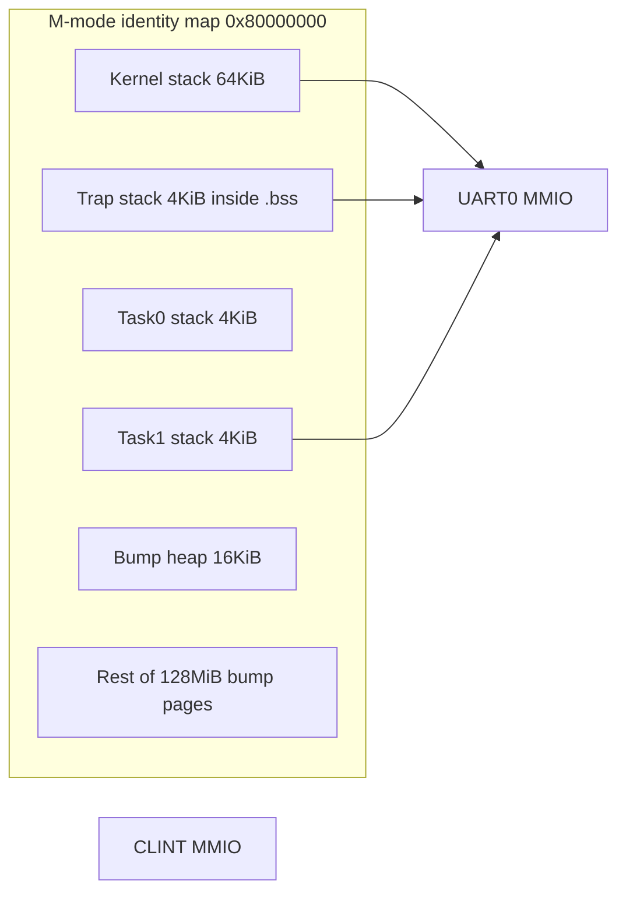
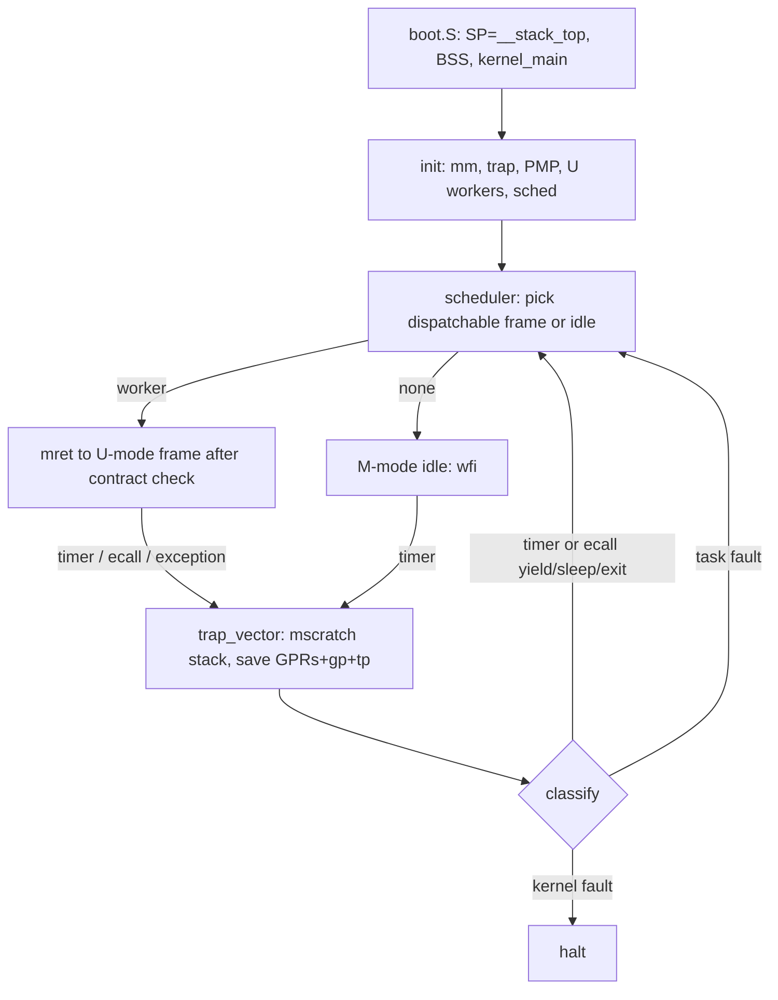

# PicoOS Revival: Contract-Checked Frame Kernel

| Field | Value |
| --- | --- |
| Title | PicoOS 0.2 Frame Kernel |
| Date | 2026-09-04 |
| Status | Draft |
| Tree audited | `/Users/vladislavkalinkin/PicoOS` (package `PicoOS` 0.1.64, edition 2021) |
| Target | RISC-V 64 (`riscv64gc-unknown-none-elf`), QEMU `virt`, `-bios none` |
| Milestone | **PicoOS 0.2 “Frame Kernel”** — a correct uniprocessor kernel with U-mode frames, PMP isolation, real preemption, and a leak-free page policy |

---

## Overview

PicoOS is a working RISC-V hobby kernel with a surprisingly strong *testing culture* around cooperative yield, resume-frame checks, sleep/wake, and trap-vs-task fault classification. It is not yet a serious kernel. It still runs everything in M-mode with no hardware isolation, bump-only allocators that never free, a default boot path that never actually runs the scheduler, and a ~35-feature maze that hides the real dispatch/restore code behind selftests.

This document audits the tree as it exists, then proposes a revival that is neither “mini Linux” nor “xv6 in Rust”. The identity is a **Contract-Checked Frame Kernel**: the scheduling unit is a *frame* (stack range + saved trap image + lifecycle FSM + resume contract), and every control transfer — boot, trap, yield, sleep, preemption, fault — is a named, UART-observable contract. **0.2 isolation is U-mode frames + unlocked PMP + `ecall`**, with the kernel remaining M-mode and `-bios none`. That is real RISC-V isolation without Sv39 or OpenSBI. Sv39 S-mode is 0.3. The milestone is finite: one hart, QEMU virt, UART+CLINT, no VFS, no net, no SMP.

---

## Background & Motivation

### Why revive now

The tree already contains the seeds of a real kernel, not a print-and-halt demo:

- Dedicated trap stack and `mscratch` swap in `src/arch/riscv64/trap.S`.
- Lifecycle states `Empty | Ready | Running | Blocked | Finished | Faulted` and return kinds `Yield | Sleep | Exit | Fault` in `src/kernel/task/table.rs`.
- Resume-frame safety checks (`is_resume_frame_safe_for_task`) that require SP inside the task stack, PC inside kernel text, and consistency with the last saved return context.
- QEMU marker tests under `scripts/` that treat UART strings as the contract.

Those are the right instincts. They are currently implemented as a **selftest product**, not as the always-on kernel.

### Current state (inventory)

**Layout (keep; it is already the right grain):**

```
src/main.rs
src/arch/          riscv64 boot, CSRs, trap.S, timer, yield stubs
src/drivers/       mmio + UART
src/platform/      qemu_virt_riscv64 constants
src/kernel/        banner, heap, log, memory, ticks, trap_frame, test
src/kernel/task/   table, scheduler, entry, fault, debug, context, tests
linker-riscv64.ld
scripts/           15 shell scripts; qemu-expect.sh is the harness
.cargo/config.toml target + static link + linker script
```

No `rust-toolchain.toml`, no `clippy.toml`, no `rustfmt.toml`, no host `#[test]` (the bin crate sets `test = false`). Active toolchain on the audit host: **rustc 1.97.1**, which supports edition 2024.

**Scale (source only, excluding `target/`):**

| Item | Count |
| --- | ---: |
| Rust files | 34 |
| Assembly files | 2 (`boot.S` 23 lines, `trap.S` 91 lines as counted by `wc -l`) |
| Rust LOC | 7,681 |
| Shell scripts | 15 / 279 LOC |
| Cargo features | 35 |
| `cfg(feature` gates | **147** (308 is the number of `feature = "` substrings, including multi-feature `cfg` lists) |
| `#[allow(...)]` | 204 (137 `dead_code`, 49 clippy of which **47** are `needless_range_loop` in `table.rs`, plus `needless_return` / `manual_memcpy`, 18 `unused_imports`) |
| `unsafe` token | 144 |
| `static mut` | 20 |
| `core::mem::transmute` | 1 (`task_trampoline_raw`) |
| `todo!` / `unimplemented!` | 0 |

Largest files: `src/kernel/task/table.rs` (1,572), `scheduler.rs` (1,042), `task/test/resume.rs` (860), `arch/riscv64/mod.rs` (782). Together they are ~55% of the Rust tree. `table.rs` alone has 73 `dead_code` allows and 47 `clippy::needless_range_loop` allows.

**What boots today (`src/main.rs::kernel_main`):**

1. UART banner (`PicoOS 0.1.64`).
2. If `selftest`: memory/heap/task-table prints, then `halt`.
3. Else: `arch::init_exceptions`, print CSRs, `kernel::test::run_runtime_selftest_bootstrap` (page bump + heap bump + create tasks via `test_tasks()` / yield variants), `scheduler::init` (round-robin cursor onto first Ready), arm CLINT timer at **1 Hz**, enable `MIE`/`MTIE`, `wfi` forever.
4. After `ticks::MAX_TEST_TICKS` (5) timer interrupts, `handle_timer_interrupt` in `src/arch/riscv64/traps.rs` (lines 216–221) calls `arch::halt()`. That is the default “runtime”, not a separate test helper.

Default path never calls `scheduler::dispatch_next` / `run`. Those exist only under `scheduler_dispatch_test` and friends.

The live IRQ path does **not** call `scheduler::on_timer_tick`. That function prints and calls `schedule_next()` without switching; it is dead-ish. The IRQ path calls `decide_next_task_dry_run()`, optionally the `timer_preemption_prototype` restore jump, then re-arms or halts.

**Platform contract (`src/platform/qemu_virt_riscv64.rs`, `.cargo/config.toml`, `scripts/run-riscv.sh`):**

- Load at `0x8000_0000`, 128 MiB RAM, UART0 `0x1000_0000`, CLINT `mtime`/`mtimecmp` hart 0, timebase 10 MHz.
- QEMU: `-M virt -bios none -nographic`.
- Panic = abort in both profiles.

### Pain points

1. **The kernel you can `cargo build` is not the kernel the tests exercise.** Dispatch, restore, fault classification, and preemption are feature-gated. The always-on binary is a timer demo that stops after five ticks.
2. **No hardware isolation.** Tasks execute the same M-mode identity map as the kernel. “Isolation” is a debug `Option<usize>` plus software stack-range checks. Unlocked PMP cannot separate two M-mode contexts; that is why 0.2 drops frames to U-mode rather than “PMP in M-mode.”
3. **Allocators never free.** `memory::allocate_page` and `heap::alloc` are bump pointers. Task stacks (one page each) are leaked for the life of the machine. Policy “no leaks” is currently unenforceable. Finished tasks stay `Finished`, not `Empty`, so slots are not reused.
4. **Unsafe is unstructured.** Twenty `static mut` cells, no interrupt-disabled critical sections around most of them, UART/MMIO unsynchronized with the timer ISR. `disable_machine_interrupts` / `enable_machine_interrupts` are not nestable (`csrc`/`csrs` on `mstatus.MIE`).
5. **Feature graph is a development journal.** 35 features encode the order experiments were added (`resume_candidate_test` → `real_resume_restore_jump` → `scheduler_reentry_test` …). That is not a kernel config surface.
6. **Clippy is denied-warnings in `scripts/check-all.sh` and is green only because of 204 `#[allow]`s.** Pedantic/nursery are unused; turning them on with `-D warnings` before cleanup is not mergeable.

---

## Goals & Non-Goals

### Goals (milestone 0.2)

- **Audit-driven hygiene:** edition 2024, pinned toolchain, Clippy `-D warnings` as the CI bar, no blanket `allow`s, no dead code in the default build. Pedantic is a later, explicit allow-list PR — not the Phase 0 merge gate.
- **One kernel path:** scheduler, yield, sleep, preemption, and fault handling compile and run without a dozen features.
- **Correct primitives**, not throwaway toys:
  - page allocator with **free** and slot **reap**
  - no general heap until free works
  - full trap frame save/restore including `gp`/`tp`, synthesized `mstatus` (`MIE=0`), `csrw mepc`, then `mret` (or idle-exit without `mret`)
  - U-mode frames; yield/sleep/exit/log via **`ecall`** with **`mepc += 4`** on resume
  - timer preemption that is a trap-path context switch, not a dry-run print
  - unlocked PMP: TOR `.text` **RX** then `.rodata` R, then NAPOT current stack; kernel data / trap stack / MMIO unmatched = deny
- **Safety policy:** privilege boundaries, `unsafe` budget with SAFETY comments, nestable IRQ masking, panic/fault policy, mechanical leak check.
- **Keep the QEMU UART contract:** existing `scripts/*.sh` remain, markers may be renamed only with script updates in the same PR. After U-mode, **the kernel** prints markers (syscall `log`), so scripts still match strings.
- **Unique identity:** named, always-compiled, UART-stable contracts at every control transfer; hardware isolation is U-mode+PMP, claimed in the banner only after it denies a worker store.

### Non-goals (explicitly out of 0.2)

- Linux compatibility, POSIX, ELF userland, libc, init/systemd thinking.
- Classroom clone of xv6 (no `fork`/`exec`/`pipe` teaching syscall set).
- SMP / multi-hart scheduling.
- VirtIO, filesystems, networking, block devices.
- S-mode + Sv39 user address spaces (this is **0.3**, documented so 0.2 does not paint into a corner).
- Formal seL4-style proofs.
- Host `std` unit tests as a substitute for QEMU contracts (host tests may be added later for pure functions; they are not the milestone gate).
- Clippy nursery as a `-D` CI gate (unstable across 1.97 patch releases).

---

## Audit: what is already right vs simplified/wrong

### Already right (keep)

| Area | Evidence | Why it is real |
| --- | --- | --- |
| Dedicated trap stack | `trap.S` `.bss.trap_stack` 4 KiB, `csrrw sp, mscratch, sp`, restore `mscratch` to `__trap_stack_top` before `mret` | Real kernels do not take traps on the interrupted stack until they know it is valid. |
| Trap frame layout | `Riscv64TrapFrame` matches the 232-byte save in `trap.S` (sp, ra, t*, a*, s*) | GPR save is the actual interrupt ABI, not a toy “save pc only”. **Gap:** `gp` and `tp` are omitted. |
| Timer via CLINT | `timer.rs` `mtime`/`mtimecmp`, `cpu::enable_machine_timer_interrupt` | Correct M-mode timer programming for QEMU virt. |
| Linker symbols | `linker-riscv64.ld` 4K-aligned `text/rodata/data/bss`, `__free_memory_start` | Usable as the basis for PMP and a real page allocator. Trap stack currently lives *inside* `.bss` and must be split before a kernel-data TOR. |
| Task lifecycle FSM | `TaskLifecycleTransition`, `can_transition_from`, `apply_task_return_transition` | Distinguishes yield/sleep/exit/fault; dispatchable ≠ Ready. |
| Resume contract | `is_resume_frame_safe_for_task`, `validate_resume_frame` | SP-in-stack + PC-in-text + record consistency is how you stop wild jumps. |
| Fault vs kernel halt | `fault::classify_current_trap_fault`, `kernel_fault_guard_test` | Nested/kernel faults halt; task faults do not resume the bad frame. |
| Sleep/wake | `mark_task_blocked_until`, `wake_sleeping_tasks(tick)` | Time is a first-class blocker. Wake already sets `can_resume = is_resume_frame_safe_for_task(id)`. |
| Observable tests | `scripts/qemu-expect.sh` success marker + fail on `FAILED` / `[FAIL]` | Treats boot logs as a specification. |

### Simplified or wrong (must not survive 0.2)

| Severity | Issue | Evidence | Real-kernel version |
| --- | --- | --- | --- |
| **High** | No hardware isolation | No `satp`, no PMP CSRs, no U-mode. Tasks call kernel functions in M-mode. Unlocked PMP would not apply to those tasks. | Drop frames to U-mode; unlocked PMP; `ecall` only. Sv39 remains 0.3. |
| **High** | Yield restore drops callee-saved regs | `restore_resume_frame_real_jump` does `mv sp; mv ra; jr resume_pc`. `LAST_RISCV_YIELD_CONTEXT` is captured by an unused helper. | Until U-mode: save/restore `s0–s11`. After U-mode: yield is `ecall` and the trap image is the CpuImage. |
| **High** | Cooperative yield stub is a placeholder | `yield_to_kernel_returning_stub` prints `"mode: placeholder"` and jumps to kernel stack via `return_to_kernel_stack_checked`. | One yield entry: `ecall` (0.2 end state) or ABI-correct M-mode save (interim). |
| **High** | Default timer path does not preempt | `handle_timer_interrupt` saves SP/PC, **dry-run** `decide_next_task_dry_run`, re-arms, `mret` to the *same* context. After 5 ticks, halt in `traps.rs`. Real switch is behind `timer_preemption_prototype`, which `jr`s from IRQ with `MIE` clear. | Timer ISR: wake sleepers, pick next, rewrite in-place trap frame, `csrw mepc`/`mstatus`, `mret`. Idle is M-mode `wfi`. |
| **High** | Bump allocators, no free, no reap | `memory.rs`, `heap.rs`. `Finished` never returns to `Empty`. `NEXT_TASK_ID` only increments. | Bitmap page allocator + `destroy`/`reap`. |
| **High** | Current-task identity is a debug global | `debug_current_task_id()` is `DEBUG_CURRENT_TASK.unwrap_or(0)`. Idle (id 0) is the fallback. | Per-hart `Cpu { current: Option<TaskId> }`. Idle is **not** a task slot. |
| **Medium** | Scheduler not on the default path | `kernel_main` WFI loop; `dispatch_next`/`run`/`handle_task_return` are `cfg(feature = …)`. Default `idle_task` prints one line and returns (then would `task_exit` if anyone ran it). | Always-on scheduler; defined default workers (see Default image). |
| **Medium** | Linear task table scans | `MAX_TASKS = 4`, every getter is `for slot in 0..MAX_TASKS` + 47 `needless_range_loop` allows. | `id == slot`; `MAX_TASKS = 8`. |
| **Medium** | `static mut` vs timer ISR | 20 `static mut` (debug 9, table 3, heap 3, memory 2, scheduler 1, `LAST_RISCV_YIELD_CONTEXT` 1, handoff test 1). | `UnsafeCell` behind nestable `without_interrupts`. |
| **Medium** | Panic drops info | `panic(_info: &PanicInfo)` prints `"KERNEL PANIC"` only. | Print location + message, then halt; nested panic → immediate halt. |
| **Medium** | UART is not polled | `uart::putc` `write32(UART0_BASE, byte)` with no LSR. | Poll `LSR.THRE`; optional `try_putc` for trap context. |
| **Medium** | `ticks::MAX_TEST_TICKS` is wired into production timer | `traps.rs` 216–221. | Test-only; production idle loops forever. |
| **Low** | ARM leftover + Russian rustdoc | `copy_name` ARM64 comment; `TaskFaultReason::from_mcause` rustdoc is Russian. | English-only comments; RISC-V only. |
| **Low** | `trigger_test_exception` dead | `main.rs` `#[allow(dead_code)]` `ebreak` helper. | Use it in a fault test or delete. |
| **Low** | `check-all.sh` gap | QEMU markers run 6 scripts; omits `test-timer-preemption-riscv.sh` and scheduler `run` / `run-once` / `runtime` / `reentry`. Ends with `cargo clean`. | Add timer-preemption when preemption lands; full matrix at the end. No clean at end of CI. |

### Isolation as it exists (software only)



Any task can store to kernel memory or MMIO. Resume checks prevent *accidental* wild PCs; they do not prevent a buggy or hostile task from touching kernel data.

---

## Proposed Design

### Thesis: Contract-Checked Frame Kernel

PicoOS is **not** a Unix. There are no processes, files, or POSIX syscalls in 0.2. The kernel’s unit of execution is a **Frame**:

```text
Frame = TaskId
      × privilege U                -- mret with mstatus.MPP = U
      × stack [base, top)          -- exclusive PMP region while running
      × TrapImage                  -- full GPR + mepc + mstatus
      × Lifecycle                  -- Empty/Ready/Running/Blocked/Finished/Faulted
      × ResumeContract             -- predicates that must hold before mret
      × ReturnKind                 -- None/Yield/Sleep/Exit/Fault
```

**Uniqueness (what 0.2 actually ships):**

1. **Named contracts at every control transfer**, always compiled, UART-stable. This already exists as prototypes (`is_resume_frame_safe_for_task`, `DispatchDecision::{StartFresh, ResumeSaved}`, trap-stack guard) and becomes the product, not a feature flag.
2. **U-mode + PMP isolation** so a worker store to kernel `.data` or UART is a task fault, not a compromised kernel. The banner (PR23) may say “PMP isolation” only after a QEMU test provokes that store and sees `Faulted`.

This is not mini-Linux (no VFS, no user ABI beyond four `ecall`s, no SMP, M-mode owner of the machine, `-bios none`). It is not xv6 (no fork lab). It is a small uniprocessor kernel whose correctness story is *checked frames* plus real U/M privilege.

### Milestone definition: PicoOS 0.2

**Done when** a default `cargo build` binary on QEMU virt:

1. Boots, inits page allocator, trap vector, PMP, U-mode workers, scheduler.
2. Runs the **default image** (M-mode idle + two U-mode workers: yield + sleep), round-robin, with timer preemption and cooperative yield via `ecall`.
3. Sleeps a frame and wakes it on tick when a valid `TrapImage` exists.
4. On task exception (including PMP deny): marks Faulted, never resumes that frame, continues others.
5. On kernel exception or trap-stack overflow: halt with panic/fault log.
6. `destroy`/`reap` of a Finished/Faulted worker returns its stack page and slot; QEMU marker `mm leak check: OK`.
7. Does not halt after five ticks.
8. Existing marker scripts pass (updated in-tree).

**Success metric:** `scripts/check-all.sh` green with Clippy **`-D warnings`** (not pedantic/nursery as deny) and the QEMU matrix below.

### Default image (always-on binary)

Today `test_tasks()` creates `idle` / `worker-a` / `worker-b` whose bodies print one line and return (`src/kernel/task/test.rs` `idle_task`, `worker_a_task`, `worker_b_task`). That cannot be the 0.2 default: they would `Finished` immediately and the table would drain.

**0.2 default (no scenario feature):**

| Role | Privilege | Entry | Behavior |
| --- | --- | --- | --- |
| Idle | M-mode, **not a `Task` slot** | `scheduler::idle_loop` | `loop { wfi }` with timer armed. Never `Finished`. |
| `worker_yield` | U-mode, slot 0 | `worker_yield_main` | Once: `u_sys_log("worker-yield")`. Then loop: `u_sys_yield()` with **no** further log. |
| `worker_sleep` | U-mode, slot 1 | `worker_sleep_main` | Once: `u_sys_log("worker-sleep")`. Then loop: `u_sys_sleep(2)` with **no** further log. |

Default boot markers (kernel-printed, stable):

- `default image: idle + worker_yield + worker_sleep`
- After each worker has entered the kernel at least once: `default scheduler: yield and sleep OK`

Scenario features (not the default image) remain for fault / kernel-fault / preempt-stress / reap / existing resume-ladder scripts until feature collapse.

### Architecture (0.2)



### Control transfers (the contracts)

Every transfer is named. Implementation may print under `log_*` features; tests assert the marker.

**End state: there is no function-call yield.** U-mode `sys_yield` is `ecall` with `a7 = 0`. The saved image is always a `TrapImage`. Interim M-mode yield (PR14, before U-mode) still saves `s0–s11` so existing resume scripts keep working.

```mermaid
sequenceDiagram
  participant T as U-mode frame
  participant V as trap_vector
  participant H as riscv64_trap_handler
  participant S as scheduler
  T->>V: ecall yield (a7=0)
  V->>V: swap to trap stack, save GPR including gp/tp
  V->>H: frame pointer
  H->>H: mepc += 4; copy TrapImage; mark Ready Yield
  H->>S: ResumeContract(next)
  S->>V: rewrite in-place frame, csrw mepc/mstatus (MIE=0, MPIE=1)
  V->>T: mret (MPP as in restore table)
```

```mermaid
sequenceDiagram
  participant T as U-mode frame
  participant V as trap_vector
  participant H as riscv64_trap_handler
  participant S as scheduler
  T->>V: interrupt (mtime)
  V->>V: swap to trap stack, save full GPR
  V->>H: frame pointer
  H->>H: wake_sleeping_tasks(tick)
  H->>S: pick next (worker or idle)
  alt next is worker frame
    S->>V: rewrite frame + mepc/mstatus (MIE=0; do not add 4)
    V->>T: mret
  else next is idle
    S->>Idle: idle-exit sketch (reset mscratch, no mret)
  end
```

**`mepc` on `ecall` (mandatory):** Hardware leaves `mepc` at the `ecall` instruction (`mcause` exception 8). PicoOS emits uncompressed `ecall` (4 bytes; do not emit `C.ECALL`). The trap handler **adds 4 to `mepc` before saving `TrapImage`** for `sys_yield`, `sys_sleep`, and `sys_log`. Timer and other exceptions **must not** add 4. `sys_exit` does not resume. Current `trap.S` does not touch `mepc`; this is new work in the handler, not implied by the epilogue. Forgetting `+4` livelocks yield and reprints `sys_log` forever.

**ResumeContract (0.2 `TrapImage`, replaces `is_resume_frame_safe_for_task`):**

- `sp ∈ [stack_start, stack_top)`
- `mepc ∈ [__text_start, __text_end)` (after the `ecall` `+4` when applicable)
- `state == Ready` and image present

**Retired:** `ra == resume_pc`, `return_pc` in `.text` as a second PC, and `TaskCpuContext` consistency with `last_kernel_return_pc`. After PR19, `ra` is the U-mode caller of the stub, not equal to `mepc`.

**Yield contract (cooperative, 0.2 end state):**

- Cause is environment call from U-mode (`mcause` exception 8).
- Handler: `mepc += 4`, then save `TrapImage`.
- `ResumeContract` holds. `ReturnKind = Yield`, state `Ready`.
- Table update under nestable interrupts-off.

**Preempt contract (timer):**

- Full trap image saved on the trap stack (`trap.S`), including `gp`/`tp`.
- `mepc`/`mstatus` snapshotted in `TrapImage` (they are CSRs; `trap.S` does not store `mepc` in the 232-byte frame today). **Do not** add 4.
- Running frame becomes Ready with that `TrapImage`.
- Restore is **only** rewrite-in-place + `csrw mepc` + `csrw mstatus` (with `MIE=0`) + existing `mret` epilogue, **or** the idle-exit sketch. No `jr` from the trap handler.

**Fault contract:**

- `current.is_some()` and (`MPP` was U, or the faulting address is the current task stack, or cause is U-mode `ecall` with bad args): `Faulted`, do not resume, schedule others.
- Interrupted region is kernel text/data, trap stack, kernel stack, or `current` is `None`: **kernel fault → halt**.
- Double fault (already Faulted, or trap on trap stack overflow): halt.

**Sleep contract:**

- `sys_sleep` is `ecall` `a7 = 1`. `mark_task_blocked_until` as today (`can_resume = false` while Blocked).
- `wake_sleeping_tasks` already does `can_resume = is_resume_frame_safe_for_task(id)` and sets `last_return_kind` to `Sleep` or `None` from that result (`table.rs` 1523–1552). That is **correct** for a task with no saved image.
- The table selftest in `test/bootstrap.rs` never installs a resume frame, so it correctly expects `!can_resume_after_wake`. That is a no-image fixture, not a spec that wake must always fail.
- 0.2 adds a second table test that injects a valid image and expects `can_resume == true`. **PR17** injects a `TrapImage` whose `mepc` is in `.text` and `sp` in-stack (or, if PR17 still runs on M-mode workers, the same fields on the interim image). **PR19** updates that fixture if any `YieldImage` / `ra == resume_pc` check remains. E2E sleep is a separate path after yield/`mret` work.

### Restore table (implement this, not “jr or equivalent”)

`trap.S` restores GPRs from the in-place frame and `mret`s using the **`mepc` CSR**, which is not in the memory frame. Switching to a **worker** therefore:

1. Writes GPRs into the current trap-stack frame (the one `sp` points at in the handler).
2. `csrw mepc, image.mepc` (already `+4` if this image was saved from `ecall`; raw interrupt PC if from timer).
3. `csrw mstatus, synthesized` — **never** a raw copy of saved `mstatus`. Required bits: **`MIE=0`**, **`MPIE=1`**, **`MPRV=0`**, `FS` left as the kernel’s current FS (or `Off` if unused), `MPP` from the column below.
4. Falls through the existing epilogue to `mret` **only on the worker path**.

If `TrapImage.mstatus` were copied with `MIE=1`, the GPR restore would run with interrupts enabled on the trap stack (the bug PR7 closed). The handler stays `MIE=0` until `mret` consumes `MPIE`.

`MPP` is **phased**. PR16 workers are still M-mode (`uart::write_line`, no PMP deny). PR19 flips workers to U.

| Current | Next | PR16 (interim) | PR19 (end state) |
| --- | --- | --- | --- |
| Worker running, **timer** | Another worker | Copy frame; `csrw mepc` **without +4**; `MPP=M`; `mret` | Same copy; `MPP=U`; `mret` |
| Worker running, **`ecall` yield/sleep/log** | Another worker | N/A (no `ecall` yet; function-call yield) | `mepc` already `+4` in saved image; `MPP=U`; `mret` |
| Worker running, timer or yield | Idle | **Idle-exit sketch** (no `mret`) | Same idle-exit sketch |
| M-mode idle, timer | Worker | Build frame; Fresh: `mepc=trampoline`; Resume: saved image; `MPP=M`; `mret` | Same; `MPP=U` |
| Worker, exit or fault | Next worker or idle | Reap or Faulted; then worker or idle-exit row | Same |
| Fresh StartFresh | Trampoline | `mepc = task_trampoline`, `a0 = entry`, `sp = stack_top`, other GPRs zero, `MPP=M` | Same with `MPP=U`; trampoline is U-safe (no UART) |

**PR16 must not cite “restore table as specified” without the PR16 column.** It `mret`s to **M-mode** frames. PR19 is the only PR that sets `MPP=U`, installs `ecall` stubs, and tightens PMP.

**Sketch A — worker ← worker (handler, IRQs already off):**

```text
# a0 = &TrapImage for next worker
# t0 = trap-stack frame (current sp)
copy  TrapImage.gpr  ->  (t0)     # includes gp, tp, sp, ra, t*, a*, s*
csrw  mepc,    TrapImage.mepc    # +4 already applied iff image came from ecall
# synthesize mstatus; do not copy TrapImage.mstatus verbatim
# MIE=0, MPIE=1, MPRV=0, MPP=M (PR16) or MPP=U (PR19)
csrw  mstatus, synthesized
# fall into trap.S: reset mscratch to __trap_stack_top, restore GPRs, mret
```

**Sketch B — worker → idle (must not fall through `mret`):**

`trap.S` entry is `csrrw sp, mscratch, sp` (trap stack in `sp`, interrupted SP in `mscratch`). The worker `mret` epilogue does `la t6, __trap_stack_top; csrw mscratch, t6` then `mret`. Skipping that while jumping to idle leaves `mscratch` as the **worker stack**. The next idle timer then swaps onto the worker stack as the trap stack. The trapped `mstatus.MPP` may still be U; an accidental later `mret` would drop to U.

```text
# still on trap stack, IRQs off, do not restore worker GPRs, do not mret
la    t0, __trap_stack_top
csrw  mscratch, t0              # (1) next trap uses the trap stack
# (2) switch sp to the kernel stack (__stack_top or saved kernel_sp)
# (3) synthesize mstatus: MPP=M, MIE=1, MPIE=1, MPRV=0
csrw  mstatus, synthesized
# (4) jump to idle_loop — never mret on this path
j     idle_loop
```

**`gp` / `tp`:** add them to `Riscv64TrapFrame` and `trap.S`. `.cargo/config.toml` uses `relocation-model=static`, so LLVM should not use `gp` as a GOT base, and there is no TLS so `tp` should be unused — but they are **not** caller-saved scratch in the RISC-V ABI. Omitting them is a silent corruption if the compiler spills through them. Save and restore both.

### Privilege and isolation (0.2: U-mode + PMP, no Sv39)

**Rejected:** “PMP while both kernel and tasks stay in M-mode.” Unlocked PMP is not checked for M-mode. Locked entries (`pmpcfg.L`) apply the *same* permissions to M-mode, so denying kernel `.data` to a task would deny it to the kernel. `mseccfg.MML` (Smepmp) still does not mean “this hart as task vs this hart as kernel” while both execute in M.

**Accepted:** M-mode kernel, U-mode frames, unlocked PMP (checked for U), `mret` with `MPP=U`, `ecall` as the only legal U→M entry. Still `-bios none`. No OpenSBI, no `satp`, no page walker.

Workers remain Rust `fn` in `.text` (Open Question 2 resolved: **RX on `.text` for U**, **R on `.rodata`** so `&'static str` can be passed to `u_sys_log` and so `auipc+ld` / jump tables in `.text` do not fault). They do not store to kernel data or MMIO; UART goes through `u_sys_log` → kernel `sys_log`. Execute-only `.text` is a 0.3 tightening after a compiled dump shows no text-section loads. Isolation vs kernel **data**/MMIO does not depend on stripping R from `.text`.

| Region | U-mode | M-mode (unlocked PMP ignored) |
| --- | --- | --- |
| Kernel `.text` | **RX** (workers + trampoline; no W) | RWX as today |
| Kernel `.rodata` | R | R |
| Kernel `.data/.bss` + kernel stack | none (PMP miss = deny) | RW |
| Trap stack (own section, not inside `.bss` TOR) | none | RW |
| Current task stack | RW (one NAPOT entry retargeted on switch) | RW |
| Other task stacks | none | RW |
| UART + CLINT | none — `sys_log` / kernel timer only | RW |
| Free page pool | none | RW |

**Two layers — U-mode stubs vs M-mode handlers.** This is a **source-level** rule, not a link-time split: PicoOS is one `riscv64gc-unknown-none-elf` binary. After PR19, U has **RX** on the whole `.text`, so a hostile frame can `jal` a M-mode handler. That is contained (MMIO/CSR from U faults via PMP miss or illegal CSR) and is accepted until 0.3 (optional `.text.user` + tighter X range; not in 0.2). Worker/trampoline **Rust** may call only `u_sys_*`. Compiling a worker that calls `sys_*` / `uart::*` / `mmio::*` is a bug.

| Layer | Names | Allowed to do | Forbidden (source) |
| --- | --- | --- | --- |
| U-mode stubs | `u_sys_yield`, `u_sys_sleep`, `u_sys_exit`, `u_sys_log` | `ecall` only (`a7` as below). No MMIO, no `without_interrupts`, no UART, no table access. | Calling `uart::write_line`, `mmio::*`, scheduler, `sys_*` |
| M-mode handlers | `sys_yield`, `sys_sleep`, `sys_exit`, `sys_log` | Run in `riscv64_trap_handler` after classifying `ecall`. UART, table, PMP retarget. | Being **called** from worker/trampoline Rust. Handler **bytes** remain fetchable in U in 0.2; do not pretend otherwise. |

`task_trampoline` after PR19 is U-mode (`mepc = task_trampoline`, `MPP=U`): it must **not** print UART. `TaskEntry` is `extern "C" fn() -> !`, so the trampoline is `entry();` only — no `task_exit` via kernel UART. If `entry` returns, that is a Rust `-> !` violation; debug builds may `u_sys_exit`.

**Tiny `ecall` ABI (`a7` = number), used only by U stubs:**

| `a7` | Stub | Args | Handler | `mepc` |
| --- | --- | --- | --- | --- |
| 0 | `u_sys_yield` | — | Yield contract | `+= 4` then save |
| 1 | `u_sys_sleep` | `a0` = ticks | Sleep contract | `+= 4` then save |
| 2 | `u_sys_exit` | — | Finished + reap | do not resume |
| 3 | `u_sys_log` | `a0` = ptr, `a1` = len | If ptr+len is in current stack or `.rodata`, copy to UART; else task fault | `+= 4` then save; `mret` to the instruction after `ecall` |

No other `ecall`. Illegal `a7` → task fault. Existing UART markers are emitted by the **kernel** (`sys_log` or scheduler prints), so `qemu-expect.sh` keeps matching lines.

**PMP programming (QEMU virt: 16 entries).** Unlocked (`L=0`) so the kernel can retarget the current-stack entry; M-mode ignores unlocked entries.

**TOR vs NAPOT encoding (do not mix):**

- **TOR** entry *i* matches `pmpaddr[i-1] ≤ y < pmpaddr[i]` **regardless of** `pmpcfg[i-1]`. `pmpaddr[i] = end >> 2` (the byte address of the first byte *not* in the region, shifted). TOR regions must be **first**, in **increasing address order**, each with a dedicated lower-bound `pmpaddr` (previous TOR or a dummy TOR/OFF).
- **NAPOT** 4 KiB at `base` (4 KiB-aligned): `pmpaddr = (base >> 2) | 0x1FF`, `A=NAPOT`. Not `base >> 2` alone (that is TOR). Put NAPOT **after** the low-memory TOR chain so a stack in high RAM cannot become TOR *i−1* for `.text`.

If pmp0 is a NAPOT stack at `~0x80xx_xxxx` and pmp1 is TOR `__text_end`, pmp1’s lower bound is the **stack** encoding and TOR typically matches **nothing**. U-mode fetch of workers then misses and is denied.

Move `.bss.trap_stack` **out of** `.bss` in `linker-riscv64.ld` (own 4K-aligned section after `__kernel_end`, before `__free_memory_start`). Today it is swallowed by any TOR over `.bss`. Align the 64 KiB kernel stack to 64 KiB (`ALIGN(64K); . += 0x10000`) so a later TOR/NAPOT can cover it if needed. Kernel data/MMIO stay **unmatched** (U deny).

| Index | Encoding | `pmpaddr` | Coverage | `pmpcfg` (U) | Lock |
| --- | --- | --- | --- | --- | --- |
| pmp0 | TOR **or** OFF | `__text_start >> 2` | **Not empty.** TOR entry 0 uses **zero** as the lower bound: `y < pmpaddr0` → `[0, __text_start)`. **Pick one:** (a) `A=TOR` with no R/W/X — deny window over MROM/CLINT/UART (harmless and useful); or (b) `A=OFF` — matches nothing, only supplies the TOR bound for pmp1. **Do not** skip pmp0 and put `.text` RX on pmp0: that would RX-map `[0, __text_end)` including UART. | (a) `A=TOR`, no R/W/X, `L=0`; or (b) `A=OFF`, `L=0` | no |
| pmp1 | TOR | `__text_end >> 2` | `[__text_start, __text_end)` — **first RX entry** | `R|X`, `A=TOR`, `L=0` | no |
| pmp2 | TOR | `__rodata_end >> 2` | `[__text_end, __rodata_end)` assuming `.rodata` follows `.text` with no gap; if the linker leaves a gap, insert an extra TOR/OFF bound at `__rodata_start` | `R`, `A=TOR`, `L=0` | no |
| pmp3 | NAPOT 4 KiB | `(stack_start >> 2) \| 0x1FF` | current task stack | `R|W`, `A=NAPOT`, `L=0` | no — rewritten on switch |
| pmp4–15 | OFF | 0 | unused | `A=OFF` | no |

**Bring-up test (PR19):** after the first `mret` to U, the first instruction of `worker_yield_main` (or the trampoline) **must retire**, not take an instruction-access fault. UART dump of `pmpcfg`/`pmpaddr` on init. Prove deny with a deliberate U-mode store to kernel `.data` or UART.

Init path (PR18): program entries OFF or identity-dump only; do not yet `mret` to U. Tighten in PR19. Do not use QEMU `info mmu`.

**0.3 (not built):** S-mode kernel, Sv39 per-frame page tables, OpenSBI or a tiny M-mode trampoline. Optional `.text.user` + PMP X only on that section (so M-mode handler bytes are not U-executable). 0.2 regions are 4 KiB aligned so they can become page mappings later.

### Memory and leak policy

Replace both bump allocators.

1. **Page allocator** (`src/kernel/memory.rs`)
   - **Algorithm: bitmap**, not a freelist. Static storage: `[u64; 512]` (4 KiB) in `.bss` — capacity for 32768 bits (full 128 MiB from `RAM_START`). Not carved from the free pool, so it does not appear as a leak.
   - Let `free_start = align_up(__free_memory_start, 4K)` and `nbits = (RAM_END - free_start) / 4096`. Only bits `[0, nbits)` are valid; bit *i* is page `free_start + i * 4096`. Never allocate a bit whose address `≥ RAM_END`. Bits `nbits .. 32768` stay stuck invalid (not free).
   - `alloc_pages(n) -> Option<PhysPage>`, `free_pages(PhysPage, n)`.
   - Poison or zero on free in debug builds.
   - `MmStats { free, used, high_water }`. The bitmap itself is `.bss` and is not in `used`.
   - **Forbidden in IRQ** (timer, trap): `alloc_pages` / `free_pages`. Spawn and reap run in the kernel with IRQs off *after* leaving the need to allocate, or only from non-IRQ paths (`create` at boot, `reap` from `ecall` exit on the kernel stack after the trap handler scheduled). Practical rule: trap handler may `reap` (free one stack page) only after IRQs-off and not from a nested trap; if that is too tight, defer reap to idle. **Recommendation:** reap in the scheduler on the kernel stack with IRQs off, never from the raw ISR prologue.

2. **No general heap in 0.2.** Delete bump `heap.rs`. `Task` stays a static `[Task; MAX_TASKS]`. `HEAP_PAGES = 4` selftest becomes page alloc/free.

3. **`destroy` / `reap`:** `Finished | Faulted` → `free_pages(stack)` → state `Empty`, slot reusable. **Ids are slot indices and are reused** (`id == slot`). `NEXT_TASK_ID` monotonic counter is deleted.

4. **Leak invariant (mechanical, QEMU):**
   - Let `baseline = stats.used` after boot, with idle (no task stacks) + two default workers (2 pages) **or** after a reap scenario with zero live workers.
   - Exclude: idle (no page), trap stack (linker), kernel stack (linker), bitmap `.bss`, kernel image.
   - Scenario `scenario_reap`: `used_before = stats.used`; spawn worker; run to `sys_exit`; `reap`; `stats.used == used_before` and a second spawn succeeds. Print `mm leak check: OK`.
   - No 0.2 “corpse” flag.

### Scheduling and time

- **Always-on** round-robin over dispatchable U-mode frames. If none, M-mode idle.
- Idle is **not** task id 0. `Cpu.current` is `None` while idle.
- `MAX_TASKS = 8` (static table; 0.2 default uses 2).
- Timer: CLINT; **100 Hz** default (10 MHz timebase / 100 = 100_000 cycles). Sleep uses tick counts, not wall seconds. Scenario tests may arm slower if a script depends on 1 Hz; that is a parameter, not a new Cargo feature. Default workers `u_sys_log` **once** then yield/sleep quietly so 100 Hz does not flood `qemu-expect.sh` logs (20s timeout; later `FAILED` substring scans). Verbose per-yield logs stay behind `log_*`.
- `ticks` stays `AtomicU64`. Remove production `MAX_TEST_TICKS`.
- Delete `on_timer_tick` from any implication it is the IRQ path.

### `without_interrupts` (required for soundness)

`cpu::disable_machine_interrupts` / `enable_machine_interrupts` today are `csrc`/`csrs` of `mstatus.MIE` and **are not nestable**. `riscv64_trap_handler` already `disable_irq()` on entry. A table accessor that always enables on the way out would set `MIE` while still on the trap stack.

**Spec:**

```rust
/// Saves MIE, clears it, runs `f`, restores the previous MIE bit.
/// Does not force MIE=1.
fn without_interrupts<T>(f: impl FnOnce() -> T) -> T;
```

Implementation: `csrr` `mstatus`, `csrc` MIE, run `f`, restore the saved MIE bit only (not a blanket `csrs`).

- Trap path starts with IRQs off and **must not enable** until the chosen return (`mret` with `MPIE=1` and **`MIE=0` in the CSR written before `mret`**, or idle-exit sketch with `MIE=1` **after** `mscratch` is reset). Synthesized `mstatus` in the handler always has `MIE=0` on the worker path.
- Table/mm mutators use `without_interrupts` and **never** call `enable_irq()`.
- Nested `without_interrupts` from the trap path keeps MIE clear throughout.

### Panic and fault policy

| Event | Policy |
| --- | --- |
| `panic!` | Print `"KERNEL PANIC"` + `PanicInfo` (file, line, message if any) over UART; leave IRQs off; `halt`. |
| Nested panic | If a flag is set, skip UART and `halt`. |
| Task exception | Fault contract; do not panic. |
| Kernel exception | Panic/halt, not “task fault”. |
| Unknown interrupt | Log and halt (no silent drop). |
| Allocator OOM | Return `None` to caller; never panic in IRQ. Task create fails cleanly. |

### Module structure (Phase 1)

Keep `src/arch`, `src/drivers`, `src/platform`, `src/kernel/task`. Do **not** explode into a workspace.

| Change | Why |
| --- | --- |
| Split `arch/riscv64/mod.rs` (782 lines) into `yield.rs` / `restore.rs` / `context.rs` | Yield/restore is not “arch root”. After U-mode, U stubs live in a U-safe file (no UART); M-mode yield helpers are deleted. |
| New `arch/riscv64/pmp.rs` | PMP dump and switch retarget. |
| Keep `kernel/task/{table,scheduler,entry,fault,context,cpu_context}` | Already the right names. |
| Move `kernel/task/debug.rs` globals into `kernel/cpu.rs` (`per-hart Cpu`) | “Debug” is actually the current execution context. |
| Keep tests under `kernel/task/test/` | They *are* the contract suite. |
| Do not create `src/sched` vs `src/kernel` | Single-person tree; extra crates cost more than they save at 8 kLOC. |
| Delete ARM comments; translate Russian rustdoc; delete unused `return_from_interrupt` | Hygiene. |

### Feature flags after cleanup

**Keep as kernel config (few):**

- `kernel_log_scoped` + `log_trap` / `log_timer` / `log_fault` / `log_sleep` / `scheduler_verbose_dispatch_trace` / `verbose_resume_debug` — logging only.

**Collapse into always-on code:**

- `task_yield_test`, `resume_*`, `real_resume_restore_*`, `scheduler_*_test`, `two_yield_task_test`, `two_task_resume_handoff_test`, `timer_preemption_prototype` — ordinary code paths. Tests select *scenarios* in `kernel/test.rs`.

**Keep as scenario features until collapse PR:**

- `selftest` — no IRQ, memory/table only.
- `task_sleep_runtime_e2e_test`, `scheduler_fault_lifecycle_test`, `kernel_fault_guard_test`, `timer_preemption_selftest`, plus a new `scenario_reap`.

---

## API / Interface Changes

### Trap image (the only CpuImage in 0.2 end state)

Interim PR14 may still use `TaskCpuContext` / a `YieldImage` for M-mode function-call yield. After the U-mode PR that type is deleted.

```rust
#[repr(C)]
pub struct Riscv64TrapFrame {
    pub sp: u64,
    pub ra: u64,
    pub gp: u64, // added
    pub tp: u64, // added
    pub t0: u64, /* … t6, a0–a7, s0–s11 … */
}

pub struct TrapImage {
    pub frame: Riscv64TrapFrame,
    pub mepc: u64,
    pub mstatus: u64,
}

pub type CpuImage = TrapImage;
```

Restore: `return_via_mret(next: &TrapImage) -> !` from the trap epilogue only. No `jr` from the handler.

### Task entry ABI (ban `transmute`)

```rust
pub type TaskEntry = extern "C" fn() -> !;

#[no_mangle]
pub extern "C" fn task_trampoline(entry: TaskEntry) -> ! {
    entry();
}
```

`start_task_on_stack` / first `mret` passes `entry` in `a0` as the function pointer. No `usize` `transmute` in `task_trampoline_raw`. The only allowed bitcast is at the asm boundary: `entry as usize` documented as “function pointer to integer for `a0`.”

### Scheduler (always compiled)

```rust
pub fn init();
pub fn current() -> Option<TaskId>; // None = idle
pub fn spawn(name: &str, entry: TaskEntry) -> Option<TaskId>;
pub fn destroy(id: TaskId); // reap: free stack, Empty
pub fn idle_loop() -> !;
pub fn on_trap(image: &mut TrapImage); // timer, ecall, exception
```

U-mode stubs (worker/trampoline **source** may call only these): `u_sys_yield`, `u_sys_sleep`, `u_sys_exit`, `u_sys_log` — `ecall` only. M-mode handlers of the same operations run in `on_trap`. They live in the same `.text` and are fetchable from U in 0.2; they must not be **called** from worker Rust. Remove `DispatchResult` / `RunOnceResult` / `RunResult` duplication; one `Pick { Idle | Task { id, Fresh | Resume } }`.

### Page allocator

```rust
pub fn init();
pub fn alloc_pages(n: usize) -> Option<PhysPage>;
pub fn free_pages(base: PhysPage, n: usize);
pub fn stats() -> MmStats; // free, used, high_water
```

### Panic handler

Use `_info` (today it is ignored). No `allow(dead_code)` on the handler.

---

## Data Model Changes

`Task` in `table.rs` already has the right fields. Changes:

- Replace `cpu_context: TaskCpuContext` with `cpu: Option<TrapImage>`.
- `can_resume` is **derived**: `state == Ready && cpu.is_some() && ResumeContract(cpu)` where ResumeContract is `sp ∈ stack && mepc ∈ .text` (no `ra == resume_pc`). Wake is updated to that predicate in the U-mode PR; until then it may still call `is_resume_frame_safe_for_task` on the interim image.
- Index by `id == slot`. `MAX_TASKS = 8`. Ids reused on reap.
- Drop `LAST_RETURNED_TASK_ID` and `NEXT_TASK_ID`.
- Per-hart `Cpu { current: Option<TaskId>, in_trap: bool, mie_nest: … }` in one `UnsafeCell`.

No on-disk schema. No migration beyond “recompile”.

---

## Alternatives Considered

### A. S-mode + Sv39 user tasks in 0.2

- **Pros:** Matches Linux/FreeBSD/xv6 privilege story.
- **Cons:** OpenSBI or a homegrown M-mode stub, `stvec`/`sret`/`sstatus`, page-table walker. That is a second kernel. Single-person 0.2 would stall hygiene and preemption.
- **Decision:** 0.3. Keep 4 KiB regions so Sv39 is an add.

### B. Stay software-only “isolation” and call it a unique cooperative kernel

- **Pros:** Least code.
- **Cons:** Uniqueness must not excuse incorrect primitives. Software stack checks are not isolation.
- **Decision:** Rejected.

### C. Microkernel + IPC as the identity

- **Pros:** Distinct vs Linux.
- **Cons:** Vaporware relative to this tree.
- **Decision:** Rejected for 0.2.

### D. Tock-like capabilities

- **Pros:** Unique, Rust-y.
- **Cons:** Not grounded in current scheduler/trap code.
- **Decision:** Rejected for 0.2.

### E. Keep 35 Cargo features as the test matrix forever

- **Pros:** Current scripts keep working with zero thought.
- **Cons:** The production kernel never exists.
- **Decision:** Collapse code paths first; keep scenario features only where scripts need a different `kernel_main` shape.

### F. U-mode + PMP, no Sv39, no OpenSBI (accepted)

- **Pros:** Unlocked PMP actually applies to U-mode. Kernel stays M-mode (`-bios none`, `mtvec`, `mret`). Isolation is a real privilege boundary. Cost is `MPP=U`, four `ecall`s, PMP allow-list, moving the trap stack out of `.bss` — not a page walker.
- **Cons:** Existing workers call `uart::write_line` as ordinary functions; they must switch to `sys_log`. Resume-PC-in-kernel-text stays valid because workers still live in `.text`.
- **Decision:** **This is the 0.2 isolation model.**

### G. M-mode tasks + PMP (original draft; rejected)

- **Pros:** No `ecall` rewrite.
- **Cons:** Hardware does not distinguish two M-mode contexts. Unlocked PMP is theater; locked PMP would jail the kernel too.
- **Decision:** Rejected.

### H. Allow UART PMP to U-mode as an exception, deny only kernel data

- **Pros:** Keep `uart::write_line` in workers.
- **Cons:** “Kernel-mediated MMIO” becomes false; a worker can spam/corrupt the console; markers are no longer kernel-authored.
- **Decision:** Rejected in favor of `sys_log`.

---

## Security & Privacy Considerations

**Threat model (0.2):**

- Attacker: a buggy or hostile **U-mode frame** on the same hart.
- Assets: kernel image, kernel stack, trap stack, other tasks’ stacks, UART/CLINT, page allocator metadata (including the static bitmap).
- Not in model: multi-hart, DMA, speculative execution, malicious QEMU.

**Boundaries:**

| Boundary | Mechanism |
| --- | --- |
| Task → kernel data | U-mode + PMP miss deny |
| Task → other task stack | PMP pmp3 NAPOT retarget on switch |
| Task → MMIO | PMP miss deny; `u_sys_log` only |
| Task → kernel | `ecall` only; illegal `a7` is task fault |
| Task PC | ResumeContract (`mepc` in `.text`, `sp` in own stack); `ecall` images have `mepc += 4` |
| Trap re-entry | Dedicated trap stack (own section); overflow is kernel fault |
| IRQ vs table | Nestable `without_interrupts`; no `enable_irq` in mutators |

**`unsafe` budget after 0.2 (allow-list; everything else is a bug).** Every remaining `unsafe` block has a one-line comment:

```text
// SAFETY: <invariant>. IRQs off: <yes/no>. Pointer: <why valid>.
```

| # | Site | Why it remains |
| --- | --- | --- |
| 1 | CSR r/w in `cpu.rs` | Architecture. |
| 2 | MMIO in `drivers/mmio.rs` | Address must be in the platform map (debug assert). |
| 3 | `trap.S` / `boot.S` | Trap/boot. |
| 4 | In-place trap-frame copy + `csrw mepc` / synthesized `mstatus` | Restore table sketches A/B. |
| 5 | Linker symbol → address | `memory.rs`, trap stack top. |
| 6 | PMP CSR writes in `pmp.rs` | Init and pmp3 NAPOT retarget, IRQs off. |
| 7 | `Cpu` / `TASKS` / page bitmap via `UnsafeCell` in `without_interrupts` | Uniprocessor critical section. |
| 8 | `*const Riscv64TrapFrame` in `riscv64_trap_handler` | Pointer is the trap-stack frame from `trap.S`; must be in `__trap_stack_bottom .. __trap_stack_top`. |
| 9 | `prepare_initial_stack` stores | Pointer in the freshly allocated stack page. |
| 10 | `start_task_on_stack` / first `mret` / `return_to_kernel_stack` until deleted | Asm stack switch. |
| 11 | `copy_nonoverlapping` if used for `sys_log` | Source range checked in stack or `.rodata`. U stubs never copy. |
| 12 | `TaskEntry as usize` into `a0` | Function-pointer-to-integer at the asm boundary only. |

**Ban:** `transmute` of `fn()`, new `static mut`, `alloc_pages` in the raw ISR prologue, unchecked offsets on task stacks.

**`static mut` remaining after PR7:** **none** in production code. PR7 must include `src/kernel/task/table.rs`, `debug.rs`/`cpu.rs`, `memory.rs`, `heap.rs` (until deleted), `scheduler.rs`, `src/arch/riscv64/mod.rs` (`LAST_RISCV_YIELD_CONTEXT`), and test-only `src/kernel/task/test/handoff.rs`.

**Mechanical leak check:** `scenario_reap` QEMU marker `mm leak check: OK` is part of `check-all.sh` after PR12.

**Privacy:** no user data, no persistence. Do not log stack contents in default builds (verbose flags only).

---

## Observability

**Logging:** keep `kernel/log.rs` levels `INFO/OK/FAIL/TRACE` and scopes. Default build: boot banner, faults, panics, default-image markers. Verbose scopes remain feature-gated.

**Stable markers (do not churn casually):**

| Marker | Script |
| --- | --- |
| `scheduler resume loop result: OK` | `test-task-resume-selftest.sh`, `test-two-task-handoff-riscv.sh`, several scheduler scripts |
| `task sleep wake result: OK` | `test-task-sleep-riscv.sh` (no-image fixture; keep) |
| `task sleep runtime e2e result: OK` | `test-task-sleep-runtime-e2e-riscv.sh` |
| `task fault scheduler result: OK` | `test-scheduler-fault-lifecycle-riscv.sh` |
| `kernel fault guard result: OK` | `test-kernel-fault-guard-riscv.sh` |
| `timer preemption result: OK` | `test-timer-preemption-riscv.sh` — add to `check-all.sh` in the preemption PR, not only at the end |
| `default scheduler: yield and sleep OK` | default binary |
| `mm leak check: OK` | `scenario_reap` |

**Metrics:** ticks, context switches, yields, preemptions, wakes, faults, `mm.free`, `mm.used`.

**Alerting:** none. Fail-closed: contract failure prints `FAILED` and `qemu-expect.sh` exits 1.

**PMP bring-up:** UART dump of `pmpcfg`/`pmpaddr`, plus a U-mode store-fault test. Not QEMU `info mmu`.

---

## Rollout Plan

Single person. This is an **ordered series**, not 24 independently mergeable PRs. After every PR: `scripts/check-all.sh` as it exists at that step.

**Parallelizable sets:** `{PR0 then PR1}` before most work; `{PR8, PR9}` after PR1 with no other deps; `{PR4, PR5}` after PR3.

1. **Phase 0 — hygiene** — toolchain, edition, Clippy `-D warnings` *as today*, dead code. Not pedantic-as-deny.
2. **Phase 1 — cleanup** — modules, nestable IRQ mask, `Cpu`, `MAX_TASKS = 8`.
3. **Phase 2 — correct base** — bitmap allocator, reap, always-on dispatch, yield ABI, default image, `mret` preemption, U-mode+PMP, `ecall`.
4. **Phase 3 — freeze 0.2** — feature collapse, full matrix, banner that matches the binary.

**Rollback:** git revert. If a PR breaks a marker, it does not merge.

**Risks:**

| Risk | Severity | Mitigation |
| --- | --- | --- |
| PMP programmed wrong → boot hang or false isolation | High | TOR chain first; NAPOT stack last; PR18 dump only; PR19 tighten + first-U-instruction retire test; UART dump + store-fault |
| U-mode `ecall` breaks resume scripts | High | Keep marker strings; kernel prints them via `sys_log`; run resume selftest in that PR |
| Yield ABI fix breaks resume tests | High | PR14 before U-mode; restore `s0–s11` |
| `without_interrupts` re-enables MIE in trap | High | Save/restore MIE; ban `enable_irq` in mutators |
| Trap stack still inside `.bss` TOR | High | Linker split in PR18 |
| `ecall` resume without `mepc+4` livelocks | High | Handler adds 4 only for yield/sleep/log; timer never |
| Idle jump leaves `mscratch` as worker SP | High | Idle-exit sketch: `csrw mscratch, __trap_stack_top` then no `mret` |
| `csrw mstatus` with `MIE=1` before `mret` | High | Synthesize `MIE=0`, `MPIE=1`; never copy raw saved `mstatus` |
| PR16 `mret` to U before PMP/`ecall` | High | PR16 column `MPP=M`; only PR19 sets `MPP=U` |
| Sleep table test “fixed” into always-resumable | Medium | Keep no-image fixture; add image fixture separately |

---

## Open Questions

1. **0.2 timer rate:** Recommendation stands: **100 Hz** default; sleep uses tick counts. (Not blocking.)
2. **~~Task text execute via PMP~~** **Resolved:** U-mode **RX** on `.text` (whole kernel `.text` in 0.2), R on `.rodata`; kernel data denied; UART via `u_sys_log`. pmp0 is a TOR-deny or OFF bound, not an empty region. Execute-only `.text` and optional `.text.user` are 0.3.
3. **~~Idle as task 0~~** **Resolved:** idle is M-mode `idle_loop`, not a `Task`. `Cpu.current = None` while idle.
4. **~~`MAX_TASKS`~~** **Resolved:** **8**.
5. **OpenSBI in 0.3 vs staying `-bios none` forever.** Recommendation: 0.3 introduces S-mode with OpenSBI *or* a tiny M-mode trampoline; decide then.
6. **Reap from trap vs idle.** Recommendation: reap on the kernel stack from the scheduler after `sys_exit`/`fault`, IRQs off, not from the ISR prologue.

---

## Key Decisions

1. **Identity = Contract-Checked Frame Kernel.** Named, always-compiled, UART-stable contracts at every transfer. Hardware isolation is claimed only when U-mode+PMP actually denies a worker store.
2. **Milestone is 0.2 Frame Kernel (finite).** Default image, always-on scheduler, real preemption, leak-free pages with reap, U-mode+PMP, panic policy. No VFS/net/SMP/userland.
3. **Isolation in 0.2 is U-mode frames + unlocked PMP + `ecall`, kernel in M-mode, `-bios none`.** Not M-mode PMP theater. Sv39 S-mode is 0.3.
4. **Edition 2024 + rustc 1.97.1 pin.** Add `rust-toolchain.toml`.
5. **No general heap / no `GlobalAlloc` until free works.** Static `Task` table + **bitmap** page allocator in `.bss`. Leak check is `scenario_reap`.
6. **One dispatch path compiled always.** Cargo features become log/scenario selectors.
7. **0.2 restore is trap-image + `csrw mepc` + synthesized `mstatus` (`MIE=0`, `MPIE=1`) + `mret`, or idle-exit (reset `mscratch`, no `mret`).** `ecall` images use `mepc+4`; timer images do not. PR16 uses `MPP=M`; PR19 uses `MPP=U`. No `jr` from the trap handler. Interim M-mode yield (PR14) preserves `s0–s11` until `ecall` replaces it.
8. **Keep `src/arch`, `src/drivers`, `src/platform`, `src/kernel/task`.** Split oversized files; do not add a workspace.
9. **QEMU UART scripts are the ABI of the kernel.** After U-mode, the kernel emits the strings (`sys_log`). Marker changes only in the same PR as the script.
10. **`unsafe` is allow-listed with a SAFETY template; `static mut` is removed** including yield context and handoff test. `without_interrupts` saves/restores `MIE` and is nestable.
11. **Default run does not halt after 5 ticks.** `MAX_TEST_TICKS` is test-only. Default image is idle + `worker_yield` + `worker_sleep`.
12. **Sleep wake is correct when no `TrapImage` exists** (`can_resume == false`). Keep that fixture. Add an injected-image fixture that expects `true`. Do not rewrite the existing selftest into “always resumable.”
13. **`MAX_TASKS = 8`; ids are reusable slots; idle is not a slot.**
14. **CI Clippy bar is `-D warnings`, not pedantic/nursery deny.** Pedantic later with an explicit allow-list; nursery at most report-only.

---

## References

- Tree: `Cargo.toml`, `.cargo/config.toml`, `linker-riscv64.ld`, `src/**`, `scripts/**`
- RISC-V Privileged Spec: PMP (unlocked entries apply to U, not M), `mstatus.MPP`, `mcause` codes (already cited in `TaskFaultReason::from_mcause`), CLINT
- QEMU `virt` memory map as coded in `src/platform/qemu_virt_riscv64.rs`; 16 PMP entries typical for virt
- Existing contracts: `scripts/qemu-expect.sh`, `scripts/check-all.sh`

---

## PR Plan

This is an **ordered series** with declared dependencies. “Independently reviewable” means a reviewer can understand one PR; it does **not** mean every PR merges in isolation from its listed parents.

**Parallel after PR1:** PR8 (panic), PR9 (UART LSR).  
**Parallel after PR3:** PR4 (table index), PR5 (split arch).  
**PMP bring-up (PR18) does not wait for the scheduler loop.**  
**Yield ABI (PR14) does not wait for always-on dispatch (PR13).**

After every PR: existing `scripts/check-all.sh`.

### PR0 — Toolchain pin

- **Title:** Pin rustc 1.97 and document RISC-V target
- **Files:** `rust-toolchain.toml` (new)
- **Depends:** none
- **Changes:** `channel = "1.97.1"`, target `riscv64gc-unknown-none-elf`. No code.

### PR1 — Edition 2024

- **Title:** Move crate to edition 2024
- **Files:** `Cargo.toml`
- **Depends:** PR0
- **Changes:** `edition = "2024"`. Fix only edition-required idioms. Behavior unchanged.

### PR2 — Clippy config, keep current bar

- **Title:** Add clippy.toml; keep -D warnings
- **Files:** `clippy.toml` (new), `Cargo.toml` `[lints.clippy]` optional, `scripts/check-all.sh`
- **Depends:** PR1
- **Changes:** Document kernel-appropriate lints. **CI stays `cargo clippy -- -D warnings`.** Do not enable pedantic or nursery as `-D`/`-W` that fails the build. No new blanket `allow(dead_code)`.

### PR3 — Dead code, comments English, unused allows

- **Title:** Remove dead helpers; English comments only
- **Files:** `src/main.rs`, `src/arch/riscv64/mod.rs`, `src/kernel/task/mod.rs`, `src/kernel/task/table.rs` (ARM comment; Russian rustdoc on `TaskFaultReason::from_mcause`), `src/platform/qemu_virt_riscv64.rs`
- **Depends:** PR2
- **Changes:** Delete or `cfg` correctly. Translate rustdoc to English. Feature-gated test APIs use `cfg` not `allow`.

### PR4 — table.rs indexing; MAX_TASKS = 8

- **Title:** Index tasks by id; eight slots
- **Files:** `src/kernel/task/table.rs`
- **Depends:** PR3
- **Changes:** `id == slot`. Remove 47 `needless_range_loop` allows. `MAX_TASKS = 8`. Public names unchanged.

### PR5 — Split arch yield/restore modules

- **Title:** Split riscv64 yield and restore out of mod.rs
- **Files:** `src/arch/riscv64/mod.rs`, new `yield.rs`, `restore.rs`
- **Depends:** PR3
- **Changes:** Move `task_yield_boundary` asm, `restore_verified_resume_frame`, stubs. Public `crate::arch` API unchanged.

### PR6 — Per-hart Cpu; delete debug statics as API

- **Title:** Replace task debug globals with Cpu
- **Files:** `src/kernel/task/debug.rs`, `src/kernel/task/entry.rs`, `src/kernel/task/test.rs`, `src/arch/riscv64/traps.rs`, new `src/kernel/cpu.rs`
- **Depends:** PR4
- **Changes:** `Cpu { current: Option<TaskId>, in_trap: bool, … }`. Never `unwrap_or(0)`. Keep UART prints so markers pass.

### PR7 — Nestable without_interrupts; remove `static mut`

- **Title:** Save/restore MIE; UnsafeCell for shared state
- **Files:** `src/arch/riscv64/cpu.rs`, `src/kernel/task/table.rs`, `src/kernel/memory.rs`, `src/kernel/heap.rs`, `src/kernel/cpu.rs`, `src/kernel/task/scheduler.rs`, `src/arch/riscv64/mod.rs` or `yield.rs` (`LAST_RISCV_YIELD_CONTEXT`), `src/kernel/task/test/handoff.rs`
- **Depends:** PR6
- **Changes:** Implement `without_interrupts` as save/`csrc`/restore of MIE. Ban `enable_irq()` inside table/mm mutators. SAFETY comment on each `unsafe`. Ticks stay atomic. Production `static mut` count → 0.

### PR8 — Panic prints PanicInfo

- **Title:** Panic handler logs location then halt
- **Files:** `src/main.rs`
- **Depends:** PR1 (parallel with PR9)
- **Changes:** Use `PanicInfo`; nested-panic flag.

### PR9 — UART LSR poll

- **Title:** Poll NS16550 LSR before TX
- **Files:** `src/drivers/uart.rs`, `src/platform/qemu_virt_riscv64.rs`
- **Depends:** none (after PR1 for a clean series)
- **Changes:** `LSR` offset, wait for THRE.

### PR10 — Bitmap page allocator with free

- **Title:** Bitmap page allocator
- **Files:** `src/kernel/memory.rs`, `src/kernel/test.rs`
- **Depends:** PR7
- **Changes:** Static `[u64; 512]` bitmap; `nbits = (RAM_END - free_start) / 4096`; `alloc_pages`/`free_pages`; `MmStats { free, used, high_water }`. Test includes free+realloc. No alloc in IRQ.

### PR11 — Retire bump heap

- **Title:** Remove leak-prone bump heap
- **Files:** `src/kernel/heap.rs`, `src/kernel/test.rs`, `src/kernel/banner.rs`
- **Depends:** PR10
- **Changes:** Delete bump heap. Selftest uses page alloc/free.

### PR12 — Reap slots and stacks

- **Title:** destroy/reap Finished and Faulted tasks
- **Files:** `src/kernel/task/table.rs`, test + `scripts/` for `mm leak check: OK`
- **Depends:** PR10, PR4
- **Changes:** `Finished|Faulted` → `free_pages` → `Empty`; ids reused. QEMU: spawn → exit → `used == before` → spawn again. Exclude idle, trap stack, bitmap `.bss`.

### PR13 — Always compile scheduler dispatch

- **Title:** Compile dispatch/run/handle_task_return without feature gates
- **Files:** `src/kernel/task/scheduler.rs`, `Cargo.toml`, `src/kernel/task/mod.rs`
- **Depends:** PR5, PR6
- **Changes:** Remove `cfg(feature = "scheduler_dispatch_test")` around the real pipeline. Verbose traces stay behind log features.

### PR14 — Yield ABI: save/restore s0–s11 (interim M-mode)

- **Title:** Preserve callee-saved registers across yield
- **Files:** `src/arch/riscv64/yield.rs`, `cpu_context.rs`, `entry.rs`
- **Depends:** PR5 (not PR13)
- **Changes:** Fill and restore `s0–s11`. Delete `"mode: placeholder"`. `LAST_RISCV_YIELD_CONTEXT` used or removed. Needed so resume scripts stay green until U-mode `ecall`.

### PR15 — Default boot image

- **Title:** kernel_main runs idle + two looping workers
- **Files:** `src/main.rs`, `src/kernel/task/test.rs`, `src/arch/riscv64/traps.rs`, `src/kernel/ticks.rs`, `src/kernel/task/scheduler.rs`
- **Depends:** PR13, PR14
- **Changes:** M-mode `idle_loop` (`wfi`). Default workers `worker_yield_main` / `worker_sleep_main` (still M-mode until PR19). Each logs **once**, then yield/sleep quietly. Markers `default image: …` and `default scheduler: yield and sleep OK`. `MAX_TEST_TICKS` test-only. No halt at tick 5.

### PR16 — Timer preemption via trap frame + mret

- **Title:** Real preemption; retire dry-run timer path
- **Files:** `src/arch/riscv64/traps.rs`, `trap.S`, `src/kernel/trap_frame.rs`, `scheduler.rs`, `scripts/check-all.sh`
- **Depends:** PR15
- **Changes:** Add `gp`/`tp` to the frame (size the `addi sp` accordingly). Save `TrapImage` including `mepc`/`mstatus`. Rewrite in-place; `csrw mepc`; synthesized `mstatus` with **`MIE=0`, `MPIE=1`, `MPP=M`**; `mret` to **M-mode** workers (PR16 column of the restore table — **not** `MPP=U`). Idle-exit sketch resets `mscratch` and does not `mret`. Timer path does **not** add 4 to `mepc`. Remove `timer_preemption_prototype` `jr`. **Add `scripts/test-timer-preemption-riscv.sh` to `check-all.sh` in this PR.**

### PR17 — Sleep wake fixtures (table)

- **Title:** Table tests for wake with and without a saved image
- **Files:** `src/kernel/task/test/bootstrap.rs`
- **Depends:** PR13 (not PR16)
- **Changes:** Keep no-image case expecting `can_resume == false`. Add injected valid image expecting `true`: inject a `TrapImage` (`sp` in-stack, `mepc` in `.text`). If this PR still sits on M-mode `TaskCpuContext`, inject that interim type and **update the fixture to `TrapImage` in PR19**. Do not inject `YieldImage` as the 0.2 end-state. Do not change `wake_sleeping_tasks` into “always resumable.” E2E sleep remains `test-task-sleep-runtime-e2e-riscv.sh` and is expected to pass after PR16 (run it in PR16’s check-all if not already).

### PR18 — PMP bring-up and linker trap-stack split

- **Title:** Program PMP, dump CSRs, split trap stack from .bss
- **Files:** new `src/arch/riscv64/pmp.rs`, `linker-riscv64.ld`, `src/main.rs`, `cpu.rs`
- **Depends:** PR1 (not PR15)
- **Changes:** 16 entries; identity dump; all OFF or dump-only so boot still works (no U `mret` yet). Move `.bss.trap_stack` to its own 4K section after `__kernel_end`. Align kernel stack. UART dump of `pmpcfg`/`pmpaddr`. Document TOR vs NAPOT encodings in comments. No QEMU `info mmu`.

### PR19 — U-mode frames, ecall ABI, PMP deny

- **Title:** Drop workers to U-mode; u_sys_* stubs; PMP TOR-then-NAPOT
- **Files:** `trap.S`, `traps.rs`, `pmp.rs`, `entry.rs`, `scheduler.rs`, default workers, fault tests
- **Depends:** PR16, PR18
- **Changes:** `mret` with `MPP=U`. U stubs (`ecall` only) vs M handlers (**source** rule: workers call only `u_sys_*`; handler bytes stay in `.text` and are U-fetchable). `mepc += 4` on yield/sleep/log `ecall`; not on timer. PMP: pmp0 TOR-deny `[0, __text_start)` **or** OFF bound; pmp1 first RX `.text`; pmp2 rodata R; pmp3 NAPOT current stack RW (`(base>>2)|0x1FF`). Never put `.text` RX on pmp0. Bring-up: first U instruction of `worker_yield_main` retires. Rewrite `task_trampoline` U-safe (no UART). Kernel prints UART markers. Deliberate U-mode store to `.data` or UART → task fault. Retire `ra == resume_pc` / `YieldImage`. Idle-exit sketch already in PR16 remains required.

### PR20 — Fault classify by privilege and region

- **Title:** Classify faults by MPP and interrupted region
- **Files:** `src/kernel/task/fault.rs`, `traps.rs`, `cpu.rs`
- **Depends:** PR19, PR6
- **Changes:** U-mode / current stack → task fault; kernel image / trap stack / `current=None` → halt. Keep `kernel fault guard result: OK`.

### PR21 — Feature flag collapse

- **Title:** Drop resume_* ladder features
- **Files:** `Cargo.toml`, `scripts/*`, `src/kernel/task/test/**`
- **Depends:** PR13–PR17, PR19
- **Changes:** Scripts use `selftest`, `scenario_resume`, `scenario_sleep`, `scenario_handoff`, `scenario_fault`, `scenario_preempt`, `scenario_kernel_fault`, `scenario_reap`. Update every script in this PR.

### PR22 — check-all matrix complete

- **Title:** Run remaining QEMU marker scripts; no cargo clean
- **Files:** `scripts/check-all.sh`
- **Depends:** PR21
- **Changes:** Include scheduler run/reentry scripts if not already; stop `cargo clean` at the end. Clippy `-D warnings` per scenario. Pedantic may be introduced here as **allow-listed `-W clippy::pedantic`**, still not nursery `-D`.

### PR23 — Banner and 0.2 freeze

- **Title:** PicoOS 0.2 Frame Kernel capabilities
- **Files:** `src/kernel/banner.rs`, `Cargo.toml` version
- **Depends:** PR19, PR22
- **Changes:** Version `0.2.0`. Capabilities match the binary: U-mode frames, PMP deny (only if PR19’s store-fault test exists), `ecall`, preemption, page free/reap, contracts. Do not claim region isolation the tests cannot provoke.

---

*End of design document.*
