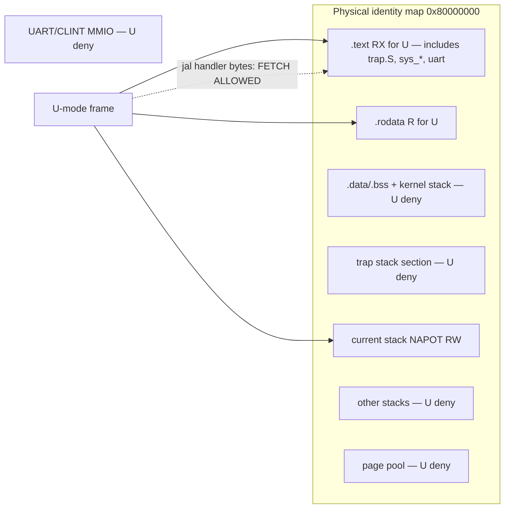
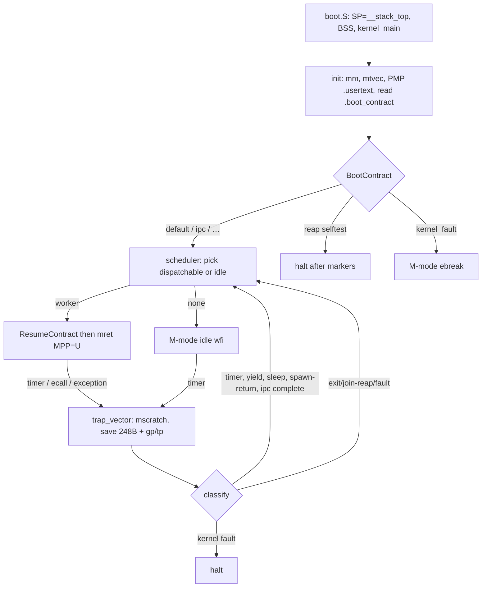
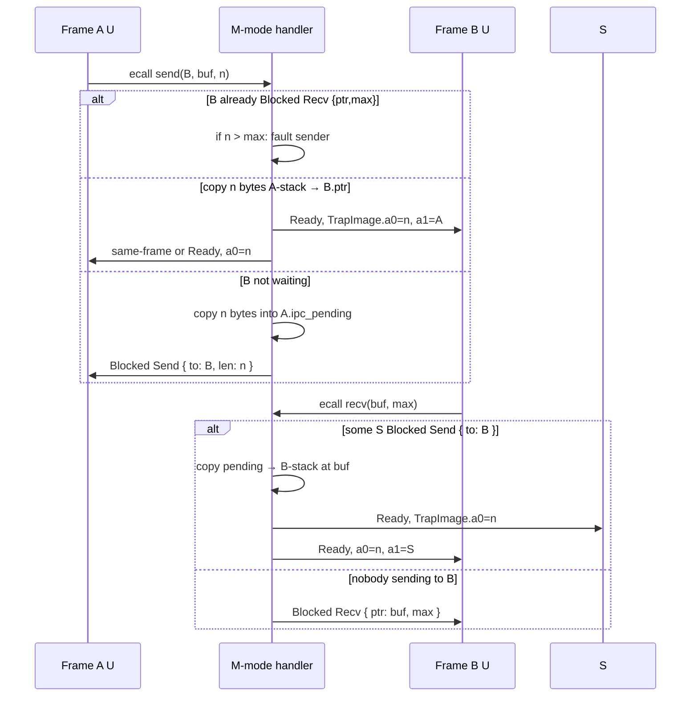

# PicoOS 0.3 — Frame Kernel: threads, IPC, and isolation tightening

| Field | Value |
| --- | --- |
| Title | PicoOS 0.3 Frame Kernel |
| Author | (design; implementation follows the PR plan) |
| Date | 2026-09-05 |
| Status | Reviewed (writer/reviewer loop, 0 open issues) |
| Tree audited | `/Users/vladislavkalinkin/PicoOS` as shipped **0.2.0** (edition 2024, rustc **1.98.1**) |
| Target | RISC-V 64 (`riscv64gc-unknown-none-elf`), QEMU `virt`, **`-bios none`** |
| Milestone | **PicoOS 0.3** — uniprocessor Frame Kernel with first-class spawn/join, copy-IPC, `.usertext` PMP X-range, one always-on binary |

This document is a **delta from the shipped 0.2 Frame Kernel**. It does **not** reuse the 0.2 spec’s “current tree (audit)” inventory: that described the pre-0.2 hobby kernel (edition 2021, 35 features, bump allocators, 5-tick halt). The inventory below is the **live 0.2.0 tree**.

---

## Overview

PicoOS 0.2 delivered a correct uniprocessor Frame Kernel: M-mode owner, U-mode frames, unlocked PMP, four `ecall`s, always-on round-robin, timer preemption via `mret`, sleep/wake, reap, and UART contracts. It is still a **prototype product**. Threads are two (or three) hardcoded workers selected by seven Cargo features. Isolation still lets U-mode `jal` M-mode handler bytes because PMP RX covers the whole `.text`. There is no IPC, so the kernel identity (“dispatch + protection + IPC routing”) is two-thirds implemented. Spawn exists only as boot-time `create_task`.

0.3 turns that prototype into a **small real kernel on one hart**. Isolation in 0.3 is **unlocked PMP X-range + ResumeContract**, not Sv39. Residuals (one physical identity map, one NAPOT stack window, gadgets in `.usertext`, no send-to-tid caps) are **0.3 product limits**, not homework that leaves 0.3 a prototype.

1. **Isolation tightening** — split `.usertext` (a section name that does **not** match GNU ld `*(.text*)`), PMP X only there, ResumeContract `mepc` in user text. Close the jal-to-handler hole without a page walker.
2. **Threads as a facility** — `sys_spawn` / `sys_join` / `sys_exit`. Finished/Faulted frames stay **zombies until join**. A Frame **is** the thread. Honest uniprocessor; no fake SMP.
3. **Minimal copy-IPC** — synchronous rendezvous, ≤32-byte payload, explicit recv `{ptr,max}` on `Task`, peer-exit wakes senders. No shared writable mappings.
4. **Staged scenario-cfg retirement** — one always-on kernel; tests select a boot contract by **patching a 1-byte `.boot_contract` section** (not UART RX; live UART is TX-only).

**Privilege decision:** 0.3 **stays M-mode + PMP + `-bios none`**. Sv39 and an S-mode kernel are **0.4**, sequencing so spawn+IPC+X-range are attributable (see Key Decisions and Alternatives).

**Filesystem:** **none in 0.3.** No VFS, no path namespace, no inode table, no userspace FS slice. Kernel image, page bitmap, trap stack, and other frames must not be nameable as files because there are no files.

---

## Background & Motivation

### What 0.2 actually shipped (live tree)

Package `PicoOS` **0.2.0**, edition **2024**, `rust-toolchain.toml` channel **1.98.1**, Clippy groups `all` + `pedantic` + `nursery` + `cargo` denied from `Cargo.toml` and `scripts/check-all.sh`. Panic = abort. No third-party crates. No `heap.rs`. No `static mut`. No host `#[test]` (`[[bin]] test = false`).

**Layout (keep; grain is right):**

```
src/main.rs
src/arch/riscv64/   boot.S, trap.S, cpu.rs, pmp.rs, restore.rs, timer.rs, traps.rs
src/drivers/        mmio.rs, uart.rs
src/platform/       qemu_virt_riscv64.rs
src/kernel/         banner, cpu, irq_cell, log, memory, sys, ticks, trap_frame, test
src/kernel/task/    table, scheduler, entry, fault, test, test/bootstrap.rs
linker-riscv64.ld
scripts/            check-all.sh, qemu-expect.sh, run-riscv.sh, 8 marker tests
```

**Scale (source only, excluding `target/`):**

| Item | Count |
| --- | ---: |
| Rust files | 30 |
| Assembly | 2 (`boot.S` 32 lines, `trap.S` **90** lines as `wc -l`) |
| Rust LOC | ~3,543 |
| Shell scripts | 12 / ~278 LOC |
| Public Cargo features | 7 (`scenario_*` only) |
| `feature = "scenario_*"` occurrences | **85** lines in `src/` (`rg 'feature =' src`); **~35** distinct `#[cfg]`/`cfg!` gates including `sys.rs` stub `cfg(any(…))`, `scheduler.rs` `cfg!`, `traps.rs`, `main.rs` truncated boots. S4 is not “delete 29 worker cfgs.” |
| `#[allow(…)]` on items | **0**; `main.rs` still has crate-level `cfg_attr(…, allow(dead_code, unused_imports))` for reap / kernel-fault |
| `unsafe` tokens | ~39 across Rust (CSR/MMIO/trap + U-mode `ecall` + `IrqCell` + trampoline `transmute`) |
| `static mut` | **0** |

**Platform (unchanged, must stay):** load `0x8000_0000`, 128 MiB RAM, UART0 `0x1000_0000`, CLINT `mtime`/`mtimecmp` hart 0, timebase 10 MHz. QEMU: `-M virt -bios none -nographic`. 16 PMP entries.

**Always-on kernel path (`kernel_main`, default features):**

1. Banner `PicoOS 0.2.0` / Frame Kernel; capability list.
2. `arch::init_exceptions` (`mtvec` = `trap_vector`, `mscratch` = `__trap_stack_top`).
3. `arch::pmp::init` — pmp0 TOR-deny `[0, __text_start)`, pmp1 TOR RX `.text`, pmp2 TOR R `.rodata`, pmp3 NAPOT current stack (retargeted in `set_current_stack`).
4. Page-allocator selftest + table reap leak check (`mm leak check: OK`).
5. `spawn_default_image`: idle is **not** a slot; U-mode `worker_yield`, `worker_sleep`, `worker_pmp_deny`.
6. Arm CLINT at **1 Hz in both** `src/main.rs` (`RISCV_TIMER_HZ`) **and** `src/arch/riscv64/traps.rs` (`TIMER_HZ`). Re-arm after each tick uses the traps.rs constant; changing only `main.rs` leaves 1 Hz after the first interrupt. 0.2 spec recommended 100 Hz.
7. `scheduler::run` → `mret` to first Ready frame (`MPP=U`).

**Contracts that already work:**

| Contract | Implementation |
| --- | --- |
| Frame | `Task` in `src/kernel/task/table.rs`: stack + `Option<TrapImage>` + lifecycle FSM + `can_resume` |
| Trap image | `Riscv64TrapFrame` 248 bytes (`gp`/`tp` included) + `mepc`/`mstatus` on `TrapImage` |
| Restore | `restore.rs`: rewrite trap-stack frame, synthesize `mstatus` (`MIE=0`, `MPIE=1`, `MPP=U`), `trap_return` → `mret` |
| Idle-exit | reset `mscratch` to `__trap_stack_top`, kernel SP, `MIE=1`, jump `idle_loop` — **no `mret`** |
| `ecall` | `a7` = 0 yield / 1 sleep / 2 exit / 3 log; uncompressed `ecall`; `mepc += 4` on yield/sleep/log |
| Reap | `destroy`: Finished\|Faulted → `free_pages` stack → Empty; `id == slot`; `switch_after` reaps terminal |
| Fault | U-mode → Faulted, schedule others; idle/`current == None` → halt; PMP store to `.data` prints `pmp deny: task fault OK` |
| ResumeContract | `is_resume_frame_safe_for_task`: `sp ∈ [stack_start, stack_top)`, `mepc ∈ [__text_start, __text_end)` |
| UART ABI | `scripts/qemu-expect.sh` exact success line; fail on `FAILED` / `[FAIL]` |

**Public scenario features** (workers + UART contracts + two truncated boots):

| Feature | Boot shape | Success marker |
| --- | --- | --- |
| (default) | yield + sleep + pmp-deny | `default scheduler: yield and sleep OK` (and `pmp deny: task fault OK`) |
| `scenario_resume` | one two-yield worker | `scheduler resume loop result: OK` |
| `scenario_handoff` | two yield workers | `scheduler resume loop result: OK` |
| `scenario_sleep` | table selftest + sleep-then-exit worker | `task sleep wake result: OK` then `task sleep runtime e2e result: OK` |
| `scenario_fault` | clean exit + U `ebreak` | `task fault scheduler result: OK` |
| `scenario_preempt` | yield loop | `timer preemption result: OK` |
| `scenario_reap` | **skips** `arch::init` / scheduler; memory + table selftest | `mm leak check: OK` |
| `scenario_kernel_fault` | **skips** workers; M-mode `ebreak` | `kernel fault guard result: OK` |

`check-all.sh` builds and clippies **default + 7 features**, then runs 8 QEMU scripts. Several scripts still `cargo clean` first.

### Pain points (why 0.3 is not “more scenarios”)

1. **Threads are fixtures.** `create_task` is kernel-only at boot. U-mode cannot spawn. Exit reaps immediately; there is no join. `MAX_TASKS = 8` is unused capacity.
2. **No IPC.** Two frames cannot exchange a payload without sharing memory (they don’t) or UART (kernel-mediated log is not routing). The Frame Kernel’s third verb is missing.
3. **U can execute kernel text.** PMP pmp1 is RX on `[__text_start, __text_end)`. A hostile frame can `jal` `sys_yield` / UART / table code. Stores still fault; CSR access from U is illegal; this is **contained but not closed**. 0.2 accepted it; 0.3 must not. The section **must not** be named `.text.user` while kernel `.text` uses `*(.text*)` (live `linker-riscv64.ld` line 13): GNU ld would consume user input sections into kernel `.text` and leave the user output empty.
4. **Seven kernels.** Feature cfg is not “mostly workers”: `sys.rs` gates the stubs themselves; `traps.rs` gates kernel-fault halt vs `kernel fault guard result: OK` and the preempt marker; `scheduler.rs` `try_print_scenario_markers` uses `cfg!(feature=…)`; `kernel/cpu.rs` gates `TrapExecutionContext`; `fault.rs` gates classification print; `main.rs` truncated boots. Clippy × 7. That fights Agents.md.
5. **`unsafe` leaked out of `src/arch/`.** U-mode `ecall` asm lives in `src/kernel/sys.rs`; trampoline `transmute` in `src/kernel/task/entry.rs`; MMIO in `src/drivers/` (justifiable); `IrqCell` in kernel (justifiable). 0.3 moves ecall/trampoline to arch.
6. **Timer is 1 Hz.** Harmless; 0.2 spec wanted 100 Hz. 0.3 raises it once logs stay single-shot.

### Why not Sv39 in the same breath

The 0.2 spec parked “Sv39 S-mode = 0.3” so 0.2 would not invent a fake MMU. The **live 0.2 leftover** is tighter U-X, not “we already have page tables.” A real S-mode + Sv39 kernel rewrites **every** 0.2 control transfer (`mtvec`→`stvec`, `mret`→`sret`, `mepc`→`sepc`, timer delegation, `satp`, walker, bootstrap). Doing that in the same milestone as product spawn and IPC would make regressions un-attributable. An identity-mapped Sv39 that still maps kernel text into U would be **theater**. See Alternatives A–C. This split is valid **only if** 0.3 actually closes the jal hole (`.usertext` + PMP) and ships spawn+IPC as specified below.

---

## Goals & Non-Goals

### Goals (milestone 0.3)

- **Done-when list** (finite; see below). Banner may read `PicoOS 0.3.0` only when that list is tested.
- **One hart, QEMU virt, `-bios none`, M-mode kernel, U-mode frames.**
- **`.usertext` + PMP:** U execute only that output section; U read `.rodata`; kernel `.text` / `.data` / trap stack / MMIO unmatched = deny. QEMU proves a U `jalr` of a **kernel `.text` symbol** instruction-access-faults the **task**, not the kernel (marker `user text: kernel fetch deny OK`).
- **First-class frames:** `spawn` / `join` / `exit`. Spawn is an `ecall`. Stack = one bitmap page. Ids are reusable slots. **Join is the reap.** Unjoined Finished/Faulted frames occupy the table until join.
- **Copy-IPC:** `send` / `recv` rendezvous, max 32 bytes, recv buffer stored on `Task`, senders targeting an exiting peer wake with `a0 = MAX`. No shared writable page.
- **One default binary** runs a default image that **uses** spawn+join. IPC and user-text fetch-deny are **boot contracts**, not extra default-image occupants. Tests do not require seven `cargo build --features` by freeze.
- **Staged cfg cut** with ordered PRs; each PR leaves `scripts/check-all.sh` green.
- **QEMU UART contracts remain the ABI.** New markers named here; scripts updated in the same PR.
- **`unsafe`:** ecall + trampoline in `src/arch/`; every `unsafe` has `// SAFETY:`; no new `GlobalAlloc`; no duplicate CPU frames.

### Non-goals (explicit)

- **POSIX, libc, ELF userland, Unix paths, shells (`sh`/`cd`), GNU utilities.**
- **VFS / filesystem / path namespace / inodes.** Even a toy userspace FS is out: it would force a naming scheme and would not shrink the kernel. Defense against FS-based attacks in 0.3 is **vacuous**: there is no FS.
- **Networking, VirtIO, block devices, drivers as servers.**
- **SMP / multi-hart.** `IrqCell` stays “one hart, IRQs off.” Do not add a second `Cpu` or IPI theater.
- **S-mode kernel, Sv39, `satp`, OpenSBI, `sret`/`stvec`.** 0.4. Do not add dead `satp` helpers (Agents.md: no dead code).
- **Execute-only user text (no R)** unless a compiled dump in this milestone shows zero loads from `.usertext`. Default: keep **RX** on `.usertext`, **R** on `.rodata`.
- **Formal proofs, seL4 capabilities, capability-passing IPC.**
- **General heap / `GlobalAlloc`.**
- **Host `std` tests as a substitute for QEMU contracts.**
- **New `#[cfg(feature = …)]` in core kernel code.** Existing `scenario_*` may linger only as **selectors** until the UART-contract PRs delete them.

---

## Key Decisions

1. **Stay M-mode + unlocked PMP + `-bios none` for 0.3; Sv39 S-mode is 0.4.** Rationale: the jal-to-handler hole is a **PMP X-range** bug. Closing it with `.usertext` is a linker + PMP entries + ResumeContract change. Sv39+S-mode is a second kernel (bootstrap, trap rewrite, walker). Splitting is sequencing so 0.3 is shippable; 4 KiB pages and identity DRAM layout are preserved so 0.4 is an add, not a teardown. 0.3 isolation **is** unlocked PMP X-range + ResumeContract, not “secure” in the Sv39/ASID sense. Product limits that stay in 0.3: one identity map, one NAPOT stack, user-text gadgets, no IPC caps.

2. **Bootstrap stays `-bios none`. No OpenSBI in 0.3 or as a silent QEMU default.** Rationale: OpenSBI is C firmware we do not control; it would change load address / SBI ecalls / `a0`/`a1` hartid/DTB conventions and fight the clean-slate rule. 0.4’s default recommendation is a **homegrown M-mode trampoline** that `mret`s into S once, still `-bios none` (Open Question 1).

3. **A thread is a Frame. No process table.** Rationale: PicoOS has no address-space object in 0.3. `TaskId` = slot = thread id. SMP is a non-goal; “multithreading” means **multiple U-mode frames on one hart**, not hardware threads.

4. **`sys_spawn` is an `ecall` (`a7 = 4`). Entry PC must be in `.usertext`.** Rationale: useful threads are created at runtime from U, not only from `kernel_main`. Without ELF, the only legal entry is a function already linked into user text. Kernel `table::spawn` remains the single primitive; boot and `sys_spawn` both call it.

5. **Always zombie until `sys_join`. `switch_after` must not `destroy` terminal frames.** Rationale: 0.2 `switch_after` always destroys Finished/Faulted (`scheduler.rs`). If the child exits before the parent joins, there is no waiter, the slot is Empty, and join returns `MAX` — a race, not a thread API. Unreaped zombies occupy `MAX_TASKS` and hold the stack page (`stats.used` drops only at join). **One joiner:** a second `sys_join` on a tid that already has a `Blocked { Join }` waiter returns `MAX` (do not multicast status). Self-join stays fault. No `sys_detach` in 0.3 (see Alternative I). The boot selftest `mm leak check: OK` remains a table-only proof; runtime join-reap uses a **new** marker.

6. **IPC is synchronous rendezvous with a 32-byte kernel copy. No mailbox file, no POSIX queues, no shared mappings.** Rationale: Frame Kernel identity is routing, not buffering. A 32-byte slot on the sender `Task` while `Blocked { Send }` is the minimum storage; it is not a shared mapping. Direct `TaskId` addressing (no caps) is enough for 8 slots.

7. **Scenario features die in stages, ending at one binary + a 1-byte `.boot_contract` patch.** Rationale: live `uart.rs` is TX-only (`putc` polls `UART_LSR_THRE`); `qemu-expect.sh` never writes QEMU stdin. UART RX + a 10 ms poll after PMP init is not implementable against this harness without a second design. Binding pick: **`llvm-objcopy --update-section .boot_contract=…`** on a **copy** of the built kernel (see Boot contracts). Stage 1 always-compiles workers **and** trap/preempt/kernel-fault print paths; stage 2 unifies `kernel_main`; stage 3 scripts patch the byte; stage 4 deletes Cargo features.

8. **No VFS in 0.3.** Rationale: user asked for userspace-only FS *if/when* it exists, with kernel image / bitmap / trap stack / other frames **never** appearing as files. The smallest honest FS is still a namespace. 0.3’s defense is absence.

9. **`MAX_TASKS` stays 8.** Rationale: enough for default image (yield, sleep, pmp-deny, spawn-parent + child, optional IPC pair via contract). Raising the table is not the milestone.

10. **Timer default becomes 100 Hz** once default workers remain single-shot logs (they already are). Rationale: 0.2 leftover; sleep is in ticks, so e2e `sleep(2)` becomes 20 ms, which is better for 20 s `qemu-expect` timeouts.

11. **`unsafe` for ecall and trampoline moves into `src/arch/riscv64/`.** MMIO stays in `src/drivers/` (hardware). `IrqCell` stays in `src/kernel/irq_cell.rs` (uniprocessor cell, not a CSR). No trampoline `transmute`: asm `jalr`. `TaskEntry` is `extern "C" fn(u64)` without `-> !`.

12. **ResumeContract `mepc` ∈ `[__user_text_start, __user_text_end)`**, not whole kernel text. `sp` still in the frame’s stack. Fresh start `mepc` = `user_trampoline` in `.usertext`. The 4K align **gap** `[__text_end, __user_text_start)` is PMP-deny (pmp1 TOR end = `__user_text_start`), not RX padding.

13. **QEMU UART scripts remain the ABI.** Marker string changes only in the same PR as the script. New markers are listed in this spec.

14. **Banner `0.3.0` at freeze only**, listing capabilities that a QEMU test actually hit (user text X, spawn/join, copy-IPC, one-binary contracts).

---

## Audit: 0.2 isolation and thread gaps (do not paper over)

### Isolation as shipped



| Region | U-mode 0.2 | U-mode 0.3 target |
| --- | --- | --- |
| Kernel `.text` (boot, trap, handlers) | **RX** | **none** (pmp1 TOR-deny through `__user_text_start`) |
| `.usertext` (stubs, trampoline, workers) | n/a (mixed into `.text`) | **RX** (own output section, **not** named `.text.user`) |
| `.rodata` | R | R |
| `.data/.bss`, kernel stack, trap stack | deny | deny |
| Current task stack | NAPOT RW | NAPOT RW |
| Other task stacks | deny | deny |
| UART, CLINT, page bitmap, free pool | deny | deny |

PMP still applies to **physical** addresses. 0.3 does not turn it off. 0.4 may keep PMP as a second belt under Sv39.

### Thread facility as shipped

- `create_task(name, entry)` in `table.rs`: first Empty slot, `allocate_page()` for stack, `Ready`, `can_resume = false` (fresh).
- `TaskEntry = fn()`; first restore: `a0 = entry as usize`, `mepc = task_trampoline_raw`, `transmute` back to `fn()`.
- No `sys_spawn`. No wait queue. `Blocked` means **only** `sleep_until_tick`.
- Live `wake_sleeping_tasks` only wakes `Blocked` with `Some(sleep_until_tick)` — a Join waiter that left that field `None` would already skip the timer. 0.3 still **must** tag `BlockReason` so sleep wake cannot be confused with IPC/join, and so `switch_after` can see Join waiters.

### `unsafe` map (0.3 budget)

| Location | Why it exists | 0.3 action |
| --- | --- | --- |
| `arch/riscv64/cpu.rs`, `trap.S`, `restore.rs`, `traps.rs`, `pmp.rs`, `mod.rs` | CSR, `mret`, `wfi` | keep; SAFETY already present |
| `drivers/mmio.rs`, `uart.rs` | UART/CLINT MMIO | keep in drivers; SAFETY already present (hardware, not “core kernel logic”) |
| `kernel/irq_cell.rs` | `UnsafeCell` + `Sync` | keep; one-hart invariant |
| `kernel/sys.rs` `asm! ecall` | U stubs | **move** to `arch/riscv64/ecall.rs` |
| `kernel/task/entry.rs` `transmute` | trampoline | **delete**; `trampoline.S` `jalr` |
| `kernel/sys.rs` `from_raw_parts` for `sys_log` | copy after `user_buffer_ok` | keep next to handler; SAFETY comment stays |
| `task/test.rs` / `test.rs` `ebreak` / volatile store | probes | move `ebreak` helper to arch; probes stay `cfg`/`contract` gated, not `allow` |

---

## Proposed Design

### Thesis (unchanged identity, completed verbs)

```text
Frame = TaskId
      × privilege U
      × stack [base, top)          -- exclusive PMP NAPOT while running
      × TrapImage                  -- GPR + mepc + mstatus  (still M-CSRs)
      × Lifecycle                  -- Empty/Ready/Running/Blocked/Finished/Faulted
      × BlockReason                -- SleepUntil(tick) | Join(tid)
                                     | Send { to, len }
                                     | Recv { ptr, max }   -- not aliased to GPRs
      × ResumeContract             -- sp in stack AND mepc in .usertext
      × IpcPending                 -- at most 32 bytes while Blocked-Send
```

Kernel verbs: **dispatch**, **protection** (PMP + contract), **IPC routing** (copy at rendezvous). Still not a Unix.

### Milestone definition: PicoOS 0.3

**Done when** a **single** `cargo build` binary on QEMU virt:

1. Boots, inits mm / `mtvec` / PMP (`.usertext` X), scheduler; banner `PicoOS 0.3.0`.
2. Default image: M-mode idle + U workers that **yield, sleep, PMP-deny, and spawn+join a child** without any `--features`. Freeze matrix includes a **default-image** QEMU script (0.2 `check-all.sh` never ran the default image).
3. Contract `user_text`: U `jalr` of a kernel `.text` symbol **Faults the task**; marker `user text: kernel fetch deny OK` (IAF path, not the store-fault `pmp deny` line).
4. `sys_spawn` from U; child may exit **before** join; parent `sys_join` still observes status (zombie); slot reused; marker **`spawn join leak: OK`** (`stats.used` vs live-worker baseline). Do **not** treat boot `mm leak check: OK` as join-reap proof.
5. Contract `ipc`: two U frames exchange a 32-byte payload via `sys_send`/`sys_recv`; spawn-arg carries the peer tid; peer exit wakes senders with `a0 = MAX`; marker `ipc rendezvous: OK`.
6. Task fault ≠ kernel halt; kernel `ebreak` still halts (contract `kernel_fault`).
7. Timer preemption via `mret` (contract `preempt`).
8. `scripts/check-all.sh` green: **one** Clippy and a QEMU matrix that **does not** rebuild with `scenario_*` features.
9. Zero `scenario_*` features in `Cargo.toml` at freeze.

**Success metric:** `scripts/check-all.sh` green; banner capabilities match tests that ran.

### Default image (always-on binary, contract byte 0)

Idle is not a slot. Boot `create_task` occupies **four** slots. Peak occupancy is 5 while the spawn child is live (still a zombie after exit until join). Yield and sleep are long-lived and never reaped on the default plan.

| Slot (typical) | How created | Entry (`.usertext`) | Lifetime |
| --- | --- | --- | --- |
| — | not a Task | `idle_loop` (M) | forever |
| 0 | boot `create_task` | `worker_yield_main` | long-lived yield loop |
| 1 | boot `create_task` | `worker_sleep_main` | long-lived sleep loop |
| 2 | boot `create_task` | `worker_pmp_deny` | store to `.data` → Faulted zombie; **not** joined on this plan (1 stack page stays in `used`) |
| 3 | boot `create_task` | `worker_spawn_main` | `u_sys_spawn(child_exit, 0)` then `u_sys_join`; does **not** wait on yield/sleep |
| 4 | runtime `sys_spawn` | `child_exit` | exits immediately; zombie until parent join, then Empty |

**Not on the default image:** IPC pair, user-text fetch probe, resume/handoff/sleep-e2e/U-ebreak. Those are other `.boot_contract` values. Round-robin is `find_next_dispatchable_after` from slot 0; spawn parent may run before pmp-deny faults. That is fine: 4 boot slots + 1 child = 5 ≤ 8. `sys_spawn` must not see a full table on this plan.

Default markers (kernel-printed, stable):

- `default image: idle + yield + sleep + pmp-deny + spawn`
- `default scheduler: yield and sleep OK` (keep)
- `pmp deny: task fault OK` (keep; store-fault path)
- `default spawn join: OK` (after join of the **child**)
- `spawn join leak: OK` (after join: `stats.used` equals baseline of live frames: yield + sleep + pmp-deny zombie + spawn parent = 4 pages)

`qemu-expect.sh` matches **one** line and keeps reading until it sees it. The default-image script waits on `spawn join leak: OK` (printed last among default markers). Boot `mm leak check: OK` is a different script (`reap` contract).

### Architecture (0.3)



### Boot contracts (1-byte `.boot_contract`, not UART RX)

Live UART is **TX-only**: `putc` polls `UART_LSR_THRE` (`1 << 5`); there is no `getc`, no `UART_LSR_DR`, and `write32(UART0_BASE)` is the THR path. `scripts/qemu-expect.sh` launches QEMU with **stdout on a fifo** and never writes stdin. A 10 ms post-PMP UART poll would lose the race if the script waited on output, and `printf | qemu > fifo` is a second harness.

**Binding (closes former OQ2):** own ELF section `.boot_contract` (so `llvm-objcopy --update-section` can find it), placed **between `.data` and `.bss`** in live `linker-riscv64.ld` (today `.data` → `.bss` → stack → trap_stack → `__free_memory_start`). VMA is in the kernel image, **below** `__free_memory_start`, not in the page pool. Do **not** merge into `*(.data*)` (objcopy would have to smash all of `.data`). Do **not** leave it as an orphan after `__free_memory_start`. U-mode still cannot write it (PMP miss on kernel data).

Linker (insert only this, then existing `.bss`):

```text
.data : ALIGN(4K) {
    __data_start = .;
    *(.data*)
    __data_end = .;
}

.boot_contract : ALIGN(8) {
    KEEP(*(.boot_contract))
    . = ALIGN(8);          /* 8-byte PROGBITS; BOOT_CONTRACT at offset 0 */
}

.bss : ALIGN(4K) { ... }
```

Rust (`src/kernel/contract.rs`):

```rust
#[repr(u8)]
enum BootContract { /* 0..=9 as in the table below */ }

#[used]
#[unsafe(no_mangle)]
#[unsafe(link_section = ".boot_contract")]
static BOOT_CONTRACT: u8 = 0;
```

`#[used]` keeps the symbol alive. **Read** once after PMP init with a volatile load so rustc/LLVM (`opt-level = "s"` + LTO on release; debug `check-all` is not the spec) cannot constant-fold `0`:

```rust
fn boot_contract_byte() -> u8 {
    // SAFETY: M-mode; `.boot_contract` is 8 allocated PROGBITS bytes in the
    // kernel image below `__free_memory_start`; QEMU `-kernel` loaded them;
    // scripts may have patched byte 0 before exec. Not a `static mut` write.
    unsafe { core::ptr::read_volatile(core::ptr::addr_of!(BOOT_CONTRACT)) }
}
```

This `unsafe` lives in `src/kernel/contract.rs` (same class as `IrqCell`: not CSR/MMIO). `addr_of!` alone is **not** a load. Out-of-range byte → log `boot contract: unknown` and use `Default`. **No** `cfg(feature)` on the plan table.

**Harness:** `qemu-expect.sh <marker> [contract-byte]` copies `target/.../PicoOS` to a temp file. Fail closed if `llvm-objcopy` is missing or `llvm-objdump -h` shows no `.boot_contract`. Write a payload of **exactly** that section’s file size (expect 8): byte 0 = contract, rest `0`.

```bash
sz=$(llvm-objdump -h "$tmp/PicoOS" | awk '/\.boot_contract/{print strtonum("0x"$3)}')
python3 -c 'import sys; n=int(sys.argv[1]); b=int(sys.argv[2]); open(sys.argv[3],"wb").write(bytes([b])+bytes(n-1))' "$sz" "$byte" "$tmp/boot_contract.bin"
llvm-objcopy --update-section .boot_contract="$tmp/boot_contract.bin" "$tmp/PicoOS"
qemu-system-riscv64 ... -kernel "$tmp/PicoOS" >"$log_pipe"
```

Stdout fifo + background pid + `FAILED` scan **unchanged**. Patch happens **before** QEMU starts.

| Byte | Name | Boot action (always-linked workers) | Script (post-S3) | Success marker |
| --- | --- | --- | --- | --- |
| 0 | default | yield + sleep + pmp-deny + spawn parent | `test-default-riscv.sh` (**new**) | `spawn join leak: OK` |
| 1 | resume | one two-yield worker | `test-task-resume-selftest.sh` | `scheduler resume loop result: OK` |
| 2 | handoff | two yield workers | `test-two-task-handoff-riscv.sh` | `scheduler resume loop result: OK` |
| 3 | sleep | table selftest + sleep-then-exit | `test-task-sleep-riscv.sh` **and** `test-task-sleep-runtime-e2e-riscv.sh` (same byte; first script can match the table marker, second the e2e marker — both lines are printed) | `task sleep wake result: OK` then `task sleep runtime e2e result: OK` |
| 4 | fault | clean exit + U `ebreak` | `test-scheduler-fault-lifecycle-riscv.sh` | `task fault scheduler result: OK` |
| 5 | preempt | yield loop; verbose `tick:` lines | `test-timer-preemption-riscv.sh` | `timer preemption result: OK` |
| 6 | reap | `run_memory_tests` + table selftest, halt (after `arch::init` + PMP) | `test-mm-reap-riscv.sh` | `mm leak check: OK` |
| 7 | kernel_fault | M-mode `ebreak` after init | `test-kernel-fault-guard-riscv.sh` | `kernel fault guard result: OK` |
| 8 | ipc | parent spawns B (recv) then A with `arg = tid_B`; A sends; B recvs; parent joins both | `test-ipc-riscv.sh` (**new**) | `ipc rendezvous: OK` |
| 9 | user_text | one worker `jalr`s a kernel `.text` symbol from `.rodata` | `test-user-text-riscv.sh` (**new**) | `user text: kernel fetch deny OK` |

Until S3, existing scripts keep `--features` and markers. S3 switches them to objcopy bytes and **drops `cargo clean`**.

### Privilege, linker, PMP

**Linker (`linker-riscv64.ld`) — ordered, 4K aligned:**

Live kernel `.text` is `KEEP(*(.text.boot))`, `KEEP(*(.text.trap))`, then `*(.text*)`. GNU ld **`.text*` matches `.text.user`**. Naming the user output `.text.user` would **empty** it: trampoline/workers stay in pmp1 deny-X, first U fetch IAFs, the fetch-deny test is meaningless.

**Do not use a `.text.*` name for user execute.** Use `.usertext`:

```text
.text : ALIGN(4K) {
    __text_start = .;
    KEEP(*(.text.boot))
    KEEP(*(.text.trap))
    *(.text .text.*)          /* still matches .text.boot/.text.trap leftovers only */
    __text_end = .;
}

.usertext : ALIGN(4K) {
    __user_text_start = .;
    KEEP(*(.usertext .usertext.*))
    __user_text_end = .;
}

.rodata : ALIGN(4K) { ... }
```

`.usertext` sits **between** kernel `.text` and `.rodata` so TOR addresses strictly increase.

**PR3 objdump contract (fail the PR if broken):**

```text
__user_text_start < user_trampoline < __user_text_end <= __rodata_start
user_trampoline >= __text_end
```

Every `worker_*` / `u_sys_*` / `child_exit` symbol address must be `>= __user_text_start` and `< __user_text_end`. Kernel `sys_*` / `uart::*` / `riscv64_trap_handler` must be `< __text_end`. Reap/selftest bodies (`idle_task` → `uart::write_line`, `reap_probe_task` → `arch::halt`) stay in kernel `.text` and are **never** `mret`'d.

**PMP (unlocked, 16 entries, QEMU virt).** RV64: **pmp0–pmp7 live in `pmpcfg0`** (8 bits each). pmp4 is **bits 32–39 of `pmpcfg0`**, not `pmpcfg2` (that is pmp8–15). Live 0.2 init is `set_pmpcfg0(pmp0 | pmp1<<8 | pmp2<<16 | pmp3<<24)` and `set_pmpcfg2(0)`. Never program `pmpcfg1` (not an RV64 CSR in this model; `cpu.rs` only has `pmpcfg0`/`pmpcfg2`).

NAPOT must **not** sit where a later TOR would use `pmpaddr[i-1]` as a lower bound (0.2 `pmp.rs` comment). Stack stays last among programmed entries.

| Index | Encoding | `pmpaddr` | U perms | Coverage |
| --- | --- | --- | --- | --- |
| pmp0 | TOR, no R/W/X | `__text_start >> 2` | deny | `[0, __text_start)` MMIO/MROM |
| pmp1 | TOR, no R/W/X | **`__user_text_start >> 2`** | deny | kernel `.text` **and** the 4K align gap `[__text_end, __user_text_start)` — not RX padding |
| pmp2 | TOR RX | `__user_text_end >> 2` | R\|X | `.usertext` |
| pmp3 | TOR R | `__rodata_end >> 2` | R | `.rodata` |
| pmp4 | NAPOT 4 KiB RW | `(stack >> 2) \| 0x1FF` | R\|W | current stack; retarget on switch |
| pmp5–15 | OFF | 0 | — | unused |

Exact init (IRQs off, same dump loop as 0.2 plus `__user_text_*` prints):

```rust
let pmp0 = PMP_A_TOR;
let pmp1 = PMP_A_TOR; // deny
let pmp2 = PMP_R | PMP_X | PMP_A_TOR;
let pmp3 = PMP_R | PMP_A_TOR;
let pmp4 = PMP_R | PMP_W | PMP_A_NAPOT;
cpu::set_pmpcfg0(
    pmp0 | (pmp1 << 8) | (pmp2 << 16) | (pmp3 << 24) | (pmp4 << 32),
);
cpu::set_pmpcfg2(0);
```

`pmp::set_current_stack` writes **`pmpaddr4`**, `(stack_start >> 2) | 0x1FF` unchanged.

**Bring-up test:** first U instruction of `user_trampoline` must retire (not IAF). Dump PMP at init.

**Source rule:** every U-entry function is `#[unsafe(link_section = ".usertext")]`. `src/user/` may call only `u_sys_*` and pure computation. Compiling a user function that names `uart::`, `mmio::`, `table::`, or handler `sys_*` is a bug.

**User-text fetch probe (contract byte 9, not default image):** an `extern "C"` **kernel** symbol in `.text` (e.g. `kernel_fetch_probe_target` in `src/kernel/sys.rs` or `src/arch/`, `#[inline(never)]`). The worker loads that address from a `.rodata` `u64` (so the immediate is not a `jal` that LTO could rewrite into a user-local helper) and `jalr`s it. QEMU **debug** profile as today (`check-all.sh` uses debug). On instruction access fault (`mcause` code 1) with `trapped_from_user()` and `mtval ∈ [__text_start, __text_end)`, print **`user text: kernel fetch deny OK` once**, then Faulted zombie. Do **not** reuse `pmp deny: task fault OK` (that line stays load/store only, `fault.rs`). Jumping to `u_sys_yield` is **not** a kernel fetch after PR3.

**ResumeContract (replace PC range only):**

```rust
fn resume_contract(id: TaskId, image: &TrapImage) -> bool {
    image.is_valid()
        && sp_in_stack(id, image.gpr.sp)
        && user_text_contains(image.mepc)   // [__user_text_start, __user_text_end)
}
```

`memory::is_inside_kernel_text` remains for classifying IAF `mtval`. Fresh `mepc` = `user_trampoline` in `.usertext`.

### Trampoline (no transmute)

`src/arch/riscv64/trampoline.S`, `global_asm!(include_str!("trampoline.S"))` next to `boot.S`/`trap.S` in `arch/riscv64/mod.rs`. Section `.usertext`:

```text
.section .usertext, "ax", @progbits
.align 4
.global user_trampoline
user_trampoline:
    /* a0 = entry in .usertext, a1 = spawn arg */
    mv   t0, a0
    mv   a0, a1
    jalr t0
    /* entry returned — treat as exit */
    li   a7, 2
    .option norvc
    ecall
```

`TaskEntry` is `extern "C" fn(u64)` **without** `-> !`, so the ecall-on-return is live. Workers that call `u_sys_exit` never fall through. Kernel `spawn` / `build_fresh_trap_image` writes `a0 = entry as usize`, **`a1 = spawn_arg`**, `mepc = user_trampoline`, `sp = stack_top`. Keep Clippy `fn_to_numeric_cast_any` allow for that cast. No `transmute`.

### Multithreading

**API (kernel, always compiled):**

```rust
pub fn spawn(name: &str, entry: TaskEntry, arg: u64) -> Option<TaskId>;
pub fn destroy(id: TaskId) -> bool;           // table primitive: terminal → free stack → Empty
pub fn join_wake(target: TaskId);             // on exit/fault: Ready the one joiner
```

`destroy` stays the table primitive: `test_reap_leak_check` in `src/kernel/test.rs` (`mark_task_finished` + `destroy`, marker `mm leak check: OK`) **must keep calling it**. Production **trap** paths call `destroy` only from `sys_join` / `join_wake`. `switch_after` never calls it.

`spawn` is today’s `create_task` plus `arg` stored until first restore. OOM or no Empty slot → `None`. Never allocate on the raw ISR prologue (same 0.2 rule). `sys_spawn` runs in the ecall handler with IRQs already off; allocating one stack page there is allowed (0.2 already allocated only at boot; 0.3 documents spawn-on-ecall as the exception, still not from the timer prologue).

**U ABI (`a7`):**

| `a7` | Stub | Args | Return (`a0` in the same frame) | Block? | `mepc` |
| --- | --- | --- | --- | --- | --- |
| 0 | `u_sys_yield` | — | — | no (Ready) | += 4, save, switch |
| 1 | `u_sys_sleep` | `a0` ticks | — | SleepUntil | += 4, save, switch |
| 2 | `u_sys_exit` | — | never | terminal | no resume |
| 3 | `u_sys_log` | `a0` ptr, `a1` len | — | no | += 4, **mret same frame** |
| 4 | `u_sys_spawn` | `a0` entry, `a1` arg | tid or `u64::MAX` | no | += 4, mret same |
| 5 | `u_sys_join` | `a0` tid | 0=exit, 1=fault, `MAX`=err | yes if live | += 4 then save |
| 6 | `u_sys_send` | `a0` tid, `a1` ptr, `a2` len | len or `MAX` | yes if no recv | += 4 then save |
| 7 | `u_sys_recv` | `a0` ptr, `a1` max | len; `a1`=sender | yes if no send | += 4 then save |
| 8 | `u_sys_gettid` | — | tid | no | += 4, mret same |

Illegal `a7` or bad buffers → **task fault** (keep 0.2 `illegal_syscall`).

**Spawn checks (all required, else `a0 = MAX` without fault if merely full/OOM; **fault** if entry not in user text — hostile PC):**

- `entry ∈ [__user_text_start, __user_text_end)`
- Empty slot exists
- `alloc_pages(1)` succeeds
- `name` is kernel-generated (`"u-N"`) for U spawn; boot spawn may pass a literal

**Join (always-zombie):**

- `tid == self` → **task fault**.
- Empty / never existed → `a0 = MAX` (same-frame return).
- A second join while some frame is already `Blocked { Join(tid) }` → `a0 = MAX` (one waiter; no multicast).
- Target `Finished` or `Faulted` (zombie, possibly already exited before this join) → write `a0 = 0` (exit) or `1` (fault), **`destroy(target)`**, same-frame or wake return.
- Target still Ready/Running/Blocked → this frame `Blocked { Join(target) }`, save image (`mepc += 4` already applied), switch.
- `sys_exit` / fault path: mark terminal **zombie**. **`switch_after` never `destroy`s.** If a joiner is waiting, `join_wake` copies status into that joiner’s `TrapImage.gpr.a0` and `destroy`s the zombie. If no joiner yet, the zombie sits until `sys_join`.
- Unreaped zombies occupy `MAX_TASKS` and keep the stack page. Default image: pmp-deny remains a zombie (not joined); spawn child is joined.

**BlockReason** (replaces “all Blocked are sleepers”):

```rust
enum BlockReason {
    SleepUntil(u64),
    Join(TaskId),
    Send { to: TaskId, len: u8 },
    Recv { ptr: u64, max: u64 },
}
```

`wake_sleeping_tasks` only transitions `SleepUntil` due ticks. Never Join/Send/Recv.

**Dispatch predicate (PR5; replaces `is_resumable_task`’s `last_return_kind ∈ {Yield, Sleep}` conjunct):**

```text
dispatchable(id) =
    state == Ready && (
        fresh                       -- !has_started && !can_resume
        || (can_resume && image.is_some() && resume_contract(id, image))
    )
```

`can_resume` remains the no-image gate: `wake_sleeping_tasks` still sets `can_resume = resume_contract(...)` (false if no `TrapImage`). The sleep table selftest in `bootstrap.rs` (no-image → not resumable; injected image → resumable) stays valid. `TaskReturnKind` may still be printed; it is **not** a dispatch gate. `find_first_resumable_task` is compiled always (drop its `scenario_sleep` cfg in S1).

**Uniprocessor honesty:** one `Cpu` in `IrqCell`. Round-robin as today (`find_next_dispatchable_after`). Preemption still 100 Hz `mret`. No run-queues per hart. Comments must not say “CPU affinity” or “IPI.”

### Minimal IPC

Synchronous **rendezvous** on `TaskId`. Recv buffer is **`BlockReason::Recv { ptr, max }` on `Task`**, not a silent alias of saved `a0`/`a1`.

**How A learns B’s tid (binding):** the **parent** is the matchmaker. Contract `ipc` (not the default image):

1. Parent `sys_spawn(worker_ipc_recv, 0)` → `tid_B`.
2. Parent `sys_spawn(worker_ipc_send, tid_B)` → `tid_A` (`a1` on the trampoline = B).
3. A `sys_send(arg, buf, n)` with `arg == tid_B`.
4. B `sys_recv(buf, max)` (anonymous).
5. Parent `sys_join` both.

Do **not** hardcode slot numbers. Boot order / a reaped probe must not break IPC.



**Pairing algorithm:** scan slots `0..MAX_TASKS` in order. Recv matches the **lowest id** with `Blocked { Send { to: recv_tid } }`. Send matches iff the destination is `Blocked { Recv {..} }`. One rendezvous per syscall.

**Rules:**

- `n == 0` or `n > 32` or send buffer not in **caller** stack → task fault.
- At rendezvous, if `n > max` → **task-fault the sender** (do not copy a prefix; `a0` is never a truncated length). Ipc contract workers: B recvs with `max >= 32`; A sends `n = 32`.
- Recv `{ptr,max}` checked against **receiver** stack at syscall time **and** at copy time (`ptr+n` still in stack).
- Send-to-self → fault.
- Send to Empty **or to a zombie (Finished/Faulted)** → `a0 = MAX` (same-frame).
- At most one pending send per frame (`ipc_pending: [u8; 32]`, `ipc_len`).
- Copy: **safe** byte loop (Clippy `manual_memcpy` is deny). No extra `unsafe`.
- No peek, no async, no broadcast, no rights.

**Peer exit / fault of T** (runs when T becomes Finished or Faulted, before `switch_after`):

1. Every `Blocked { Send { to: T } }`: `TrapImage.gpr.a0 = u64::MAX`, `Ready`, `can_resume` from ResumeContract; drop `ipc_pending`.
2. The one `Blocked { Join(T) }`: status in `a0`, then `destroy(T)` from `join_wake`.
3. Every `Blocked { Recv {..} }` on frame B **iff** no remaining **potential sender** to B exists. **0.3 definition:** a potential sender is a non-zombie `S != B` in `Ready`, `Running`, or `Blocked { Send { to: B } }` only. **Sleep-then-send is not a 0.3 contract** (a sleeper is not a potential sender, so Recv may return `MAX` while that peer still exists). Do **not** count `Join` or `Recv` as potential senders — the ipc **parent** is `Blocked Join` and must not pin B’s Recv forever after A faults. Wake those Recv with `a0 = MAX`, `a1 = u64::MAX`.

This unblocks a recv worker when its sender faults on the ipc contract. It does **not** unblock a recv on the default image (yield/sleep stay Ready/Running). No timeout syscall.

**Ipc contract construction:** only `worker_ipc_parent` is `create_task`d at boot. It spawns B (`worker_ipc_recv`) then A (`worker_ipc_send`, `arg = tid_B`). A sends 32 bytes from its stack; B recvs; both exit; parent joins A then B; kernel prints `ipc rendezvous: OK` on the first successful copy. **Not started on the default plan.** No default-image deadlock.

**Why this is enough for 0.3:** two isolated frames can cooperate without a shared writable mapping. Ports/caps/shared-memory grants are 0.4+ (and only with Sv39).

### Control transfers (delta from 0.2)

Keep 0.2 yield / sleep / timer / idle-exit / fault sketches. Live `sys_log` only bumps `mepc` and synthesizes `mstatus`; `handle_ecall(frame: &Riscv64TrapFrame)` is immutable; `riscv64_trap_handler(frame: *const Riscv64TrapFrame)` `return`s into `trap.S` `trap_return`, which **reloads `a0` from the trap-stack copy**. Yield/sleep/exit never return (`-> !` via `switch_after`). “Like `sys_log`” would drop spawn’s return value.

**Two return paths (binding):**

1. **Same-frame return** (log, gettid, spawn success/MAX, join of an already-zombie, send/recv that complete immediately, failed send to Empty): `riscv64_trap_handler` takes `*mut Riscv64TrapFrame` (the trap-stack slot). Handler writes `frame.a0` / `frame.a1`, `csrw mepc, mepc+4`, synthesize `mstatus`, **`return` to `trap_return`**. Do **not** call `mret_to_trap_image` (that would copy a second image; the trap-stack slot **is** the live image). `Task.trap_image` is only for saved blocked/preempted frames.
2. **Switch return** (yield, sleep, blocking join/send/recv, exit, fault): save `TrapImage` from the slot (with `mepc+4` already applied for ecall), `switch_after` / `mret_to_trap_image` or idle-exit. Completing a blocked peer writes `gpr.a0`/`gpr.a1` on **that** saved `TrapImage`.

Timer **never** adds 4. Illegal CSR from U is a task fault (`IllegalInstruction`).

### Scheduler / table data-model delta

Keep `IrqCell<[Task; 8]>`, `id == slot`. Add fields on `Task`:

- `block: Option<BlockReason>` (`Recv` carries `{ ptr, max }`)
- `ipc_pending: [u8; 32]`
- `ipc_len: u8`
- `spawn_arg: u64`

Do **not** keep a second saved register file. `TrapImage` remains the only CpuImage. Dispatch predicate as in Multithreading (no `last_return_kind` gate). `switch_after` **does not destroy**; join (and the boot reap selftest) does.

### Scenario cfg retirement (ordered)

| Stage | What lands | Features left | `check-all.sh` |
| --- | --- | --- | --- |
| **S0** (now) | 7 features pick workers + two truncated `kernel_main`s | 7 | 8 builds + 8 QEMU; **default image not in the QEMU matrix** |
| **S1** | Always compile workers, `u_sys_*`, **and** trap/preempt/kernel-fault **print** paths. `PLAN: IrqCell<BootContract>` exists; S2 still **writes** it from cfg. Features only select which starter runs | 7 | same matrix |
| **S2** | One `kernel_main`: always `arch::init` + PMP; `reap`/`kernel_fault` are functions from `PLAN` still **assigned from cfg** | 7 | same |
| **S3** | Read `BOOT_CONTRACT` byte; scripts objcopy the section; drop `--features` and `cargo clean` | 7 unused (keep one PR so dead_code does not fire mid-series) | **1 build** + N QEMU; clippy default only |
| **S4** | Delete `[features]`; delete every `cfg(feature = "scenario_*")` / `cfg!`; drop `main.rs` crate-level `allow` | 0 | 1 Clippy + QEMU matrix including **default** |

Do not skip to S4 in one PR. S1 is independently reviewable. S3 is the harness ABI change (same UART **markers**).

**Live `feature = "scenario_*"` inventory (S4 must touch all of these):**

| File | What the cfg does |
| --- | --- |
| `src/kernel/sys.rs` | `u_sys_yield` / `u_sys_sleep` existence (`cfg(any(feature=…, not(any(…))))`) |
| `src/kernel/task/test.rs` | reap dummy tasks; `spawn_default_image` arms; each worker `fn` |
| `src/kernel/task/test/bootstrap.rs` | reap context guard; sleep table selftest + probe |
| `src/kernel/task/table.rs` | `find_first_resumable_task` |
| `src/kernel/task/scheduler.rs` | `try_print_scenario_markers` `cfg!` |
| `src/kernel/task/fault.rs` | kernel-fault classification print |
| `src/kernel/cpu.rs` | `TrapExecutionContext` type + print |
| `src/kernel/test.rs` | `run_selftests` / `run_kernel_fault_guard` |
| `src/main.rs` | crate `cfg_attr allow(dead_code, unused_imports, unreachable_code)`; truncated `kernel_main` |
| `src/arch/riscv64/traps.rs` | kernel-fault OK vs halt; preempt `timer preemption result: OK` |

`debug_assertions` poison in `memory.rs` is unrelated and stays. S1: those print paths compile always and key off `PLAN` (even if PLAN is still set from cfg in S2). `scheduler.rs` markers use `PLAN.get()`, not `cfg!`.

`cfg!(feature = …)` in `try_print_scenario_markers` becomes `PLAN` checks.

### Module structure (small adds, no workspace)

| Path | Role |
| --- | --- |
| `src/user/mod.rs` | U-only: stubs re-export, workers, spawn child, ipc pair, probes |
| `src/arch/riscv64/ecall.rs` | `u_ecall_0`, `u_ecall_a0`, `u_ecall_a0a1` — the only user `asm!` |
| `src/arch/riscv64/trampoline.S` | `.usertext` `jalr` |
| `src/kernel/contract.rs` | `BOOT_CONTRACT` byte + plan table |
| `src/kernel/ipc.rs` | rendezvous match / pending copy / peer-exit wake |
| `src/kernel/sys.rs` | M-mode handlers only (no `asm!`); `*mut` frame |
| `linker-riscv64.ld` | `.usertext`, `.boot_contract` |

Keep `src/kernel/task/{table,scheduler,entry,fault}`. Do not add `src/sched`.

### Banner 0.3.0 (freeze PR only)

```
PicoOS 0.3.0
Frame Kernel
kernel capabilities:
- architecture: riscv64
- UART console
- U-mode frames
- PMP: U-X only .usertext (kernel .text fetch faults the task)
- ecall yield/sleep/exit/log/spawn/join/send/recv/gettid
- timer preemption via mret
- page allocator with free and reap
- contract-checked resume (mepc in .usertext)
- copy-IPC rendezvous (32 B)
```

Each dash must have a QEMU script that would fail if the line were a lie.

---

## API / Interface Changes

### Syscall surface

0.2: `a7 ∈ {0,1,2,3}`. 0.3 adds `{4,5,6,7,8}` as specified above. No ioctl, no fd, no mmap.

`handle_ecall(frame: &mut Riscv64TrapFrame)` (today `&Riscv64TrapFrame`). `riscv64_trap_handler(frame: *mut Riscv64TrapFrame)` (today `*const`). Same-frame path mutates the trap-stack slot in place.

Returning ecalls write `a0` (and `a1` for recv) into the **`*mut` trap-stack slot** then `return` to `trap_return`, or into a saved `TrapImage` if the peer was blocked (Control transfers).

### `user_buffer_ok`

Keep stack ∪ `.rodata` for **log**. Spawn/IPC payloads: **stack only** (do not let a frame send kernel `.rodata` as IPC — harmless but pointless; log still needs `.rodata` for `b"…"`).

### Scheduler

`switch_after` **never destroys**. Public `spawn` used by contract starters and `sys_spawn`. Production trap paths call `destroy` only from `sys_join` / `join_wake`. Kernel/test (`test_reap_leak_check`) may call `destroy` directly.

---

## Data Model Changes

No disk, no migration.

`Task` field adds as above. `TaskReturnKind` adds `Join`, `Send`, `Recv` if still printed; or keep UART silent for those.

Page allocator unchanged (bitmap `[u64; 512]`, 4 KiB pages, poison `0xA5` on free in debug). Spawn consumes 1 used page; **join** returns it. Boot `mm leak check: OK` (`test.rs::test_reap_leak_check`, printed from `run_memory_tests` **before** workers) is **not** join-reap proof. Default-image marker `spawn join leak: OK` compares `stats.used` to the live-worker baseline (yield + sleep + pmp-deny zombie + spawn parent = 4 pages) after the child is joined.

---

## Alternatives Considered

### A. S-mode + Sv39 as the 0.3 core (0.2 spec’s parking lot)

- **Pros:** Matches textbooks; per-frame page tables; kernel text naturally unmapped in U; 0.2 document said “0.3.”
- **Cons:** Homegrown M-trampoline or OpenSBI; rewrite `trap.S` to `stvec`/`sret`; `sepc` vs `mepc` in `TrapImage`; timer via `stimecmp` or SBI; walker + ASID; every UART contract re-proven. Combined with spawn+IPC, the milestone is not finite for one series.
- **Decision:** **0.4.** 0.3 closes the named 0.2 isolation leftover with PMP X-range, which Sv39 would also do — but PMP does it without faking a walker.

### B. M-mode kernel + Sv39 for U only (`satp` from M, keep `mret`)

- **Pros:** No OpenSBI; `trap.S` mostly stays; U walks page tables; kernel stays physical.
- **Cons:** Workers are linked at `0x8000_0000`. Identity maps of `.usertext` + stack reproduce PMP. Mapping kernel text into U repeats the jal hole. Distinct VAs need a user loader we will not add (no ELF). High complexity, low new isolation vs `.usertext`.
- **Decision:** Rejected for 0.3. Revisit in 0.4 if S-mode is split.

### C. OpenSBI `-bios default` now, kernel still M-mode

- **Pros:** Early familiarity with SBI timers for 0.4.
- **Cons:** Two firmware owners; QEMU bundled OpenSBI is C; load protocol changes; zero isolation gain in 0.3.
- **Decision:** Rejected. Stay `-bios none`.

### D. Catalog spawn (`a0` = worker kind id) instead of raw user PC

- **Pros:** Cannot jump to an arbitrary gadget in `.usertext`.
- **Cons:** Not a thread API; just a test switch. Hostile frames can still `jal` gadgets **inside** `.usertext` after isolation tightening — catalog does not fix that. ResumeContract already requires `mepc` in user text.
- **Decision:** Rejected as the only spawn API. **Raw PC in `.usertext`** is spawn. Contracts may still spawn by calling `table::spawn("name", worker_fn, 0)` from M at boot.

### E. Mailbox IPC (queued messages in kernel)

- **Pros:** Sender never blocks if 1 slot free.
- **Cons:** Queue policy, depth, DoS (fill all inboxes). Bigger than the identity needs.
- **Decision:** Rejected. Rendezvous. A 32-byte `ipc_pending` on the **sender** while blocked is not a mailbox service.

### F. Shared-memory IPC (map the same page RW into two frames)

- **Pros:** Fast.
- **Cons:** Breaks “no shared writable mappings.” PMP has **one** NAPOT stack entry; sharing would require a second user-writable region or a hole. Hostile frames could smash each other without routing.
- **Decision:** Rejected. 0.4+ with Sv39 grants, if ever.

### G. Keep seven scenario binaries forever

- **Pros:** Scripts stay as-is.
- **Cons:** Violates Agents.md; Clippy × 7; workers gated so hard that `u_sys_yield` does not even compile in some images.
- **Decision:** Staged deletion, not a freeze leftover.

### H. Tiny userspace FS in 0.3

- **Pros:** User mentioned FS isolation as a precaution.
- **Cons:** Names, storage, and a send-path for bytes that IPC already covers. Kernel must not grow VFS. A fake “memfs” that lists kernel symbols would **create** the attack surface the user wants to avoid.
- **Decision:** **No FS.** Document the invariant for 0.4+: if FS appears, it is a U-mode frame with no mapping of kernel pages, and the kernel never registers those pages as file objects.

### I. Immediate reap if no waiter vs always-zombie until join

- **Pros of immediate reap (0.2 `switch_after`):** leak check is automatic; table never fills with corpses.
- **Cons:** child exit before parent join → Empty slot → join returns `MAX`. Two joiners: first destroys, second sees Empty. Not a thread API.
- **Pros of always-zombie:** join is real; exit-before-join works; one destroy site (`sys_join` / `join_wake`).
- **Cons:** unreaped frames occupy `MAX_TASKS` and hold a stack page. Default pmp-deny is a deliberate zombie. No `sys_detach` in 0.3 (would reintroduce the race if tests forget to join).
- **Decision:** **Always zombie until join.** One waiter. No detach.

### J. UART RX contract vs objcopy `.boot_contract` vs leftover Cargo feature

- **UART RX:** needs `UART_LSR_DR`, `read8(UART0_BASE)`, stdin into QEMU at process start, a bounded `mtime` wait (`TIMEBASE_FREQ = 10_000_000`; 100_000 cycles = 10 ms). Live UART is TX-only; `qemu-expect.sh` never writes stdin.
- **Objcopy `.boot_contract`:** one `cargo build`; section sits **between `.data` and `.bss`** (kernel image, not the page pool); `#[used]` + `read_volatile`; scripts `--update-section` with a payload of **exact** ELF section size. Stdout fifo unchanged. No boot race.
- **Keep a compile-time selector:** fights Agents.md.
- **Decision:** **Objcopy `.boot_contract`** as specified under Boot contracts. Not UART RX in 0.3. Not a Cargo feature after S4.

---

## Security & Privacy Considerations

**Threat model (0.3):**

- Attacker: a buggy or hostile **U-mode frame** on hart 0, including one that issues arbitrary `ecall`s and jumps to any VA.
- Assets: kernel `.text/.data/.bss`, kernel stack, trap stack, page bitmap, other frames’ stacks and `TrapImage`s, UART/CLINT, pending IPC bytes of other frames.
- Not in model: extra harts, DMA, Spectre, malicious QEMU, physical PMP bypass, OpenSBI (not present).

**Boundaries:**

| Boundary | 0.3 mechanism |
| --- | --- |
| U → kernel data / MMIO / other stacks | PMP miss deny → task fault |
| U → kernel `.text` fetch | PMP pmp1 no-X → instruction access fault → task fault |
| U → kernel `.text` as spawn entry | `sys_spawn` rejects; **task fault** |
| U → 4K gap `[__text_end, __user_text_start)` | pmp1 TOR-deny (not RX padding) |
| U → arbitrary `mepc` on resume | ResumeContract; bad image not dispatched |
| U → kernel UART | only `sys_log` after `user_buffer_ok` |
| U → other frame memory via IPC | copy of ≤32 stack bytes; no map |
| U → join a stranger | allowed (8 ids, no caps); cannot read their stack |
| Frame exit | zombie until join; wake senders-to-T and Recv with no potential sender |
| Kernel bug / idle fault | halt (unchanged) |
| FS-based attack | **no FS** — no directory of kernel pages |

**Privacy:** no user data at rest. IPC payload lives in sender `ipc_pending` or on stacks; reaped pages are debug-poisoned (`0xA5`).

**0.3 product limits (not deferred “homework” that leaves 0.3 a prototype):**

- One **physical identity map**. No per-frame page tables, no ASID, no Sv39.
- One NAPOT window: only the **current** stack is U-writable.
- U can **read** `.rodata` and **execute gadgets in `.usertext`**. Isolation is not CFI. Catalog spawn would not stop that either.
- Direct send-to-tid has no caps.
- Kernel `.text` is PMP-deny for U (no R, no X) **if** the `.usertext` output is actually populated (Issue: GNU ld glob).

---

## Observability

Stay linear: UART lines, no shadow logs, no metrics daemon.

| Event | Marker / line |
| --- | --- |
| Boot | `PicoOS 0.3.0` |
| Contract chosen | `boot contract: default` (or name from the byte) |
| PMP | existing dump + `user text: ` hex range |
| Default sched | `default scheduler: yield and sleep OK` |
| Spawn/join default | `default spawn join: OK` |
| Default join leak | `spawn join leak: OK` (default-image script waits on this) |
| IPC | `ipc rendezvous: OK` (ipc contract only) |
| User fetch kernel | `user text: kernel fetch deny OK` (IAF path; user_text contract) |
| Boot table leak | `mm leak check: OK` (`reap` contract only) |
| Failures | `FAILED` substring (qemu-expect kills) |
| Panic | `KERNEL PANIC` + file:line + message |

Timer lines (`tick: N saved current: …`) stay; at 100 Hz they are noisy. **Decision:** print a timer line every tick **only** for contract `preempt`; default image prints ticks at most every 100 ticks or not at all after the first. Concrete: default path **does not** print per-tick `tick:` lines (move the verbose print behind `PLAN == Preempt` or a `ticks % 100 == 0` in default). `qemu-expect` 20 s timeout must not drown. This is an observability PR, not a feature flag.

No new `log_*` Cargo features.

---

## Rollout Plan

Ordered series (like 0.2), not 12 independently mergeable-from-`main` PRs without their parents. After **every** PR: `scripts/check-all.sh`.

**Feature flags:** do not add any. Only delete `scenario_*` at S4.

**Rollback:** git revert. A PR that breaks a marker does not merge.

**Risks:**

| Risk | Severity | Mitigation |
| --- | --- | --- |
| `.usertext` empty because `*(.text*)` swallowed it | High | **do not name it `.text.user`**; PR3 objdump symbol contract |
| pmp4 programmed in `pmpcfg2` (that is pmp8) | High | `pmp4 << 32` in `pmpcfg0` |
| Align gap RX | Medium | pmp1 TOR end = `__user_text_start` |
| `wake_sleeping_tasks` wakes Join/IPC | High | `BlockReason` **before** join/IPC PRs |
| Spawn from ecall allocates under IRQs-off | Medium | allowed; never from timer prologue; OOM returns `MAX` |
| Immediate reap races join | High | **always zombie**; `switch_after` does not destroy |
| Same-frame ecall drops `a0` | High | `*mut` trap-stack slot; two return paths |
| Recv hangs after sender fault | High | potential-sender wake rule |
| Default image full table | High | 4 boot + 1 child; IPC/user_text not on default |
| 100 Hz floods expect logs | Medium | quiet timer except `preempt`; change **both** HZ constants |
| `check-all` still clippy × 7 after S3 | Low | S4 deletes features; S3 may keep empty features one PR |
| Unsafe creep in `sys.rs` copies | Medium | IPC uses a safe 32-byte loop; ecall asm only in arch |

---

## Open Questions

Only true forks. Defaults are binding if the owner does not answer.

1. **0.4 bootstrap: homegrown M-trampoline vs OpenSBI?** Default: **homegrown, stay `-bios none`.** OpenSBI only if QEMU virt without SBI timers becomes a tax. Not blocking 0.3.

2. **IPC payload 32 vs 8 bytes?** Default: **32.** 8 is too small for a tid+status blob tests will want. 256 would bloat `Task`.

3. **Raise `MAX_TASKS` to 16?** Default: **no, stay 8.**

Boot-contract transport is **decided** (objcopy `.boot_contract`; Alternative J). None of the remaining questions block PR1.

---

## References

- Shipped 0.2 spec: `/Users/vladislavkalinkin/PicoOS/docs/picoos-0.2-frame-kernel.md` (pre-0.2 audit is historical; isolation leftover `.text.user` and “Sv39 = 0.3” parking lot are the relevant 0.2 promises)
- Brief plan: `/Users/vladislavkalinkin/PicoOS/PLAN.md`
- Agent rules: `/Users/vladislavkalinkin/PicoOS/Agents.md`
- Live tree: `Cargo.toml` 0.2.0, `rust-toolchain.toml` 1.98.1, `linker-riscv64.ld`, `src/**`, `scripts/**`
- RISC-V Privileged Spec: unlocked PMP (checked for U), TOR vs NAPOT, `mstatus.MPP`, `mcause` 8 = U ecall, instruction access fault
- QEMU virt map: `src/platform/qemu_virt_riscv64.rs`

---

## PR Plan

Ordered series. “Independently reviewable” means a reviewer can understand one PR against its parent, not that every PR merges onto untouched `main`. After every PR: `scripts/check-all.sh`.

### PR1 — Always compile U stubs and workers (scenario S1)

- **Title:** Compile all U stubs and scenario workers without `cfg` on the functions
- **Files:** `src/kernel/sys.rs`, `src/kernel/task/test.rs`, `src/kernel/task/test/bootstrap.rs`, `src/kernel/task/table.rs`, `src/kernel/task/scheduler.rs`, `src/arch/riscv64/traps.rs`, `src/kernel/task/fault.rs`, `src/kernel/cpu.rs`
- **Depends:** none
- **Changes:** `u_sys_yield` / `u_sys_sleep` always exist. Worker functions always exist. Trap/preempt/kernel-fault **print** paths always compile; still **selected** by `cfg` or a `PLAN` cell written from cfg. `find_first_resumable_task` always compiled. `spawn_default_image` still **selects** via `cfg(feature)`. Clippy matrix unchanged. No marker changes.

### PR2 — `BlockReason` on `Task`

- **Title:** Tag Blocked frames (sleep vs future join/ipc)
- **Files:** `src/kernel/task/table.rs`
- **Depends:** none (parallel with PR1)
- **Changes:** `sleep_until_tick: Option<u64>` becomes `block: Option<BlockReason>` with `SleepUntil` first. `wake_sleeping_tasks` matches only `SleepUntil`. Sleep selftest markers unchanged.

### PR3 — `.usertext` linker + PMP X-range + ResumeContract

- **Title:** Isolate user execute: `.usertext` and deny U-fetch of kernel `.text`
- **Files:** `linker-riscv64.ld`, `src/arch/riscv64/pmp.rs`, `src/kernel/memory.rs`, `src/kernel/task/table.rs` (`is_resume_frame_safe_for_task`), `src/user/` (new) with `link_section = ".usertext"`, default workers moved, `src/kernel/task/fault.rs` (IAF marker)
- **Depends:** PR1 (workers must be movable as a group)
- **Changes:** Section name **`.usertext`**, not `.text.user`. PMP as specified (`pmpcfg0` includes `pmp4 << 32`; pmp1 TOR end = `__user_text_start`; `set_current_stack` → `pmpaddr4`). Objdump contract in the PR description / a `scripts/` check: `user_trampoline` and every `worker_*` / `u_sys_*` live in `[__user_text_start, __user_text_end)`. **Fetch probe until PR9:** piggyback **`scenario_fault`** (replace or add a third worker that `jalr`s a kernel `.text` symbol from `.rodata`). Default image is **not** given a fifth boot slot. `record_and_switch_user_fault` prints `user text: kernel fetch deny OK` on IAF + `mtval` in kernel text. Store-fault marker unchanged. Reap fixtures stay kernel-side and are never `mret`'d. Banner version unchanged.

### PR4 — Asm trampoline; delete `transmute`

- **Title:** User trampoline in assembly; `TaskEntry` is `extern "C" fn(u64)`
- **Files:** `src/arch/riscv64/trampoline.S`, `src/arch/riscv64/mod.rs` (`global_asm!` next to boot/trap), `src/kernel/task/entry.rs`, `src/kernel/task/scheduler.rs` (`build_fresh_trap_image` sets `a1 = spawn_arg`), `src/arch/riscv64/ecall.rs` (move `asm!` from `sys.rs`)
- **Depends:** PR3
- **Changes:** No `-> !` on `TaskEntry` (trampoline ecall-on-return is live). `unsafe` ecall/trampoline only under `src/arch/`. SAFETY comments. Keep `fn_to_numeric_cast_any` allow. Marker scripts unchanged.

### PR5 — `sys_spawn` / `sys_join` / `sys_gettid`

- **Title:** First-class spawn and join on the frame table
- **Files:** `src/kernel/sys.rs`, `src/arch/riscv64/traps.rs` (`*mut` frame), `src/kernel/task/table.rs`, `src/kernel/task/scheduler.rs` (`switch_after` **stops destroying**; dispatch predicate without `last_return_kind`), `src/user/` spawn workers, `scripts/test-default-riscv.sh` (**new**, `--features` empty, expect `spawn join leak: OK`)
- **Depends:** PR2, PR3, PR4
- **Changes:** `a7` 4/5/8. Same-frame returns write `a0` on the trap-stack slot. **Always zombie until join.** Default image: yield, sleep, pmp-deny, spawn parent; child at runtime; 5 slots peak. Markers `default spawn join: OK` and `spawn join leak: OK`. Illegal spawn PC → task fault. Add default script to `check-all.sh` **in addition** to the seven feature QEMU tests.

### PR6 — Copy-IPC rendezvous

- **Title:** 32-byte send/recv rendezvous between U frames
- **Files:** `src/kernel/ipc.rs` (new), `src/kernel/sys.rs`, `src/kernel/task/table.rs`, `src/user/` ipc parent/A/B, `scripts/test-ipc-riscv.sh`
- **Depends:** PR5
- **Changes:** IPC workers **always compiled**. **Not** started on the default plan (no deadlock, no extra slots). **No new Cargo feature.** PR6 lands kernel+workers only; **do not** add `test-ipc-riscv.sh` to `check-all.sh` yet. Handoff script unchanged. Default image does **not** print `ipc rendezvous: OK`. Peer-exit wake rules land here. PR9 adds `test-ipc-riscv.sh` (byte 8) as the QEMU gate.

### PR7 — Quiet 100 Hz timer

- **Title:** 100 Hz preemption; verbose `tick:` lines only on preempt plan
- **Files:** `src/main.rs` (`RISCV_TIMER_HZ`), `src/arch/riscv64/traps.rs` (`TIMER_HZ` **and** the `tick:` print)
- **Depends:** PR1 (preempt script stays green)
- **Changes:** Both constants → 100. Verbose `tick:` only when `PLAN == Preempt` (cfg `scenario_preempt` until S2). Do **not** merge 100 Hz without the quiet half. Sleep e2e: 2 ticks = 20 ms. Preempt marker unchanged.

### PR8 — Unify `kernel_main` (scenario S2)

- **Title:** One boot path; reap and kernel-fault are plans, still cfg-selected
- **Files:** `src/main.rs`, `src/kernel/test.rs`, `src/kernel/contract.rs` (`BootContract` enum + `PLAN` cell)
- **Depends:** PR1
- **Changes:** Always `init_exceptions` + `pmp::init`. Cfg writes `PLAN` then calls the starter. `scenario_reap` selftest after init. `scenario_kernel_fault` ebreaks after init. Drop crate-level `allow` if unuseds are gone. Markers unchanged.

### PR9 — `.boot_contract` byte (scenario S3)

- **Title:** Select boot contract from a 1-byte ELF section; one `cargo build` for all QEMU tests
- **Files:** `linker-riscv64.ld` (`.boot_contract` output **between `.data` and `.bss`**, 8-byte PROGBITS), `src/kernel/contract.rs` (`#[used]` + `read_volatile`), `scripts/qemu-expect.sh`, `scripts/test-*.sh`, `scripts/check-all.sh`, new `scripts/test-user-text-riscv.sh`, `scripts/test-ipc-riscv.sh` (if not already added), `scripts/test-default-riscv.sh`
- **Depends:** PR8, PR5, PR6, PR3
- **Changes:** Volatile load of `BOOT_CONTRACT`; no UART RX. `qemu-expect.sh <marker> [byte]` copies the kernel; fail if `llvm-objcopy` or `.boot_contract` is missing; payload size = `llvm-objdump -h` section size, byte 0 = contract. Scripts drop `--features` and `cargo clean`. `check-all.sh`: one build, one clippy default, QEMU matrix:

  | Script | Byte | Marker |
  | --- | --- | --- |
  | `test-default-riscv.sh` | 0 | `spawn join leak: OK` |
  | `test-task-resume-selftest.sh` | 1 | `scheduler resume loop result: OK` |
  | `test-two-task-handoff-riscv.sh` | 2 | `scheduler resume loop result: OK` |
  | `test-task-sleep-riscv.sh` | 3 | `task sleep wake result: OK` |
  | `test-task-sleep-runtime-e2e-riscv.sh` | 3 | `task sleep runtime e2e result: OK` |
  | `test-scheduler-fault-lifecycle-riscv.sh` | 4 | `task fault scheduler result: OK` |
  | `test-timer-preemption-riscv.sh` | 5 | `timer preemption result: OK` |
  | `test-mm-reap-riscv.sh` | 6 | `mm leak check: OK` |
  | `test-kernel-fault-guard-riscv.sh` | 7 | `kernel fault guard result: OK` |
  | `test-ipc-riscv.sh` | 8 | `ipc rendezvous: OK` |
  | `test-user-text-riscv.sh` | 9 | `user text: kernel fetch deny OK` |

  PR3’s `scenario_fault` fetch probe moves to byte 9; fault contract (byte 4) stays exit+ebreak only.

### PR10 — Delete `scenario_*` (scenario S4)

- **Title:** Remove Cargo scenario features
- **Files:** `Cargo.toml`, remaining `cfg(feature)` / `cfg!` listed in the S4 inventory, `scripts/check-all.sh`
- **Depends:** PR9
- **Changes:** Omit `[features]`. Clippy once. Count remaining `feature = "scenario` with `rg` in the PR; must be 0 in `src/`.

### PR11 — Freeze 0.3.0 banner

- **Title:** Banner PicoOS 0.3.0 matching tested capabilities
- **Files:** `src/kernel/banner.rs`, `Cargo.toml` `version = "0.3.0"`
- **Depends:** PR10, and the QEMU matrix above
- **Changes:** Version and capability list as specified. No new behavior.

**Parallelism:** `{PR1, PR2, PR7}` after 0.2 freeze. PR3 after PR1. PR4 after PR3. PR5 after PR2+PR4. PR6 after PR5 (code only until PR9). PR8 after PR1 (can overlap PR3–7). PR9 after PR8 and PR3/5/6. PR10 after PR9. PR11 last.

**Not in this series:** Sv39, S-mode, OpenSBI, VFS, SMP, ELF, heap.
